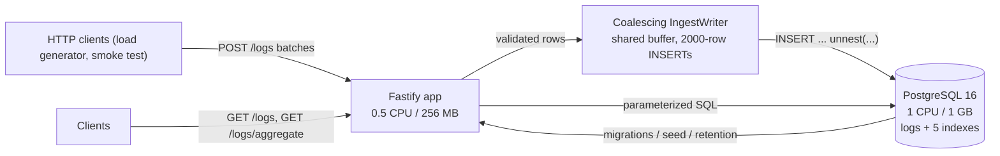

# 01. Project Overview

## Summary

This course explains a Datadog/Loki-style log ingestion and query service built with Fastify + TypeScript + PostgreSQL, runnable with a single `docker compose up`. The service sustains **15,000 logs/s ingestion** on a 0.5 CPU / 256 MB app container while serving filtered queries and time-bucketed aggregations against **1M+ rows** from a 1 CPU / 1 GB PostgreSQL container. The system is deliberately simple — two containers, one table, no message broker, no object storage — yet it meets the contract with real measured numbers. The course consists of 22 documents, one per design decision, each grounded in the actual implementation at `../`.

## Detailed explanation

The repository has two top-level folders: `src/` holds the production codebase, `study/` holds this course. The contract the project must satisfy, restated:

- Ingest **15,000 logs/s** sustained (batch POSTs), with per-entry validation reporting rejections by index.
- Serve filtered list queries with stable keyset pagination and time-bucketed aggregations, with p95 aggregate latency **under 1 second** at 1M+ rows.
- Run entirely inside two resource-capped containers: app 0.5 CPU / 256 MB (Node 22 alpine, non-root), database 1 CPU / 1 GB (postgres:16-alpine).
- Queryable latency ("request to visible") under 20 s — in practice it equals ingest latency, because a 200 is only returned after PostgreSQL commits.

The architecture is: HTTP clients POST batches of log entries to the Fastify app; the app validates every entry with Ajv (compiled once at startup); validated rows are pushed into a shared in-memory buffer inside a **coalescing writer** (`src/services/ingestWriter.ts`); a single serial writer drains the buffer into big `INSERT ... SELECT * FROM unnest(...)` statements (~2000 rows each); PostgreSQL stores rows in one `logs` table with five indexes, including a GIN index over a canonicalized string-valued JSONB copy of each entry's attributes (the double-JSONB strategy); `GET /logs` and `GET /logs/aggregate` serve queries over parameterized SQL.

The HTTP surface is four endpoints: `POST /logs` (batch ingestion with per-entry rejection reasons and a 200 only after the rows are durably committed), `GET /logs` (filters `since`/`until`/`service`/`level`/`q`/`attr.<key>`, limit 1-1000, opaque base64url keyset cursor), `GET /logs/aggregate` (epoch-aligned `date_bin` buckets with whitelisted `bucket` and `group_by` parameters), and `GET /health` (503 until ready, 200 `{"status":"ok"}` after). Every client error is a uniform `{"error": "..."}` envelope.

The bootstrap order in `src/index.ts` is part of the contract: wait for the database (retry with backoff), run embedded migrations under an advisory lock, optionally seed the load generator API key, start the retention sweeper, and only then listen — `/health` reports `503` until the app is ready and `200 {"status":"ok"}` after.

The measured contract-scale run (Docker Desktop on Windows, 1.2M rows in 80 s, 0 rejected, 0 errors): ingest latency p50 65 ms / p95 380 ms / p99 668 ms; aggregate p95 **162 ms during active 15k/s ingestion** and p50 42 ms / p95 73 ms at rest; table+indexes 629 MB; app ~60 MB / 256 MB; DB ~790 MB / 1 GB. Five real bottlenecks were found and fixed along the way — unbounded client concurrency causing GC collapse, a timer-only flush producing tiny 500-row inserts, read/write pool contention starving the writer, app CPU saturation at 0.5 CPU, and shared_buffers too small for the 629 MB working set. These stories are reused throughout this course as "Common mistakes" sections.

## Why this exists

A log service is one of the most instructive systems to build because it combines every hard problem in backend engineering: high-throughput ingestion, validation at scale, batching/coalescing, durable writes, indexed querying, pagination under concurrent inserts, time-series aggregation, retention, and resource-constrained deployment. Real products (Datadog, Loki, ELK) solve these with large distributed systems; this project shows how far a disciplined, single-node design with one database can go when every byte and CPU cycle is accounted for. The course exists to teach those decisions, file by file, so a reader can reproduce the reasoning on their own projects.

## Alternatives considered

| Alternative | Pros | Cons |
|---|---|---|
| Managed SaaS (Datadog/Loki Cloud) | Zero ops, huge scale | Not self-hostable, costly at 15k logs/s, no learning value |
| Elasticsearch + Logstash/Filebeat | Full-text search out of the box, mature | Heavy: Java stacks, 1 GB+ RAM per node, needs multiple nodes for HA |
| ClickHouse | Columnar, excellent compression, 100k+ rows/s on one node | Another system to run; contract's 1M rows doesn't need it; steeper SQL surface |
| Kafka + consumers + OLAP store | Standard modern pipeline, buffering, replay | 3+ containers, zookeeper/kraft overhead, far beyond contract resources |
| Vector/Promtail + Loki | Real-world Loki pipeline | Loki still wants object storage (S3/MinIO) + index store at scale; PG suffices here |
| **This project: Fastify + PostgreSQL only** | Two containers, fits the resource cap, all SQL is testable | No full-text search, no HA, aggregation scans the time window |

## Why this was chosen

The contract's numbers (15k logs/s, 1M rows, p95 aggregate < 1 s, 0.5 CPU app / 1 GB DB) sit squarely inside what a single tuned PostgreSQL instance can do — no broker, no search engine, no columnar store needed. The measured 25k/s serial-writer ceiling and 575 ms cold full-window aggregate prove headroom exists. PostgreSQL provides the durable, transactional guarantees the contract demands (200 only after commit) for free, and its index types (btree, GIN with `jsonb_path_ops`) cover every query shape in the contract. A single codebase with embedded migrations means `docker compose up` is the entire setup, which matches the "zero configuration by default" requirement. Anything more complex would burn the 0.5 CPU app budget on process overhead instead of validation and HTTP.

## Advantages / Disadvantages / Trade-offs

### Advantages

- Two containers, one command to run; reproducible and cheap.
- PostgreSQL gives transactional durability, SQL aggregation, and GIN indexing without extra infrastructure.
- Every design decision is measurable (the README contains the measured numbers) and testable (35 unit + 39 integration tests).
- The 0.5 CPU app is small enough that capacity planning is trivial: ~60 MB of 256 MB used.

### Disadvantages

- Single instance: the writer's in-memory queue is lost on a hard crash (no 200 was sent, so clients can retry — at-least-once).
- No HA, no replication, no TLS, no rate limiting — deliberately out of scope.
- Aggregations scan the whole time window (index-only scan at this scale), so per-query cost grows with data volume, not with the number of buckets.

### Trade-offs

- Durability vs. latency: batching delays the 200 by at most one flush cycle (~10 ms + insert time), but guarantees the 200 means "committed".
- App CPU vs. DB CPU: attribute canonicalization was moved into the INSERT (SQL-side `jsonb_each`) because the app was saturated at 0.5 CPU while PG had idle capacity.
- Memory vs. throughput: the buffer is bounded implicitly by in-flight requests (bounded to 50 by the load generator), trading a little latency for a hard memory ceiling.

## Code

The architecture as documented in the implementation README (`README.md:3-14`):

```
HTTP clients ──▶ Fastify app (0.5 CPU / 256 MB)
                     │  POST /logs (batch, per-entry validation)
                     ▼
              Coalescing IngestWriter
              (shared buffer → big 2000-row INSERTs)
                     ▼
              PostgreSQL 16 (1 CPU / 1 GB)
              logs table + 5 indexes (double-JSONB attribute strategy)
```

The bootstrap sequence that makes `/health` honest (`src/index.ts:21-47`) — the app is only built after the DB is reachable and migrations ran, and readiness flips true only after `listen()`:

```ts
async function main(): Promise<void> {
  const config = loadConfig();

  const pool = createPool(config);
  await waitForDatabase(pool);
  await runMigrations(pool);

  if (config.authEnabled && config.loadgenApiKey) {
    await seedLoadgenKey(pool, config.loadgenApiKey);
  }
  ...
  const readyState = { ready: false };
  const app = buildApp({ config, pool, writer, ready: { isReady: () => readyState.ready } });
  await app.listen({ port: config.port, host: "0.0.0.0" });
  readyState.ready = true;
```

The two-container topology with resource caps and the healthcheck gate (`docker-compose.yml:5-66`):

```yaml
db:
  image: postgres:16-alpine
  healthcheck:
    test: ["CMD-SHELL", "pg_isready -U loguser -d logdb"]
    ...
  deploy:
    resources: { limits: { cpus: "1.0", memory: 1g } }
app:
  build: .
  depends_on:
    db: { condition: service_healthy }
  deploy:
    resources: { limits: { cpus: "0.5", memory: 256m } }
```

## Diagrams



## Common mistakes

- **No in-flight cap on the client**: the first load generator fired hundreds of concurrent 200 KB bodies; the app pinned at 256 MB, GC stalled the event loop, latency spiraled to 13 s. Fix: bound concurrency (50) — `loadtest/loadgen.mjs:154`.
- **Assuming the DB needs more than it does**: at this scale PG alone is the right call; introducing Kafka or Elasticsearch would have been infrastructure theater that misses the resource caps.
- **Treating `/health` as liveness instead of readiness**: this project's health is a true readiness gate (503 until migrations done), which is what containers and load balancers actually need.
- **Windows development friction**: use `npm.cmd` not `npm`, quote `node --test` globs (`"tests/unit/*.test.ts"` — see `package.json:16`), and remember Docker Desktop timer jitter (~ms) when reasoning about pacing tests.

## Optimization ideas

- Pre-aggregated rollup tables maintained by the writer (the documented escape hatch for when the time window outgrows RAM) — `README.md:164`.
- Time-based partitioning (e.g. daily) with `DROP PARTITION` for O(1) retention instead of chunked deletes.
- Stream INSERTs with the `COPY` protocol for a further throughput multiplier (see study 07 and 15).
- HA/read replicas once the single instance is a constraint; TLS and rate limiting before that.

## Interview questions & answers

1. **Q: Why does a 0.5 CPU container suffice for 15k logs/s?** A: Because per-request work is small (Ajv compiled validation, two JSON stringifies, HTTP framing) and the heavy cost — index maintenance on insert — is amortized by the coalescing writer's ~2000-row INSERTs. The app's measured ceiling was ~25k rows/s serialized into big chunks; the DB, not the app, sets the final rate.
2. **Q: What makes the 200 response a durability guarantee?** A: The route `await`s `writer.submit(...)` (`src/routes/logs.ts:92`), and the writer resolves each request only after PostgreSQL acknowledges the commit of the INSERT (`src/services/ingestWriter.ts:167-184`). A 200 is never sent for queued rows.
3. **Q: How is this like Datadog/Loki and how is it different?** A: Same pipeline shape (agent/HTTP → batch → index → query) and same user-facing contract (ingest, filter, aggregate); different scale — they shard, chunk to object storage, and cluster; we keep everything on one PG node and one table.
4. **Q: Why two JSONB columns for attributes?** A: The contract requires both typed round-trip (number 3 stays 3) and string-equality matching (`attr.retries=3` matches). One column can't do both with `@>`; a canonicalized string-valued copy plus a GIN index gives index-supported equality while the typed copy is returned to clients — `README.md:113-121`.
5. **Q: What happens to in-flight rows if the app crashes?** A: The queue is in memory, so they are lost — but no 200 was sent, so clients retry. That is at-least-once semantics at the client, not exactly-once, and is documented as a known limitation.
6. **Q: Why run migrations at startup instead of a separate step?** A: Zero-config startup; the advisory lock (`0x4c4f4753`) serializes concurrent instances, and `/health` stays 503 until they finish, so a client can never observe a half-migrated service.
7. **Q: Why is aggregation an endpoint rather than a query parameter?** A: It has a different response shape (buckets, not logs), different validation (bucket whitelist, required since/until), and a different SQL plan (GROUP BY date_bin) — a separate route keeps each handler and schema small.
8. **Q: How would you scale this past 1M rows?** A: Keep ingestion on the writer and add: time partitioning, rollup tables for aggregates, and read replicas for queries; eventually shard by tenant or time range across instances.
9. **Q: Why no message broker in front of the DB?** A: The DB was measured to absorb the rate (25k/s serial ceiling); a broker adds a container, latency, and exactly-once headaches without improving the contract numbers. It only pays off at much larger scale.
10. **Q: What would you measure first when tuning this system?** A: Insert time vs. chunk size (500 rows ≈ 72 ms, 2000 rows ≈ 80 ms), shared_buffers vs. working set size, and the app's CPU% during load — the three knobs that each produced a 2-3x change in this project.

## Implementation references

- `../README.md:3-14` — architecture and contract summary
- `../README.md:136-160` — measured performance and the five bottlenecks fixed
- `../src/index.ts:21-67` — bootstrap sequence (DB wait, migrations, seed, retention, listen, ready)
- `../src/app.ts:24-38` — Fastify options (body limit, request timeout, logging off)
- `../docker-compose.yml:5-66` — two-container topology and resource caps
- `../src/config.ts:40-62` — environment configuration with defaults
- `../package.json:10-19` — scripts (typecheck, lint, unit/integration tests)
