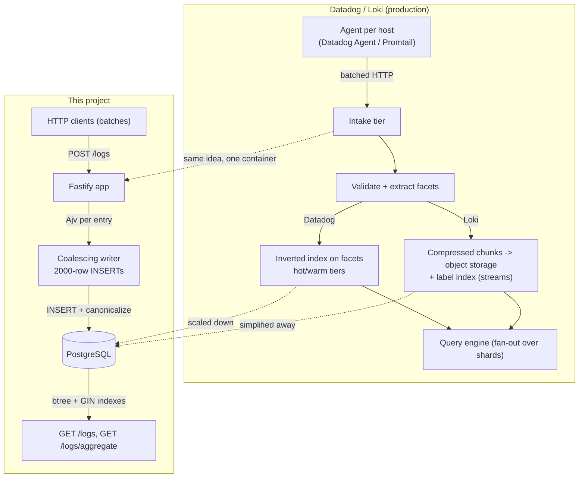

# 02. How Datadog and Loki Work

## Summary

Real log platforms are distributed pipelines: an agent on every host collects logs, ships them over a transport to an intake tier, which batches and indexes them into storage, and query engines fan out across shards to answer filters and aggregations. Datadog ingests into centralized index clusters with attribute/facet metadata and tiered retention; Loki compresses logs into chunks in object storage and keeps only a small label index, preferring brute-force scans of filtered chunks over full-text indexing. This project emulates the pipeline's shape — batch ingestion, attribute filtering, aggregation, retention — while collapsing all tiers into one Fastify process and one PostgreSQL table, which is exactly what the contract's scale demands.

## Detailed explanation

### The real pipelines

**Agents and transport.** Both platforms run a small agent per host (Datadog Agent, Loki's Promtail/Grafana Alloy). The agent tails files, parses lines, enriches them with host/container labels, and batches them over HTTP/gRPC to an intake endpoint. Batching exists because per-line network round-trips are the dominant cost — exactly the insight this project's coalescing writer reuses.

**Ingestion and chunking.** Datadog's intake tier validates, deduplicates, and fans logs into "index" clusters; the log body is stored compressed in hot/warm tiers while facets (parsed key/value metadata) are indexed. Loki compresses raw log lines into blocks (chunks, typically up to a few MB after snappy/gzip compression) that are appended to object storage, and writes a per-stream metadata index (tenant, labels, time ranges → chunk references). A stream is the set of labels a log line matches; a chunk belongs to one stream and one time window.

**Index strategies.** This is the fundamental design fork:

- **Loki**: the index maps `tenant + labels + time range` to chunks. It does *not* index log content. A query first narrows candidates via the label index, then downloads and decompresses the candidate chunks and does a brute-force line scan. This is why Loki is cheap to store (no content index) but needs filtering to be pushed to the chunk level.
- **Datadog**: indexed logs get an inverted index over facets (typed attributes) plus metadata, enabling instant equality/range filtering and aggregations; full-text search runs on the indexed body. Indexing everything is expensive, which is why Datadog has an "index vs archive" split — you pay to index only what you need to search, and everything else goes to compressed archives.
- **Elasticsearch (the third pole)**: inverted index over the whole document; powerful full-text but the highest storage multiplier (often 10-30x original size with replicas).

**Retention tiers.** Datadog: indices have retention tiers (e.g. 7/15/30 days, then archives to object storage). Loki: per-tenant retention on chunks plus periodic index compaction, table-based retention in the index store, and chunk storage that can be pruned independently. Tiers exist because the cost of searchable storage is much higher than the cost of object storage.

**Query.** LogQL (Loki) and Datadog Log Explorer both support: time-range restriction, label/facet equality filters, string search, and aggregation (count over time buckets — Loki `rate()`, Datadog "log metrics"). This project's `GET /logs` and `GET /logs/aggregate` are the same contract at a smaller scale: filter + count-over-time-buckets.

### The mapping to this project

| Concept | Datadog/Loki | This project |
|---|---|---|
| Agent/collector | Datadog Agent, Promtail | The load generator / any HTTP client (batches via `POST /logs`) |
| Transport + batching | Batched HTTP/gRPC with backpressure | Batched HTTP; server-side coalescing into ~2000-row INSERTs |
| Validation/normalization | Intake pipeline, facet extraction | Ajv per-entry validation; server-side attribute canonicalization (`attr_lookup`) |
| Index strategy | Inverted index on facets / label index + chunk scan | Btree indexes + GIN `jsonb_path_ops` over canonicalized attributes; `message ILIKE` scans the window (Loki-like brute force on a small window) |
| Chunk/block storage | Compressed chunks in object storage | Rows in one PG table (629 MB at 1.2M rows); toast-compressed JSONB |
| Aggregation | LogQL `rate`, Datadog log metrics | `date_bin` + `GROUP BY` with a whitelisted `group_by` |
| Retention | Tiers + archives | Chunked deletes by `ts < cutoff` (study 13) |
| Query fan-out | Distributed query engine over shards | Single PG instance, parameterized SQL |

What we **simplified**: no sharding, no object storage, no chunk compression, no full-text inverted index, no distributed query engine. `q` is an `ILIKE '%...%'` substring scan over the filtered window — acceptable because the contract bounds the window (1M rows, ~600 ms cold full-window), whereas Loki at petabyte scale must scan gigabytes of chunks for the same operation and therefore pushes hard on label filtering. What we **emulate** faithfully: coalescing for write amplification (the single most important throughput lever in every log system), an attribute-equality index (our version of facet filtering), string-valued canonicalization (our version of Datadog's typed-vs-string facet semantics), time-bucketed aggregation, and bounded retention.

## Why this exists

You cannot design a log service responsibly without knowing the two big designs in the space: the inverted-index design (Datadog/Elasticsearch, expensive writes, instant reads) and the chunk-scan design (Loki, cheap writes, reads bound by filtering). Every choice in this project — double-JSONB attributes, GIN over the canonicalized copy, `ILIKE` instead of full-text, chunked deletes — is a conscious position in that spectrum. Understanding the real products explains *why* those choices are correct at our scale and when they would stop being correct.

## Alternatives considered

| Approach | Pros | Cons |
|---|---|---|
| Full-text inverted index (ES/Datadog style) | Instant substring search, relevance ranking | 10-30x storage overhead, heavy index maintenance, expensive at 15k/s on 1 GB |
| Chunk-scan (Loki style) | Minimal write cost, huge scale, cheap storage | Queries scan compressed chunks; needs object storage + label discipline |
| Hybrid (index facets only, scan bodies) | Balances write cost and read speed | More moving parts (two stores) |
| **This project: relational row store + targeted indexes + window scans** | One system, transactional, index maintenance ~80 ms/2000 rows, window scans fine at 1M rows | Substring search degrades as the window grows; no free compression of bodies |

## Why this was chosen

The contract's two hard numbers are 15k logs/s of writes and a p95 aggregate under 1 s on 1M rows. A chunk-scan design buys nothing at 1M rows (a single 629 MB table fits RAM), while an inverted index's write amplification is the opposite of what a 1 CPU DB needs. PostgreSQL lets this project have the middle path: index the cheap things (time, service, level, attribute equality via GIN) and scan the rest — and at the contract's scale the "scan" is an index-only scan over 1.2M rows that EXPLAINs at 575 ms cold (warm: p95 73 ms). The honest limitation (documented in the README) is that this design degrades super-linearly past RAM-resident data — the escape hatch is a rollup table, not a different storage engine.

## Advantages / Disadvantages / Trade-offs

### Advantages

- Conceptually close to the real products, so the course's lessons transfer directly to Datadog/Loki work.
- Explains the "double-JSONB" decision as a scaled-down facet index with Datadog-style string-comparison semantics.
- Makes retention and aggregation look like ordinary SQL problems instead of distributed-systems problems.

### Disadvantages

- No true full-text search; `q` scans the filtered window (fine at 1M rows, not at 1B).
- No compression strategy for bodies (PG toast compresses JSONB, but plain-text `message` is stored uncompressed); storage grows ~linear with retention.
- The label/facet index requires clients to put searchable metadata in `attributes` — same discipline as Loki labels.

### Trade-offs

- Write cost vs. read speed: GIN + btree maintenance per insert (the 72→80 ms index-dominated profile) is the price for sub-second reads; a scan-only design would invert the cost curve.
- Indexing everything vs. indexing facets: we index only `service`, `level`, `ts`, and attribute equality — anything else must be pushed into filters that can use the time index.
- SQL simplicity vs. scale ceiling: `date_bin` aggregation is O(window), which is the accepted trade for a 1M-row contract.

## Code

The attribute index is our "facet index" — the canonicalized string-valued copy built server-side at insert time (`src/services/ingestWriter.ts:58-78`):

```sql
INSERT INTO logs (ts, level, service, message, attributes, attr_lookup, tenant_id)
SELECT u.ts, u.level, u.service, u.message, u.attrs, lk.lookup, u.tenant
FROM unnest(
  $1::timestamptz[], $2::text[], $3::text[], $4::text[],
  $5::jsonb[], $6::text[]
) AS u(ts, level, service, message, attrs, tenant)
CROSS JOIN LATERAL (
  SELECT COALESCE(
    jsonb_object_agg(
      e.key,
      CASE WHEN jsonb_typeof(e.value) IN ('object', 'array')
           THEN e.value::text
           ELSE e.value #>> '{}'
      END
    ),
    '{}'::jsonb
  ) AS lookup
  FROM jsonb_each(u.attrs) AS e(key, value)
) lk
```

This is Datadog's typed-facet problem in miniature: the client sends `retries: 3` (number), the contract matches `attr.retries=3` (string), so a canonicalized copy is derived at write time — the same "extract facets at ingestion" step Datadog's intake performs.

Queries hit the GIN index with an exact `@>` containment (`src/lib/queryParams.ts:208-211`):

```ts
for (const [key, value] of filters.attrPairs) {
  // String comparison against the canonicalized lookup column — indexed by GIN.
  clauses.push(`attr_lookup @> ${t(JSON.stringify({ [key]: value }))}::jsonb`);
}
```

Our "chunk scan" equivalent — the substring filter that brute-forces the window (`src/lib/queryParams.ts:212-216`):

```ts
if (filters.q) {
  clauses.push(`message ILIKE '%' || ${t(escapeLike(filters.q))} || '%' ESCAPE '\\'`);
}
```

And the time-bucketed aggregation, the analog of LogQL `rate()` / Datadog log metrics (`src/lib/queryParams.ts:288-296`):

```ts
sql: `SELECT date_bin(${intervalParam}::interval, ts, TIMESTAMPTZ 'epoch') AS bucket_start,
             ${groupExpr} AS group_name,
             count(*)::int AS count
        FROM logs ${where.sql}
       ${groupByClause}
       ORDER BY 1 ASC, 2 ASC`,
```

## Diagrams



## Common mistakes

- **Thinking Loki indexes log content**: it does not — its index maps streams/labels to chunks, and matching happens by scanning decompressed chunks. This is why Loki performance depends on pushing filters to labels. Our project's `attr.<key>` filter plays that role.
- **Assuming Datadog indexes everything**: indexed logs are expensive; that is why Datadog splits "index" (searchable, billed) from "archive" (cheap storage). Our schema reflects the same idea: only attribute equality is indexed, full text is not.
- **Copying the agent requirement**: real pipelines ship agents because hosts are distributed; our contract has one load generator talking HTTP. Reimplementing tailing/promtail semantics would be scope creep.
- **Ignoring the string-vs-typed facet trap**: Datadog facets have declared types; this project's contract says compare as strings — the double-JSONB design exists precisely because a single typed column can't satisfy both round-trip and string matching.

## Optimization ideas

- Pre-aggregated rollup tables (the Loki-`rate()`-at-query-time problem) updated by the writer, so aggregates stop being O(window).
- Partitioning by time plus `DROP PARTITION` for O(1) retention — the production answer to chunked deletes.
- Compressing bodies at ingest (gzip attribute payloads) and decompressing on read, mimicking chunk compression.
- If data outgrows one node: shard by tenant/time and route queries with a thin gateway — the first step toward a real Loki.

## Interview questions & answers

1. **Q: How does Loki store logs?** A: Raw lines are compressed into chunks in object storage; a metadata index maps streams (label sets) and time ranges to chunk references. Content is not indexed — queries narrow with the label index, then scan candidate chunks.
2. **Q: Why can Loki be cheaper than Elasticsearch for storage?** A: No full-text inverted index per document; content is compressed once and stored once. ES writes a large index per document (10-30x storage multiplier with replicas).
3. **Q: What does this project's `attr_lookup` column correspond to in Datadog?** A: Facet indexing: at intake, Datadog extracts typed facets from structured fields; we canonicalize all attribute values to strings at insert time and GIN-index them so equality filters are index-supported.
4. **Q: Where does this project do "chunk scanning"?** A: The `q` substring filter (`message ILIKE '%...%'`) and windowed aggregations scan rows — but the window is bounded by the time index and fits RAM at 1M rows, so it is a 575 ms cold / 73 ms warm operation instead of a multi-second chunk fetch.
5. **Q: Why is batching the universal lever in log pipelines?** A: Per-line overhead (network round-trips, protocol frames, index maintenance) dominates; amortizing it over large chunks is how both Datadog's intake and our 2000-row INSERTs reach their throughput.
6. **Q: What is a retention tier and why do real products have several?** A: Searchable indexed storage is much more expensive than archives; tiers (7/15/30 days + archive) let customers pay for searchability only where needed. Our project has one tier plus chunked deletes; the concept maps to `RETENTION_HOURS`.
7. **Q: If our data grew 1000x, which part of this design breaks first and what's the fix?** A: The O(window) aggregations and ILIKE scans stop fitting in RAM/IO. Fixes: rollup tables, time partitioning, read replicas; then sharding and object-storage chunks (the Loki path).
8. **Q: Why does the contract's string-comparison for attributes matter?** A: Clients query with strings (`attr.http_status=200`) but want typed values back (`200` as a number). Real systems pick one (Datadog typed facets); we satisfy both with the canonicalized copy, which is exactly the "extract at ingest" trick.
9. **Q: How would you add full-text search to this service without changing storage?** A: Add a `tsvector` column + GIN index on message (PG FTS), or route `q` to a dedicated search index while keeping PG for filters/aggregates — the hybrid approach real products converge on.
10. **Q: What does "queryable within ingest latency" mean and why is it unusual?** A: Real pipelines have indexing lag (seconds to minutes). Because the 200 only fires after PG commits, a row is queryable the moment its request returns — the README's measured "visibility ≈ ingest latency".

## Implementation references

- `../src/services/ingestWriter.ts:58-78` — server-side facet canonicalization in SQL
- `../src/lib/queryParams.ts:208-216` — GIN attribute equality and ILIKE substring filters
- `../src/lib/queryParams.ts:288-296` — `date_bin` aggregation SQL (LogQL-`rate` analog)
- `../src/db/migrations.ts:31-60` — the five indexes (our index strategy)
- `../src/services/retention.ts:25-49` — chunked retention deletes
- `../README.md:111-121` — double-JSONB strategy rationale
- `../README.md:132-134` — retention and bounded sweeps
