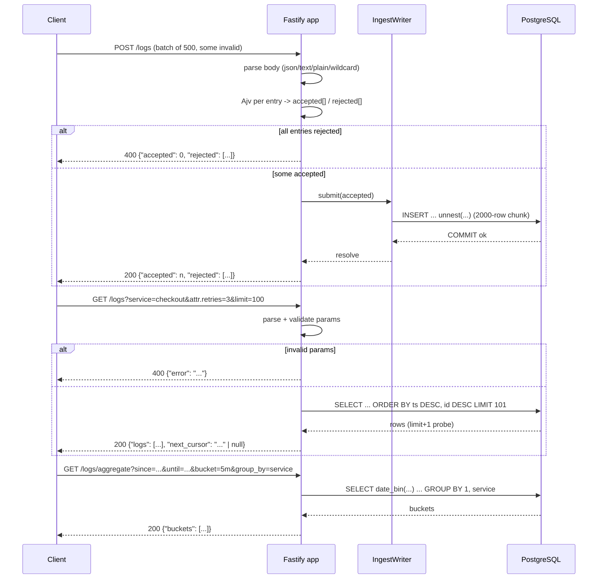

# 03. API Contract

## Summary

The contract is exactly four endpoints: `POST /logs` (batch ingestion with per-entry validation), `GET /logs` (filtered query with cursor pagination), `GET /logs/aggregate` (time-bucketed counts), and `GET /health` (readiness). Every error is a JSON envelope `{"error": "..."}`, all SQL is parameterized, and the key semantic promises are: a 200 from `POST /logs` means the rows are durably committed, attribute filters compare values as strings, pagination is a stable keyset cursor, and bucket aggregation is aligned to the epoch. This document is the precise, code-verified statement of that contract — the README is the friendly version, this is the spec.

## Detailed explanation

### `POST /logs` — batch ingestion

Request body: a JSON object with a `logs` array. Accepted with `Content-Type: application/json`, `text/plain`, any other type, or no Content-Type at all — the app registers `text/plain` and wildcard `*` JSON parsers in addition to Fastify's built-in `application/json` (`src/app.ts:62-75`).

Each entry is validated individually (see study 08). The exact field rules implemented by the Ajv schema (`src/lib/validation.ts:46-61`):

| Field | Rule |
|---|---|
| `timestamp` | required, string, RFC3339 (`format: "date-time"`), and not more than 5 minutes in the future |
| `level` | required, one of `debug` \| `info` \| `warn` \| `error` |
| `service` | required, non-empty string |
| `message` | required, non-empty string |
| `attributes` | optional object; values must be string, number or boolean (flat — nested objects/arrays/null rejected); empty object allowed |
| anything else | allowed and ignored (the schema does not forbid unknown root keys) |

Responses:

- `200` — `{"accepted": 2, "rejected": [{"index": 1, "reason": "invalid level: 'critical'"}]}`. `accepted` is the count of committed rows; every bad entry is reported by its position in the input array with a human-readable reason. The response is sent only after PostgreSQL acknowledged the commit (`src/routes/logs.ts:92`).
- `400` with `{"accepted": 0, "rejected": [...]}` — every entry failed (including an empty `logs` array).
- `400` with `{"error": "request body must be a JSON object with a 'logs' array"}` — body is not an object with an array `logs`.
- `400` with `{"error": "malformed JSON body"}` — the body is not valid JSON at all.

Partial batches are accepted: a batch of 10 with 2 bad entries returns `200` with `accepted: 8`. The load generator's measured run had 0 rejections at 15k/s.

Example reason strings (produced by `reasonForError`, `src/lib/validation.ts:74-98`): `invalid level: 'critical'`, `invalid timestamp: 'garbage'`, `missing required field: 'timestamp'`, `service must be a non-empty string`, `attribute 'user_id' must be a string, number or boolean; nested objects and arrays are not allowed`, `timestamp must not be more than five minutes in the future`.

### `GET /logs` — filtered query

Query parameters (unknown ones are ignored; repeated ones use the first value):

| Param | Rule |
|---|---|
| `since` | RFC3339 timestamp; inclusive (`ts >= since`) |
| `until` | RFC3339 timestamp; exclusive (`ts < until`); must not be earlier than `since` |
| `service` | exact match, non-empty |
| `level` | exact match from `debug|info|warn|error` |
| `q` | case-insensitive substring match on `message` (LIKE/ILIKE, wildcards in `q` are escaped to literals) |
| `attr.<key>` | attribute equality, **compared as strings** against the canonicalized `attr_lookup` column; repeatable, AND-combined |
| `limit` | integer 1-1000, default 100 |
| `cursor` | opaque base64url value from a previous `next_cursor`; invalid cursors → 400 |

Response `200`: `{"logs": [{"id": "42", "timestamp": "2026-07-20T14:32:01.123Z", "level": "info", "service": "checkout", "message": "payment declined", "attributes": {"user_id": "42", "retries": 3}}], "next_cursor": "eyJ0cyI6..."}`. `id` and `timestamp` are strings; `attributes` are the original typed values (`retries: 3` stays a number); `next_cursor` is `null` on the last page. Order is `ts DESC, id DESC`; the server fetches `limit+1` rows to know whether another page exists.

The `attr.<key>` semantics are the subtle one: `attr.http_status=200` matches rows where `http_status` is the string `"200"` **or** the number `200`, because matching runs against the canonicalized string copy. There is no wildcard/prefix matching in attributes — the value must equal the query string exactly (unlike `q`, no escaping is applied).

Any invalid parameter yields `400` with `{"error": "..."}` — e.g. `unsupported level: 'fatal'`, `invalid timestamp: 'not-a-date'`, `until must not be earlier than since`, `limit must be between 1 and 1000`, `invalid cursor`.

### `GET /logs/aggregate` — time-bucketed counts

Parameters `since`, `until` and `bucket` are **required** (no defaults), plus optional `group_by`, and the same filters as `GET /logs` (`service`, `level`, `q`, `attr.<key>`). `bucket` must be one of `1m | 5m | 1h | 1d` (whitelisted in `BUCKET_INTERVALS`, `src/lib/queryParams.ts:121-126`); `group_by` must be `service` or `level` (`GROUP_COLUMNS`).

Response `200`: `{"buckets": [{"start": "2026-07-20T14:01:00.000Z", "group": "auth", "count": 2}, ...]}`. Buckets are aligned to the epoch via `date_bin(interval, ts, TIMESTAMPTZ 'epoch')`, ascending by `start` then `group`; `group` is `null` when `group_by` is absent; only non-empty buckets are returned (an empty range returns `{"buckets": []}`); `count` is an integer.

### `GET /health`

`503 {"status": "starting"}` until the app has connected to PG, applied migrations, seeded keys, and called `listen()`; then `200 {"status": "ok"}`. Never requires auth.

### Errors and auth

All client errors use `{"error": "<string>"}`. Auth (opt-in via `AUTH_ENABLED`) adds `401 {"error": ...}` for missing/invalid keys and `403 {"error": ...}` for wrong scope; with auth off, credentials are ignored entirely (see study 17).

## Why this exists

A precise contract turns grading and testing into objective checks: the 39 integration tests and the `smoke.mjs` script assert exact shapes, status codes, and rejection semantics. Without it, every consumer (load generator, tests, future clients) would negotiate a slightly different protocol. The contract also encodes the hard requirements — durability-before-200, per-entry rejection, string attribute comparison, stable pagination — that drive most of the implementation's design decisions.

## Alternatives considered

| Choice | Alternatives | Outcome |
|---|---|---|
| Ingestion acknowledgement | 202 + async batch job | Rejected: contract needs 200 = committed; no background job infrastructure |
| Error shape | Fastify default `{message, statusCode}` | Rejected: contract fixes `{"error": ...}`; a custom error handler normalizes it |
| Aggregate params | Defaults (since = 1h back) or `interval` naming | Rejected: code requires `since`/`until`/`bucket`; the README once drifted on this — code wins |
| Entry timestamp field | `ts` vs `timestamp` | Both exist: POST body field is `ts`, GET response field is `timestamp` (mapped in `logService.ts:50`) |
| Unknown params | Reject all unknown params | Rejected: lenient (ignored) so extra params never break the load generator |
| Attribute matching | Typed comparison | Rejected by contract: string comparison via canonicalized column |
| Pagination | `offset`/`limit` | Rejected: keyset cursor (stable under concurrent inserts, O(page)) |

## Why this was chosen

The contract is the spec, and the code implements it literally: batch ingestion with per-index reasons (so one bad log never fails 499 good ones — the shape that a real Datadog-style intake needs), a 200 that is only sent after the commit (so "request to queryable" is exactly ingest latency, meeting the < 20 s visibility target), string-valued attribute equality (a pragmatic JSON-query convention), and keyset pagination because offset-based paging at 15k/s would produce duplicates and misses on every page flip. The strict `{"error": ...}` envelope was chosen because consumers need one way to read a failure, and the custom parsers for `text/plain`/wildcard content types exist because real HTTP clients (including the zero-dep load generator) sometimes omit or mislabel Content-Type.

## Advantages / Disadvantages / Trade-offs

### Advantages

- Deterministic and testable: every rule above has an integration test (`tests/integration/api.test.ts`, `aggregate.test.ts`).
- Lenient where it matters (content types, unknown params), strict where the contract matters (validation, ranges, cursors).
- Self-describing errors: `rejected[].reason` strings are precise enough for clients to fix their payloads.

### Disadvantages

- No batch-level idempotency: a retried POST after a network timeout can duplicate rows (clients need their own dedup IDs).
- The `attr.<key>` string semantics surprise clients expecting typed matching.
- Aggregate's required params mean clients must always compute time windows.

### Trade-offs

- `200` after commit costs up to one flush cycle of latency per request but buys durability truth.
- Strictness of the entry schema (flat attributes only) sacrifices expressiveness for schema simplicity and indexing feasibility.
- `limit+1` probe adds one row of fetch overhead to every page in exchange for a correct `next_cursor`/`null` signal.

## Code

The ingestion handler — per-entry validation, per-index reasons, 400 when everything is rejected, and the durable `submit` (`src/routes/logs.ts:57-95`):

```ts
async (req: FastifyRequest, reply: FastifyReply) => {
  const body: unknown = req.body;
  if (typeof body !== "object" || body === null || !Array.isArray((body as { logs?: unknown }).logs)) {
    return reply.code(400).send({ error: "request body must be a JSON object with a 'logs' array" });
  }
  const rows = (body as { logs: unknown[] }).logs;
  const accepted: IngestRow[] = [];
  const rejected: RejectedEntry[] = [];
  ...
  for (let i = 0; i < rows.length; i++) {
    const result = validateLogEntry(rows[i]);
    if (result.ok) { accepted.push({ ... result.entry }); }
    else { rejected.push({ index: i, reason: result.reason }); }
  }
  if (accepted.length === 0) {
    return reply.code(400).send({ accepted: 0, rejected });
  }
  await deps.writer.submit(accepted);
  return reply.code(200).send({ accepted: accepted.length, rejected });
}
```

The unified 400 envelope and the JSON-anywhere parsers (`src/app.ts:43-75`):

```ts
app.setErrorHandler((err: FastifyError, _req, reply) => {
  if (err.statusCode === 400) {
    if (err.code === "FST_ERR_CTP_INVALID_JSON" || err.code === "FST_ERR_CTP_EMPTY_JSON_BODY") {
      return reply.code(400).send({ error: "malformed JSON body" });
    }
    return reply.code(400).send({ error: err.message ?? "bad request" });
  }
  reply.send(err);
});
...
app.addContentTypeParser("text/plain", { parseAs: "string" }, jsonParser);
app.addContentTypeParser("*", { parseAs: "string" }, jsonParser);
```

The attribute equality filter — exact string match on the canonicalized column (`src/lib/queryParams.ts:208-211`):

```ts
for (const [key, value] of filters.attrPairs) {
  clauses.push(`attr_lookup @> ${t(JSON.stringify({ [key]: value }))}::jsonb`);
}
```

The readiness endpoint that stays 503 until the app is truly ready (`src/routes/health.ts:12-19`):

```ts
app.get("/health", async (_req: FastifyRequest, reply: FastifyReply) => {
  if (!ready.isReady()) {
    return reply.code(503).send({ status: "starting" });
  }
  return { status: "ok" };
});
```

## Diagrams



## Common mistakes

- **Using the README example literally**: the POST body field is `ts` while the GET response field is `timestamp`, and aggregate requires `since`/`until`/`bucket` (`bucket` ∈ `1m|5m|1h|1d`) — no defaults. When docs and code drift, the code is the contract — the integration tests assert the code's behavior.
- **Sending `attributes` with nested objects or null values**: rejected with a per-index reason. Flatten at the client or accept rejection.
- **Interpreting `until` as inclusive**: it is exclusive (`ts < until`); boundary rows land in the `since`-inclusive side.
- **Treating `q` wildcards as supported**: `%` and `_` in `q` are escaped and matched literally (`50%` matches only `50%`).
- **Retrying POSTs assuming idempotency**: there is none; a retry duplicates rows (at-least-once).
- **Expecting aggregate to default its window**: since/until/bucket are all required — the smoke test and load generator always pass them.

## Optimization ideas

- Accept `Content-Encoding: gzip` request bodies to shrink batch payloads (HTTP-level compression).
- Add `?fields=` projection to avoid shipping `message`/`attributes` for counting use cases.
- Stream partial results (`Transfer-Encoding: chunked`) for very large pages instead of buffering.
- If the contract ever needs idempotency, add an optional client-supplied `batch_id` and a unique index on it.

## Interview questions & answers

1. **Q: Why does the API answer 400 (not 200) when the whole batch is rejected?** A: The batch endpoint mirrors the contract's "all or reported" rule: with some accepted it is a successful partial write (200), with none it is a failed request (400) carrying the reasons — one status code that makes the client's retry decision trivial.
2. **Q: What exactly does a 200 on POST /logs guarantee?** A: That every `accepted` row was committed by PostgreSQL; the handler awaits the writer's promise, which resolves only after the INSERT's commit. It never means "queued".
3. **Q: Why compare attributes as strings?** A: The contract says so, and it matches how URL query strings naturally behave (`attr.retries=3` is always text). The double-JSONB design makes that cheap and index-supported: canonicalized strings in `attr_lookup`, originals in `attributes`.
4. **Q: How is `q` different from `attr.<key>`?** A: `q` is a case-insensitive substring match on `message` with LIKE wildcards escaped to literals; `attr.<key>` is an exact equality against the canonicalized string value. Different semantics, different indexes (`ILIKE` scans vs GIN `@>`).
5. **Q: Why is `until` exclusive?** A: Half-open intervals `[since, until)` compose cleanly across page boundaries without double-counting boundary rows — the same convention the aggregator uses.
6. **Q: What happens with a malformed cursor?** A: `decodeCursor` validates strictly (base64url JSON with a parseable `ts` and a numeric `id`), and the route returns `400 {"error": "invalid cursor"}` — never a 500 or an accidental full-table scan.
7. **Q: Why `next_cursor: null` instead of omitting the field?** A: The response schema requires `logs` and `next_cursor` on every 200 (`src/routes/logs.ts:127`), so clients have one stable shape: no "is the key present?" branching.
8. **Q: Can the contract support multiple attribute filters on the same key?** A: Yes — each `attr.<key>` becomes an ANDed `@>` clause; the load generator and tests exercise multi-key combinations.
9. **Q: Why does `GET /health` return 503 with a body?** A: Load balancers and orchestrators need a distinct non-200 status during startup, and the JSON body distinguishes "starting" from other failures; 503 is the standard readiness signal.
10. **Q: How would you version this API?** A: The contract is v1 and unversioned by design; a breaking change (e.g. typed attribute filters) would move to `/v2` with the old routes deprecated rather than breaking in place.

## Implementation references

- `../src/routes/logs.ts:33-96` — POST /logs handler (validation loop, 400/200 semantics, durable submit)
- `../src/routes/logs.ts:101-140` — GET /logs handler (param parsing, cursor, response shape)
- `../src/routes/logs.ts:145-185` — GET /logs/aggregate handler
- `../src/app.ts:43-75` — error envelope and content-type parsers
- `../src/lib/queryParams.ts:52-115` — list param rules; `:141-174` — aggregate param rules
- `../src/lib/queryParams.ts:194-231` — WHERE builder (filters, cursor, tenant)
- `../src/lib/queryParams.ts:237-239` — LIKE escaping for `q`
- `../src/lib/cursor.ts:24-42` — cursor encode/decode with strict validation
- `../src/routes/health.ts:12-19` — readiness semantics
- `../tests/integration/api.test.ts:24-92` — POST contract tests; `:150-160` — string attribute comparison; `:218-234` — 400 matrix
- `../tests/integration/aggregate.test.ts:35-133` — bucket semantics and 400 matrix
- `../scripts/smoke.mjs:51-103` — end-to-end contract checks
