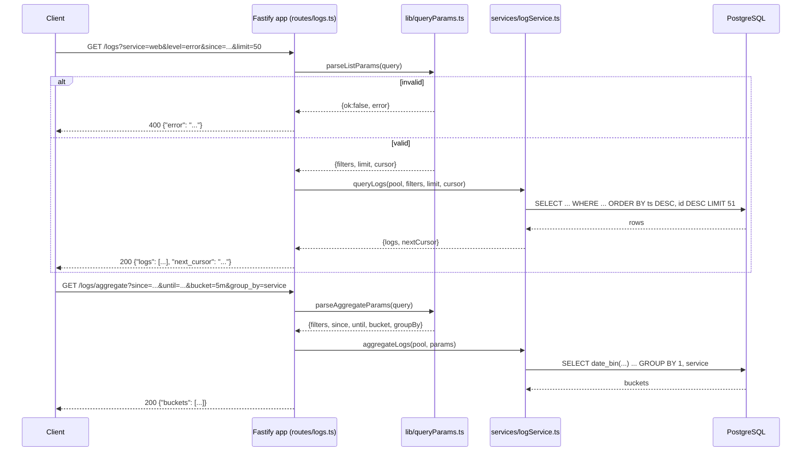

# 04. REST API Design

## Summary

The API is a small, deliberately pragmatic REST surface: one collection resource (`/logs`) with a batch create (`POST`), a filtered read (`GET`), a derived aggregation sub-resource (`GET /logs/aggregate`), and a standalone readiness probe (`GET /health`). It follows REST conventions where they pay (resource-oriented URLs, HTTP verbs and status codes) and breaks them where the problem demands (batch-only ingestion, no update/delete on log entries, query semantics in parameters rather than a body). The design principles are: correctness over purity, one error envelope, stateless servers with opaque cursors, and a contract small enough to be verified by 39 integration tests and a smoke script.

## Detailed explanation

### Resource modeling

Logs are append-only events. The API models them as a collection resource: `POST /logs` creates entries, `GET /logs` reads a filtered, paginated view, and `GET /logs/aggregate` returns a *derived* resource (time-bucketed counts) that could be implemented as a view in a database. Notably there is no `PUT /logs/:id` or `DELETE /logs/:id`: log entries are immutable facts, and per-entry mutation would require an ID scheme the contract doesn't define (rows are addressable only via cursor positions). Retention is the only deletion, and it happens server-side by time.

### Endpoint semantics

- **`POST /logs`** — a *batch* endpoint, because the throughput contract (15k logs/s) makes per-log requests unviable: each request carries a JSON body with a `logs` array, validation happens per entry, and the response reports `accepted`/`rejected` counts with per-index reasons. The batch endpoint is a pragmatic REST departure — the request is a "create many" verb with a custom response shape, not a `201 Created` with `Location` headers (there is no meaningful URI for a batch of rows; the service is a sink, not a resource manager).
- **`GET /logs`** — query-by-parameters: filters are expressed in the query string (`since`, `until`, `service`, `level`, `q`, `attr.<key>`), results come back in a fixed shape `{logs, next_cursor}`, and pagination is state carried by the *client* (the opaque cursor). No session state, no offset math — a stateless design that scales horizontally by construction.
- **`GET /logs/aggregate`** — a separate endpoint rather than a `?aggregate=` flag because it has a different response shape (`{buckets}`), different required parameters, and a completely different SQL plan (`GROUP BY date_bin(...)`). Co-locating it with the list endpoint would force every list consumer to also validate aggregate-only rules.
- **`GET /health`** — not a `/logs` resource at all; it is infrastructure, exempt from auth, and reports readiness (503 until migrations are applied and the app listens — `src/index.ts:44-47`).

### Conventions that make the design consistent

- **One error envelope**: every client error is `{"error": "<string>"}`, enforced centrally by `app.setErrorHandler` (`src/app.ts:43-54`). Fastify's default `{message, statusCode, ...}` payload is normalized away so clients parse one shape.
- **HTTP verbs as truth**: 200 = partial/durable success, 400 = client error (with the reason inside), 401/403 = auth, 503 = not ready. There is no 202 ("accepted for later") because the service never acknowledges before committing.
- **Type discipline on the wire**: `id` and `timestamp` are strings (BIGSERIAL exceeds `Number.MAX_SAFE_INTEGER` at 2^53 rows — `src/lib/cursor.ts:17-22`), `attributes` round-trip with original types, `count` is an integer, `next_cursor` is `string | null`.
- **Parameter rules**: unknown query parameters are ignored (lenient for real-world clients), repeated parameters take the first value, and every *known* parameter is validated strictly with a 400 on failure (`src/lib/queryParams.ts:52-115`).
- **Whitelisting instead of interpolation**: `group_by` is compiled-time whitelisted to `service | level` and `bucket` to `1m | 5m | 1h | 1d`; everything else is a `$n` parameter — the "safe dynamic SQL" grading criterion (`src/lib/queryParams.ts:269-297`).
- **No versioning**: v1 by default; breaking changes would move to `/v2` rather than degrade the old surface.

### Request lifecycle

A client POSTs a batch; the app parses (any content type), validates each entry, splits accepted/rejected, pushes accepted rows to the coalescing writer, and blocks until the DB commits. A query client GETs a page, follows `next_cursor` until `null`, and issues aggregates for charting. The whole lifecycle is exercised end-to-end by `scripts/smoke.mjs` and the integration tests.

## Why this exists

API design is where the contract meets the implementation, and every ambiguity here would surface as a test failure or a load-test anomaly. The design exists to (a) make the throughput contract achievable (batch ingestion), (b) make correctness verifiable (uniform shapes, exact status codes), (c) keep the server stateless so it fits the 256 MB cap with no session bookkeeping, and (d) keep the surface small enough that one person can hold the whole contract in their head — the README fits the API on one screen.

## Alternatives considered

| Approach | Pros | Cons |
|---|---|---|
| Single-log POST (`POST /logs` per row) | Simple REST purity | ~15k requests/s of HTTP+validation overhead; would blow the 0.5 CPU budget before the DB is even involved |
| 202 Accepted + async pipeline | Non-blocking clients | Contract requires 200 = committed; 202 makes "did it land?" a poll loop and breaks the visibility target |
| PUT/DELETE on `/logs/:id` | "Complete" REST | Logs are immutable; id scheme not in the contract; adds auth surface and complexity for no grader-visible value |
| Aggregate as `GET /logs?aggregate=1h` | Fewer routes | Two response shapes and two param sets in one handler; schema/validation gets convoluted |
| Offset pagination (`?offset=`) | Familiar, simple to implement | O(n²) scans and shifting pages under 15k/s inserts — duplicates/misses guaranteed |
| GraphQL | One endpoint, flexible queries | Validation, caching and batching complexity far beyond need; no contract precedent |
| **Chosen: batch POST + GET list + GET aggregate + GET health** | Small, stateless, testable, matches contract | Batch endpoint is non-idiomatic REST (deliberately) |

## Why this was chosen

The dominant constraint is the 15k logs/s ingestion rate on 0.5 CPU: a single-log POST would multiply HTTP framing, JSON parsing, and validation costs by the batch size, and the measured bottleneck history (app CPU saturation at ~98% during the load run — `README.md:159`) shows there is no headroom to waste. Batch ingestion amortizes those costs and feeds the coalescing writer naturally. The other choices follow from the contract text: `{"error": ...}` everywhere (one parse path), cursor pagination (stable reads under concurrent writes), `limit` capped at 1000 (bounded memory per response), aggregate with required window and whitelisted bucket (explicit, cacheable queries), and health as a readiness gate (correct container orchestration). Where REST purity and the contract conflict, the contract wins — that is the point of a contract-first course.

## Advantages / Disadvantages / Trade-offs

### Advantages

- Small surface (4 endpoints) that maps 1:1 to the contract and to tests.
- Stateless server: any instance can serve any request; no sticky sessions, trivial to replicate later.
- Batch ingestion is both API-level throughput and the natural input for the coalescing writer.
- Error envelope and response shapes are machine-verifiable, which is why the smoke script and 39 integration tests stay small and readable.

### Disadvantages

- No per-row addressing: clients cannot fetch, update, or delete one specific log (acceptable — logs are append-only facts).
- No request idempotency: retries duplicate rows; clients need their own dedup strategy.
- No formal API versioning or deprecation policy in the codebase.

### Trade-offs

- Lenient unknown params (ignored) vs. strict known params: maximizes client compatibility at the cost of typos silently doing nothing.
- `limit` bound of 1000 vs. deep paging: protects memory and query time; clients must page for bulk exports.
- Aggregation scans the window vs. pre-aggregated endpoints: simplicity now, documented O(window) cost later.

## Code

Route registration with auth scopes and response schemas — the HTTP layer never touches SQL (`src/routes/logs.ts:22-56`):

```ts
export function registerLogRoutes(app: FastifyInstance, deps: LogRoutesDeps): void {
  const auth = (scope: RequiredScope) => createAuthHook(deps.pool, deps.config, scope);
  const tenantOf = (req: FastifyRequest): TenantScope =>
    req.authContext === undefined ? undefined : req.authContext.tenantId;

  app.post("/logs", {
    onRequest: [auth("ingest")],
    schema: { response: { 200: { /* {accepted, rejected:[{index, reason}]} */ } } },
  }, async (req, reply) => { ... });

  app.get("/logs", {
    onRequest: [auth("query")],
    schema: { response: { 200: { /* {logs:[...], next_cursor} */ } } },
  }, async (req, reply) => { ... });

  app.get("/logs/aggregate", {
    onRequest: [auth("query")],
    schema: { response: { 200: { /* {buckets:[{start, group, count}]} */ } } },
  }, async (req, reply) => { ... });
}
```

The "handlers stay thin" separation: routes parse → validate → call services; persistence lives in `logService.ts` (`src/routes/logs.ts:132-139` + `src/services/logService.ts:26-62`):

```ts
async (req: FastifyRequest, reply: FastifyReply) => {
  const parsed = parseListParams(req.query as Record<string, unknown>);
  if (!parsed.ok) return reply.code(400).send({ error: parsed.error });
  const { filters, limit, cursor } = parsed.value;
  const page = await queryLogs(deps.pool, filters, limit, cursor, tenantOf(req));
  return { logs: page.logs, next_cursor: page.nextCursor };
}
```

The `limit+1` probe that makes `next_cursor` truthful (`src/services/logService.ts:44-61`):

```ts
// We fetched limit+1 rows: the extra row proves a next page exists.
const hasMore = rows.length > limit;
const page = hasMore ? rows.slice(0, limit) : rows;
const last = page[page.length - 1];
return { logs, nextCursor: hasMore && last ? encodeCursor(last.ts, String(last.id)) : null };
```

## Diagrams



## Common mistakes

- **Designing a REST API by checklist**: adding PUT/DELETE per-entry CRUD to an append-only log store adds auth surface, ID semantics, and tests for features nobody uses. The project scoped to the contract's four operations.
- **Acknowledging before persisting**: answering 200/202 at the HTTP layer before the DB commit is the classic ingestion-API bug; the handler blocks on `writer.submit` specifically to prevent it (`src/routes/logs.ts:92`).
- **Inconsistent error shapes**: Fastify's default 400 payload is `{message, statusCode}`; the custom error handler normalizes every 400 to `{"error": ...}` (`src/app.ts:43-54`) — without it, clients would need two parsers.
- **Letting route handlers grow SQL**: keeping handlers parse-only and SQL in `lib/queryParams.ts` + `services/` is what makes the SQL reviewable and the handlers unit-testable.
- **Stateful pagination**: servers that remember page positions (session/sequence ids) break under multiple clients and restarts; the opaque keyset cursor keeps all state client-side.

## Optimization ideas

- Response compression (gzip) for list pages with big `attributes` payloads.
- HTTP/2 or keep-alive tuning for the load path (the generator reuses connections implicitly through `fetch`).
- Add `HEAD`/`OPTIONS` support if tooling needs it; add `?fields=` projection for metric-only consumers.
- If batch sizes grow past the body limit, streamed ingestion (`ndjson` content type) is a natural extension.

## Interview questions & answers

1. **Q: Why is ingestion batch-only?** A: 15k logs/s as single-row POSTs means ~15k HTTP requests/s — parse, validate, and reply overhead dominates and would saturate the 0.5 CPU app. Batch POSTs amortize framing and let the coalescing writer build big INSERTs regardless of how clients chunk their traffic.
2. **Q: Why is `GET /logs/aggregate` a separate endpoint?** A: Different response shape (`buckets` vs `logs`), different required parameters, different SQL plan (GROUP BY `date_bin`). One endpoint per concern keeps validation and response schemas small and testable.
3. **Q: What makes this API stateless, and why does that matter?** A: All state is client-owned (filters, cursor) or server-persisted (rows); no sessions. It matters because any instance can serve any request, which is the precondition for horizontal scaling and for surviving restarts.
4. **Q: Why no 202 Accepted?** A: The contract fixes 200 = durably committed; 202 would require a separate "is it done?" query and breaks the visibility guarantee (request → queryable < 20 s, actually ≈ ingest latency).
5. **Q: How do you evolve the API without breaking the contract?** A: Additive changes (new optional params, new fields) are safe by the lenient-unknown-params rule; breaking changes (typed attribute matching, new status codes) go behind a versioned path.
6. **Q: Why `id` and `timestamp` as strings in responses?** A: BIGSERIAL ids exceed `Number.MAX_SAFE_INTEGER` at 2^53 rows, and timestamps must round-trip with exact precision — strings are the only lossless JSON representation (`src/lib/cursor.ts:17-22`).
7. **Q: What would you add if clients needed to export 10M rows?** A: A server-side export endpoint with chunked responses or object-storage delivery; the current `limit<=1000` cursor walk is correct but not efficient at that volume.
8. **Q: How does the API surface stay consistent when the team grows?** A: The response schemas are declared in route options and enforced by Fastify's serializer; the error envelope is centralized in one error handler — two chokepoints instead of per-route ad-hoc shapes.
9. **Q: Why are unknown query parameters ignored rather than rejected?** A: Real clients (including the load generator) send extra params; rejecting them turns harmless noise into 400s. Known params stay strict so typos in contract params still fail loudly.
10. **Q: What is the difference between the health endpoint and a liveness probe?** A: Liveness asks "is the process up?"; this `/health` is readiness — 503 until migrations complete and `listen()` returns, which is what orchestrators must gate traffic on.

## Implementation references

- `../src/routes/logs.ts:22-96` — route registration, POST handler
- `../src/routes/logs.ts:101-185` — GET /logs and GET /logs/aggregate handlers
- `../src/routes/health.ts:12-19` — readiness endpoint
- `../src/app.ts:24-38` — Fastify options; `:43-54` — unified error envelope
- `../src/lib/queryParams.ts:52-115` — lenient/strict parameter parsing
- `../src/lib/queryParams.ts:121-174` — bucket/group_by whitelists and aggregate parsing
- `../src/services/logService.ts:26-62` — pagination and the limit+1 probe
- `../scripts/smoke.mjs:51-103` — end-to-end contract verification
- `../README.md:39-88` — API documentation (friendly version of this spec)
