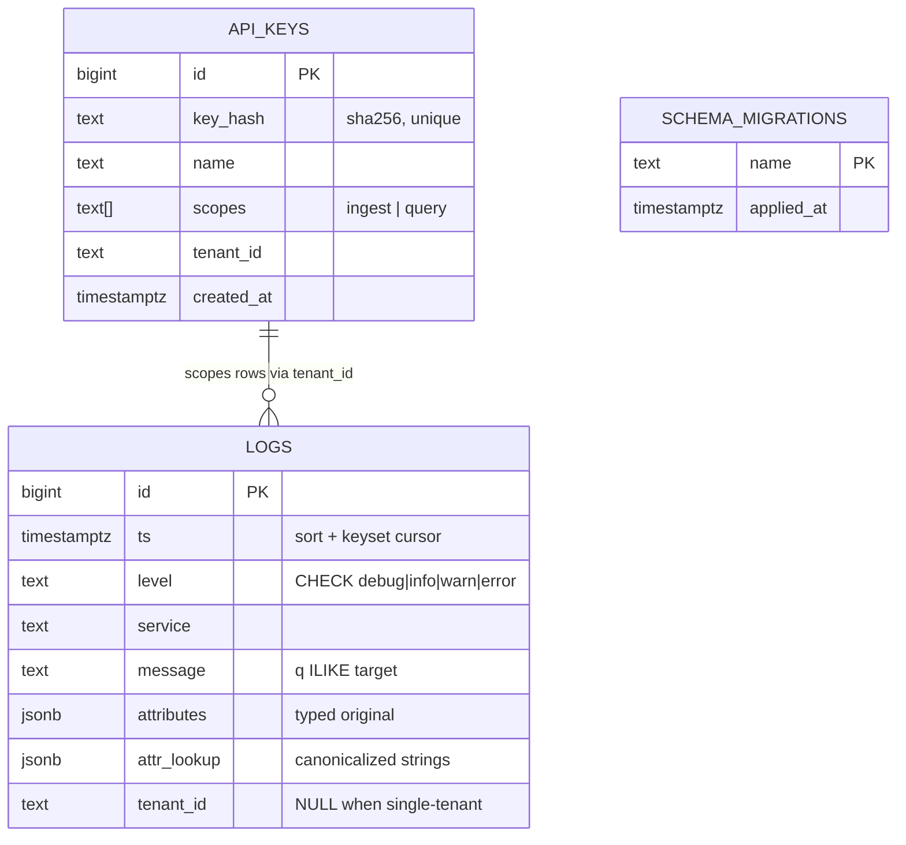
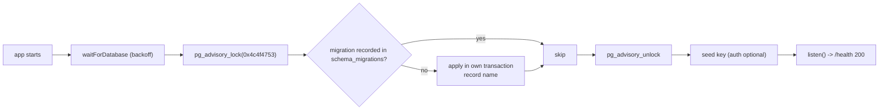

# 06. Database Schema

## Summary

The entire service stores logs in one table: `logs` with columns `id BIGSERIAL`, `ts TIMESTAMPTZ`, `level TEXT + CHECK`, `service`, `message`, `attributes JSONB` (the typed original), `attr_lookup JSONB` (a canonicalized string-valued copy), and an optional `tenant_id`. Five indexes serve the five query shapes: time+id sort/cursor, service+level+time, level+time, GIN on `attr_lookup` for attribute equality, and a partial tenant index. Schema management is embedded TypeScript migrations (`0001_init`, `0002_auth`) applied at startup under a PostgreSQL advisory lock before `/health` reports ready. At 1.2M rows the table + indexes measured 629 MB — the working set that dictated `shared_buffers=512MB`.

## Detailed explanation

### Columns

- **`id BIGSERIAL PRIMARY KEY`** — 64-bit monotonic id. It doubles as the tie-breaker in `ORDER BY ts DESC, id DESC` and in the keyset cursor, guaranteeing total order when timestamps collide (which is common at 15k/s). BIGINT (not INTEGER) because a contract-scale run already produces 1.2M rows; `INT` would cap at 2^31.
- **`ts TIMESTAMPTZ NOT NULL`** — timezone-aware timestamps. This is a deliberate choice over `TIMESTAMP`: `date_bin()`/`date_trunc()` bucketing and `::text` round-trips behave identically regardless of the session's `timezone` (the pool also pins `-c timezone=UTC` — `src/db/pool.ts:30`). Any timezone offset in the client's RFC3339 string is normalized at parse.
- **`level TEXT NOT NULL CHECK (level IN ('debug','info','warn','error'))`** — TEXT + CHECK instead of a PostgreSQL enum. Enums are stored as 4-byte oids with a catalog dependency: adding a level is an `ALTER TYPE ... ADD VALUE` that can lock and cannot run inside a transaction block in older PG versions, and they offer no performance benefit here. A CHECK constraint gives the same integrity with zero migration ceremony.
- **`service TEXT NOT NULL`, `message TEXT NOT NULL`** — plain text; `message` is the target of `q` (ILIKE substring) filters.
- **`attributes JSONB NOT NULL DEFAULT '{}'::jsonb`** — the original payload with types preserved. Returned verbatim by `GET /logs`, so `retries: 3` stays a JSON number on the way out. The entry schema guarantees values are only strings/numbers/booleans (flat), but nothing stops future schema evolution.
- **`attr_lookup JSONB NOT NULL DEFAULT '{}'::jsonb`** — the canonicalized copy: every key mapped to its value coerced to a string (nested values serialized as JSON text). Built server-side inside the INSERT (`src/services/ingestWriter.ts:58-78`), never written by the app directly. This is the column the GIN index covers and the column all `attr.<key>` filters hit.
- **`tenant_id TEXT`** (migration 0002, nullable) — NULL for the default single-tenant path; a string scopes rows to one API key's tenant. The partial index `WHERE tenant_id IS NOT NULL` means the default configuration carries **zero** tenant-index write overhead.

### Indexes and the queries they serve

| Index | Serves |
|---|---|
| `idx_logs_ts_id ON logs (ts DESC, id DESC)` | the default `ORDER BY ts DESC, id DESC` and the keyset cursor predicate `(ts < $1 OR (ts = $1 AND id < $2))` — exact match |
| `idx_logs_service_level_ts ON logs (service, level, ts DESC)` | `service=` and `service=+level=` filters via leftmost-prefix scans |
| `idx_logs_level_ts ON logs (level, ts DESC)` | `level=` filters (cannot use the previous index — `service` is the prefix) and `group_by=level` aggregates |
| `idx_logs_attr_lookup GIN (attr_lookup jsonb_path_ops)` | `attr_lookup @> '{"k":"v"}'::jsonb` equality filters — the `jsonb_path_ops` opclass is smaller and exactly as useful for `@>` |
| `idx_logs_tenant_ts (tenant_id, ts DESC) WHERE tenant_id IS NOT NULL` | tenant-scoped queries when auth/tenancy is enabled |

Ordering matters: composite btree indexes are traversed by leftmost prefix, which is why the two "filter" indexes are ordered `(filter, time)` — they can both narrow by time. The EXPLAINed cold full-window aggregate (575 ms) is an **Index Only Scan** on `idx_logs_ts_id`, confirming that even the "scan everything" query walks the index, not the heap.

### Migrations: embedded, locked, ordered

Migrations live as TypeScript strings in `src/db/migrations.ts` rather than loose `.sql` files, because the production image only ships `dist/` — an embedded migration can never be "missing at runtime" (the exact rationale in `src/db/migrations.ts:1-13`). `runMigrations` (`:98-130`) takes a dedicated connection, acquires the advisory lock `0x4c4f4753` ('LOGS'), creates `schema_migrations` if needed, then applies each pending migration in its own transaction, recording the name. The advisory lock serializes concurrent app instances (two replicas booting simultaneously) — the second sees `0001_init` already recorded and skips it. This all happens **before** `listen()`, so `/health` can't report ready mid-migration (`src/index.ts:24-26`).

`0001_init` creates the table + four indexes; `0002_auth` creates `api_keys` (SHA-256 `key_hash` unique, `scopes TEXT[]`, `tenant_id`, `created_at`) and adds the tenant column + partial index. The api_keys table is written at runtime only by seeding/lookup (`src/auth/keys.ts:27-44`), never with plaintext keys.

### Storage reality at contract scale

At 1.2M rows (5 attributes each) table+indexes measured **629 MB** (README `README.md:138`). That number drove two operational decisions: `shared_buffers=512MB` in compose (at 256 MB the index pages were read from disk on every insert — a measured bottleneck), and chunked retention deletes (dead tuples must be kept manageable, see study 13).

## Why this exists

The schema is where the contract becomes physical: attribute values must round-trip typed **and** match as strings (two JSONB columns), pagination must be stable under 15k/s inserts (ts,id key + index), aggregations must be epoch-aligned (`date_bin` on TIMESTAMPTZ), auth must be optional without taxing the default path (nullable tenant + partial index), and the whole thing must fit 1 GB. Every column and index traces to a contract line or a measured bottleneck.

## Alternatives considered

| Approach | Pros | Cons |
|---|---|---|
| One `attributes JSONB`, typed `@>` matching | Half the JSONB storage, one column | `attr.retries=3` (string) would not match number 3 — contract break; no string-canonicalization |
| Normalized `attributes(key, value)` table (EAV) | Relational purism, any type per column | JOIN per query, no GIN containment, slower inserts — wrong for 15k/s |
| PostgreSQL enum for `level` | Typed, small | Catalog lock pain on ALTER, no perf gain; CHECK is simpler and sufficient |
| Single JSONB with all values stringified | One column | Contract break: clients must get original types back |
| Time-based partitioning from day one | O(1) retention, smaller indexes | Schema complexity before the contract demands it (1M rows fits fine); noted as optimization |
| SQL files in a `migrations/` folder | Familiar tooling | The runtime image ships only `dist/`; loose SQL files would be absent in prod unless copied — embedded strings remove the class of bug |
| **Chosen: double-JSONB + TEXT+CHECK + ts-id keyset index + embedded locked migrations** | Matches every contract line, one table, testable | Duplicated JSONB cost (~storage), migration approach less conventional |

## Why this was chosen

The double-JSONB strategy exists because the contract's two attribute requirements (typed round-trip on read, string comparison on filter) are incompatible in a single column — the README states this explicitly (`README.md:113-121`). TEXT+CHECK over enum is the low-ceremony choice for a 4-value domain with no migration history. The `(ts DESC, id DESC)` index is not optional polish: it is the keyset cursor's execution plan, and the default query order, and the aggregate's index-only scan — one index, three jobs. Embedded migrations were chosen because the production image contains only `dist/` (the compile step would catch a missing migration as a type error — a whole failure class removed), and the advisory lock because the startup sequence can race when two instances boot. Tenant as a nullable column with a partial index was chosen so the *default* configuration pays no tenant overhead — zero write cost in the graded configuration, full scoping when enabled (proven by the auth integration tests).

## Advantages / Disadvantages / Trade-offs

### Advantages

- One table, five indexes, zero joins — the whole query surface is a single scan/filter plan.
- `attr_lookup` canonicalization is idempotent and testable in SQL (see study 07).
- Embedded migrations can't go missing and are type-checked; advisory locking makes startup race-safe.
- Partial tenant index keeps the default path free of tenancy costs.

### Disadvantages

- JSONB duplication: `attr_lookup` roughly doubles the attribute storage volume (part of the 629 MB).
- No full-text index: `q` is an ILIKE scan (acceptable at the contract's scale, documented limitation).
- CHECK constraints on TEXT don't carry a compact oid representation; the column stores the full string per row (4 distinct values — trivially compressible in the toast/heap, but it's a theoretical saving vs enum).

### Trade-offs

- Write amplification (5 indexes per insert, ~72-80 ms per chunk) vs. read speed — the measured profile shows index maintenance *dominates* insert cost, which is exactly why chunking is the throughput lever (study 07).
- `shared_buffers=512MB` sacrifices half the 1 GB for cache to serve the 629 MB working set — measured to fix disk-reads-on-insert.
- No partitioning now vs. the documented O(1)-retention alternative when data outgrows RAM.

## Code

The complete `0001_init` migration (`src/db/migrations.ts:22-61`):

```sql
CREATE TABLE IF NOT EXISTS logs (
  id          BIGSERIAL PRIMARY KEY,
  ts          TIMESTAMPTZ NOT NULL,
  level       TEXT NOT NULL CHECK (level IN ('debug', 'info', 'warn', 'error')),
  service     TEXT NOT NULL,
  message     TEXT NOT NULL,
  attributes  JSONB NOT NULL DEFAULT '{}'::jsonb,
  attr_lookup JSONB NOT NULL DEFAULT '{}'::jsonb
);

CREATE INDEX IF NOT EXISTS idx_logs_ts_id
  ON logs (ts DESC, id DESC);

CREATE INDEX IF NOT EXISTS idx_logs_service_level_ts
  ON logs (service, level, ts DESC);

CREATE INDEX IF NOT EXISTS idx_logs_level_ts
  ON logs (level, ts DESC);

CREATE INDEX IF NOT EXISTS idx_logs_attr_lookup
  ON logs USING GIN (attr_lookup jsonb_path_ops);
```

`0002_auth` adds the optional tenancy and API keys (`src/db/migrations.ts:65-84`):

```sql
CREATE TABLE IF NOT EXISTS api_keys (
  id         BIGSERIAL PRIMARY KEY,
  key_hash   TEXT NOT NULL UNIQUE,
  name       TEXT NOT NULL,
  scopes     TEXT[] NOT NULL DEFAULT ARRAY['ingest', 'query'],
  tenant_id  TEXT,
  created_at TIMESTAMPTZ NOT NULL DEFAULT now()
);

ALTER TABLE logs ADD COLUMN IF NOT EXISTS tenant_id TEXT;
CREATE INDEX IF NOT EXISTS idx_logs_tenant_ts
  ON logs (tenant_id, ts DESC) WHERE tenant_id IS NOT NULL;
```

The advisory-locked runner (`src/db/migrations.ts:98-130`):

```ts
export async function runMigrations(pool: import("pg").Pool): Promise<void> {
  const client = await pool.connect();
  try {
    await client.query("SELECT pg_advisory_lock($1)", [MIGRATION_LOCK_KEY]); // 0x4c4f4753
    await client.query(`CREATE TABLE IF NOT EXISTS schema_migrations (...)`)...
    for (const migration of MIGRATIONS) {
      const existing = await client.query("SELECT 1 FROM schema_migrations WHERE name = $1", [migration.name]);
      if (existing.rowCount) continue;
      await client.query("BEGIN");
      try {
        await client.query(migration.sql);
        await client.query("INSERT INTO schema_migrations (name) VALUES ($1)", [migration.name]);
        await client.query("COMMIT");
      } catch (err) {
        await client.query("ROLLBACK");
        throw err;
      }
    }
  } finally {
    await client.query("SELECT pg_advisory_unlock($1)", [MIGRATION_LOCK_KEY]).catch(() => {});
    client.release();
  }
}
```

## Diagrams





## Common mistakes

- **Enums for small closed domains**: the project explicitly rejected PG enums for `level` — `ALTER TYPE ... ADD VALUE` can lock, can't run in some transaction contexts, and gives no performance benefit over TEXT+CHECK.
- **Indexes that don't match the query's ORDER BY**: the cursor predicate `(ts, id)` needs `(ts DESC, id DESC)` exactly; an index on `(ts)` alone would leave the tie-break as a sort.
- **GIN opclass confusion**: `jsonb_ops` indexes all keys+values but is larger; `jsonb_path_ops` is the right choice for the `@>` operator we use (and the migration comment says so — `src/db/migrations.ts:57-60`).
- **Forgetting `IF NOT EXISTS` + idempotent migrations**: migrations must be re-runnable after a partial boot failure; every statement here is guarded, and the runner records applied names.
- **shared_buffers below the working set**: at 256 MB the 629 MB working set read index pages from disk per insert (a measured bottleneck) — the compose file sets 512 MB for this exact reason.
- **Retention deleting in one giant statement**: leaves enormous dead-tuple bloat and blocks writers; the chunked `ctid ... LIMIT` approach exists to avoid it (study 13).

## Optimization ideas

- **Time-based partitioning** (e.g. daily `ts` ranges) + `DROP PARTITION` for O(1) retention and smaller per-partition indexes.
- `BRIN` index on `ts` for very large tables where btree size becomes the problem.
- Columnar storage extension (e.g. `pg_paradedb`/columnar engines) if analytics outgrow the heap model — a step toward ClickHouse semantics without leaving PG.
- Covering indexes (INCLUDE columns) to make the list query's index-only scan fully index-only with `message`/`attributes` excluded.
- `storage` tuning: `level`/`service` as `TEXT` with dedicated compression is fine; consider `EXTENDED`/`EXTERNAL` for large messages.

## Interview questions & answers

1. **Q: Why two JSONB columns instead of one?** A: The contract requires typed values on read and string equality on filter. `attributes` preserves types; `attr_lookup` holds string-canonicalized values for `@>` matching — one column cannot serve both semantics without coercion errors at one of the ends.
2. **Q: Why TEXT with a CHECK instead of an enum?** A: Same integrity, zero catalog ceremony; PG enums are hard to extend safely and no faster for equality on 4 values.
3. **Q: What does the `(ts DESC, id DESC)` index serve?** A: Three jobs: the default `ORDER BY ts DESC, id DESC`, the keyset cursor predicate `(ts < $1 OR (ts = $1 AND id < $2))`, and the aggregate's index-only scan.
4. **Q: Why is the tenant index partial?** A: `WHERE tenant_id IS NOT NULL` means the default single-tenant configuration keeps no tenant index at all — zero write overhead — while tenant mode still gets indexed scoping.
5. **Q: How are migrations protected against concurrent boots?** A: `pg_advisory_lock(0x4c4f4753)` serializes runners; each migration is recorded in `schema_migrations` inside its own transaction, so the second instance skips applied ones.
6. **Q: Why embed migrations in TypeScript instead of .sql files?** A: The runtime image ships only `dist/`; embedded strings are type-checked at compile time and can never be missing at runtime — one whole class of prod failures removed for a 2-migration project.
7. **Q: What made shared_buffers=512MB necessary?** A: The measured 629 MB working set (1.2M rows) exceeded 256 MB, so index pages were read from disk on every insert; 512 MB keeps the working set cached on the 1 GB container.
8. **Q: Where does the 629 MB come from?** A: 1.2M rows × (two JSONB columns with 5 attributes each + text columns + 5 index entries per row) — the JSONB duplication is the deliberate price of the double-JSONB strategy.
9. **Q: Why `BIGSERIAL` and not `SERIAL`?** A: Contract-scale data reaches 1.2M rows in 80 s; `SERIAL` (32-bit) caps at ~2.1B rows — reachable at this rate in days — and the id doubles as the cursor tie-breaker, so it must be exact and 64-bit-safe.
10. **Q: How would you migrate this schema to partitioned tables?** A: Add a partitioning key on `ts`, create a default partition for future data, `ATTACH PARTITION` historical ranges, and route retention through `DROP PARTITION` — while keeping the ts-id index per partition for the cursor.

## Implementation references

- `../src/db/migrations.ts:20-62` — `0001_init` (table + 4 indexes)
- `../src/db/migrations.ts:64-85` — `0002_auth` (api_keys, tenant_id, partial index)
- `../src/db/migrations.ts:88-130` — advisory lock, schema_migrations, runner
- `../src/services/ingestWriter.ts:58-78` — INSERT that populates `attr_lookup`
- `../src/lib/queryParams.ts:208-211` — GIN containment filter
- `../src/lib/queryParams.ts:219-225` — keyset cursor predicate
- `../src/lib/queryParams.ts:289-296` — `date_bin` aggregation over the schema
- `../docker-compose.yml:17-29` — the `-c` flags tuned for this schema
- `../README.md:90-121` — schema + double-JSONB rationale
- `../README.md:138` — 629 MB measured storage
