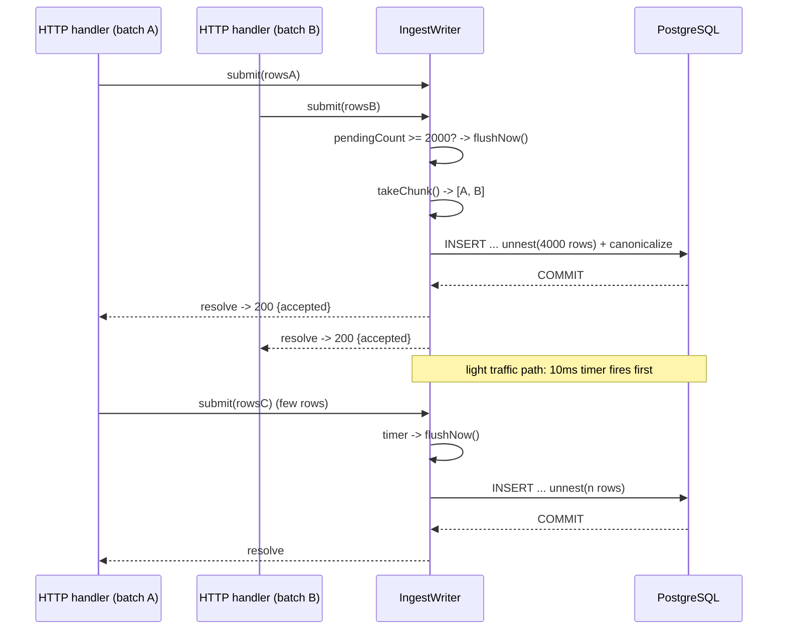
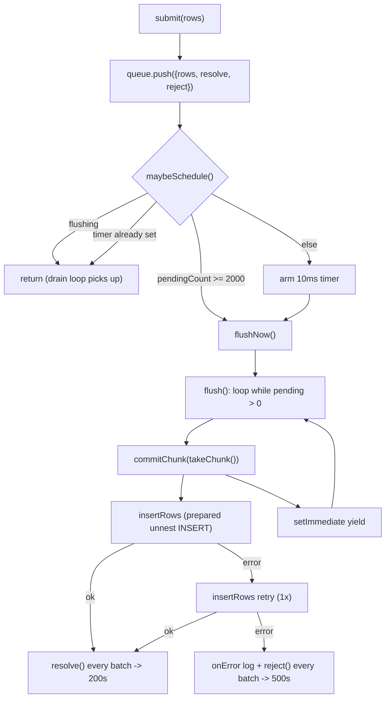

# 07. Ingestion Coalescing Writer

## Summary

The coalescing writer is the single most important throughput decision in the project. Instead of each HTTP request issuing its own INSERT, every accepted batch is pushed into a shared in-memory queue (`PendingBatch[]`), and one serial writer drains the queue into large `INSERT ... SELECT * FROM unnest(...)` statements that coalesce thousands of rows from many concurrent requests into one transaction. The flush trigger is **size-first**: a full target chunk (2000 rows, `INGEST_MAX_ROWS_PER_FLUSH`) flushes immediately; a 10 ms wait timer (`INGEST_MAX_FLUSH_WAIT_MS`) only fires for light traffic. A request's promise resolves only after PostgreSQL acknowledges the commit, so a 200 still means "durable" — but the measured cost profile (500 rows ≈ 72 ms vs 2000 rows ≈ 80 ms, because index maintenance dominates) means 4x the rows costs almost nothing extra. The `attr_lookup` canonicalization column is also derived server-side in the same SQL statement, offloading CPU from the saturated app to the database.

## Detailed explanation

### Why per-request INSERTs fail at this scale

If each `POST /logs` executed its own INSERT, throughput would be hostage to the client's batch size: with batch=1 the DB sees thousands of tiny statements per second, each paying the same index-write costs on **five indexes** as a 2000-row statement. The measured profile is explicit: 500 rows ≈ 72 ms, 2000 rows ≈ 80 ms — index maintenance dominates, not row count. So per-statement overhead — not per-row cost — is what must be amortized: as few, as large statements as possible, regardless of client batch size.

### The design, line by line

**Data structures.** `IngestRow` is the validated, DB-ready row (`src/services/ingestWriter.ts:35-42`); `PendingBatch` wraps rows with a `resolve`/`reject` pair so the writer settles each request independently (`:44-48`). The queue is a plain array — Node's single-threaded event loop makes the push/shift critical sections safe without locks.

**The INSERT.** `INSERT_SQL` (`:58-78`) is constant SQL text, so node-pg reuses the server-side prepared statement. It inserts six parallel arrays via `unnest` and derives `attr_lookup` in the same statement:

```sql
INSERT INTO logs (ts, level, service, message, attributes, attr_lookup, tenant_id)
SELECT u.ts, u.level, u.service, u.message, u.attrs, lk.lookup, u.tenant
FROM unnest(
  $1::timestamptz[], $2::text[], $3::text[], $4::text[],
  $5::jsonb[], $6::text[]
) AS u(ts, level, service, message, attrs, tenant)
CROSS JOIN LATERAL (
  SELECT COALESCE(
    jsonb_object_agg(
      e.key,
      CASE WHEN jsonb_typeof(e.value) IN ('object', 'array')
           THEN e.value::text
           ELSE e.value #>> '{}'
      END
    ),
    '{}'::jsonb
  ) AS lookup
  FROM jsonb_each(u.attrs) AS e(key, value)
) lk
```

Semantics mirror the contract exactly: scalar values become their string form (`3` → `'3'`, `true` → `'true'`) via `#>> '{}'`; nested values (validation forbids them today; the CASE keeps the column format stable) are serialized via `::text`; empty attributes produce `'{}'` through `COALESCE`. Moving this derivation off the app matters: PG has idle CPU in the 0.5/1 split, so the second stringify per row is effectively free there — the measured final push from ~98% app CPU to a clean 15k/s (README `README.md:159`).

**Scheduling — size-first.** `submit()` pushes the batch and calls `maybeSchedule()` (`:98-103`). `maybeSchedule` (`:115-127`) implements the state machine:

- if flushing → return (the drain loop picks up new rows);
- if `pendingCount >= maxRowsPerFlush` (2000) → flush immediately;
- otherwise, if no timer is pending → arm a `maxFlushWaitMs` (10 ms) timer that flushes whatever accumulated (unref'd, so it never keeps the process alive).

This fixes the project's second bottleneck: a pure timer-based flush emitted ~500-row chunks at ~72 ms each, capping the writer at ~7k/s. Size-first flushing guarantees that under load every statement is a full 2000-row chunk (~80 ms, ~25k rows/s serial ceiling), so throughput is *independent of the client's batch size* — a batch=1 client and a batch=1000 client both feed the same big statements.

**The drain loop.** `flushNow()` sets `flushing = true` and runs `flush()` asynchronously (`:129-138`). `flush()` loops `while (pendingCount > 0)`: `takeChunk()` then `commitChunk()` then `setImmediate` yields (`:142-148`) so queries and health stay responsive between chunks. `takeChunk()` (`:154-165`) pops batches while the running total stays under the target — with the deliberate rule that a single oversized request (larger than the target) still flushes alone; there is no `await` between the emptiness check and the `shift()`s, so no interleaving hazard. A `finally` re-checks `pendingCount` so a submit racing the state flip still gets flushed (`:131-137`).

**Commit and durability.** `commitChunk` (`:167-184`) is where semantics are set in stone: try `insertRows`; on success, `resolve()` every batch in the chunk (each request wakes up and returns 200); on failure, retry once (transient blips), then `reject()` every batch in the chunk and log via `onError`. Rows are never acknowledged early — failure surfaces as request errors (Fastify 500), never a silent 200. Because `resolve()` happens after PG's commit acknowledgment, durability is identical to per-request INSERTs while throughput is ~5x higher at the same durability level.

**The write pool.** The writer uses its own dedicated pool of 2 connections (`PG_WRITE_POOL_MAX`, `src/db/pool.ts:42-55`) — the fix for the measured bottleneck where slow aggregates held all 10 read connections and the writer's acquire timed out at 5 s. With a dedicated pool, ingestion latency is independent of query load.

**Latency model.** A request waits at most one flush cycle: time to fill the chunk plus insert time (~80 ms under load). The measured run: p50 65 ms / p95 380 ms / p99 668 ms at exactly 15k/s, 0 rejects — well inside the "queryable < 20 s" contract (visibility equals ingest latency: rows are committed before the 200).

### The abandoned alternative: parallel workers

An earlier design used parallel workers with per-worker queues and hit a **double-decrement race** in shared pending-count accounting — a bug class that only manifests under load. Abandoned for the serial loop: provably race-free, with ~60% headroom over the 15k/s target. Serialism was the simpler design that still wins.

## Why this exists

The contract's 15k logs/s on 0.5 CPU / 1 CPU is achievable only if the cost per *statement* is amortized over thousands of rows. The writer exists to decouple the service's throughput from the client's batching behavior, to keep the durability contract (200 = committed) intact, and to keep the app's memory and CPU bounded under bursty traffic. Without it, the DB would be drowned in tiny statements and the app would be drowned in per-request round-trips.

## Alternatives considered

| Approach | Pros | Cons |
|---|---|---|
| Per-request multi-row INSERT | Simple, obvious | Throughput = client batch size; batch=1 means ~15k tiny statements/s, each paying 5-index maintenance |
| Timer-only flush (10 ms) | Simple trigger | Measured: ~500-row chunks at 72 ms each → ~7k/s ceiling, below target |
| Parallel writer workers (sharded queues) | Horizontal write parallelism | Double-decrement accounting race under load (hit for real), complexity, no need — serial ceiling is 25k/s |
| COPY protocol (`pg-copy-streams`) | Fastest bulk path | Streaming protocol doesn't return row counts the same way; still want buffering; extra dependency |
| Message broker in front (Kafka) | Decouples producers, replay | Extra container + ops, latency, far beyond resource caps and contract |
| `INSERT INTO ... VALUES (...), (...)` built per chunk | Standard | Constant-SQL `unnest` version reuses prepared statements and needs no SQL assembly per chunk |
| **Chosen: shared queue + single serial writer + size-first trigger + unnest INSERT** | Race-free by construction, batch-size independent, measured 15k/s with headroom | Single writer = serialized commit path (fine at this rate); in-memory queue lost on hard crash |

## Why this was chosen

Every alternative was eliminated by a measured number or a contract line. Timer-only flushing *was* measured and failed (7k/s). Parallel workers were tried and produced a real race that would have eaten days of debugging. COPY adds a dependency without improving the binding constraint — index maintenance, not row transport, dominates the 72→80 ms profile. A broker is infrastructure theater at 15k/s into one table. The serial size-first writer is the simplest design that satisfies the durability contract exactly (resolve-after-commit), is race-free by construction (single consumer, no shared counters), and measured 15k/s sustained with ~60% serial headroom. The dedicated write pool removes the only realistic deadlock (writer starved by readers). This is the rare case where the correct answer is also the simplest one.

## Advantages / Disadvantages / Trade-offs

### Advantages

- Throughput independent of client batch size (batch=1 and batch=1000 feed the same 2000-row statements).
- Durability semantics identical to per-request inserts (resolve only after commit).
- Bounded memory: buffer size is bounded by in-flight requests (the load generator caps at 50); a full chunk is ~2000 rows × ~200 B ≈ 400 KB.
- Constant SQL text → prepared statement reuse, no per-chunk query parsing.
- Single serial consumer is provably race-free; the drain loop yields (`setImmediate`) so queries stay responsive between chunks.

### Disadvantages

- Serial commit path: all chunks go through one connection; the ceiling is the single-insert throughput (~25k rows/s) — plenty for the contract, a ceiling forever after.
- In-memory queue: on a hard crash, buffered rows are lost (no 200 was sent, so clients can retry — at-least-once on the client side).
- One retry per chunk is coarse: a chunk with 2000 rows fails and retries as a whole; a single poison row (e.g. a PG-format edge case) fails the whole chunk twice and rejects all requests in it.

### Trade-offs

- Latency vs. durability: the 200 waits for commit, so a request can sit in the buffer for up to one flush cycle; the contract's visibility target (< 20 s) is met with p95 380 ms — a bargain.
- App CPU vs. DB CPU: canonicalization moved into SQL because PG had headroom and the app didn't — the app still pays one `JSON.stringify` per row.
- Memory vs. throughput: bigger target chunks (e.g. 5000) would improve throughput slightly but increase worst-case flush latency and buffer memory; 2000 was chosen at the measured sweet spot.

## Code

The scheduling state machine — size-first, timer fallback (`src/services/ingestWriter.ts:115-127`):

```ts
private maybeSchedule(): void {
  if (this.flushing) return;
  if (this.pendingCount >= this.opts.maxRowsPerFlush) {
    this.flushNow();
    return;
  }
  if (this.flushTimer !== null) return;
  this.flushTimer = setTimeout(() => {
    this.flushTimer = null;
    if (!this.flushing && this.pendingCount > 0) this.flushNow();
  }, this.opts.maxFlushWaitMs);
  this.flushTimer.unref?.();
}
```

The drain loop with the yield between chunks (`src/services/ingestWriter.ts:142-148`):

```ts
private async flush(): Promise<void> {
  while (this.pendingCount > 0) {
    await this.commitChunk(this.takeChunk());
    // Yield between chunks so queries/health stay responsive.
    await new Promise((r) => setImmediate(r));
  }
}
```

Chunk assembly with the single-oversized-request rule (`src/services/ingestWriter.ts:154-165`):

```ts
private takeChunk(): PendingBatch[] {
  const chunk: PendingBatch[] = [];
  let rows = 0;
  while (this.queue.length > 0) {
    const next = this.queue[0]!;
    if (chunk.length > 0 && rows + next.rows.length > this.opts.maxRowsPerFlush) break;
    this.queue.shift();
    chunk.push(next);
    rows += next.rows.length;
  }
  return chunk;
}
```

Commit with exactly-one retry and all-or-nothing resolution (`src/services/ingestWriter.ts:167-184`):

```ts
private async commitChunk(chunk: PendingBatch[]): Promise<void> {
  const allRows = chunk.flatMap((b) => b.rows);
  try {
    await this.insertRows(allRows);
    for (const batch of chunk) batch.resolve();
  } catch {
    // One retry for transient failures (e.g. connection blip), then
    // fail every request in the chunk — never a silent success.
    try {
      await this.insertRows(allRows);
      for (const batch of chunk) batch.resolve();
    } catch (finalErr) {
      const error = finalErr instanceof Error ? finalErr : new Error(String(finalErr));
      this.opts.onError?.(error, allRows.length);
      for (const batch of chunk) batch.reject(error);
    }
  }
}
```

The parallel-array encoding that feeds `unnest` (`src/services/ingestWriter.ts:190-210`):

```ts
private async insertRows(rows: IngestRow[]): Promise<void> {
  if (rows.length === 0) return;
  const ts = new Array<string>(rows.length);
  const levels = new Array<string>(rows.length);
  ... // services, messages, attributes, tenants
  for (let i = 0; i < rows.length; i++) {
    const row = rows[i]!;
    ts[i] = row.timestamp.toISOString();
    levels[i] = row.level;
    services[i] = row.service;
    messages[i] = row.message;
    attributes[i] = JSON.stringify(row.attributes);
    tenants[i] = row.tenantId;
  }
  await this.pool.query(INSERT_SQL, [ts, levels, services, messages, attributes, tenants]);
}
```

And the factory wiring the config knobs (`src/services/ingestWriter.ts:228-233`):

```ts
export function createWriter(pool: Pool, config: Config): IngestWriter {
  return new IngestWriter(pool, {
    maxFlushWaitMs: config.ingestMaxFlushWaitMs,
    maxRowsPerFlush: config.ingestMaxRowsPerFlush,
    onError: (err, rows) => console.error(`[ingest] flush of ${rows} rows failed: ${err.message}`),
  });
}
```

## Diagrams





## Common mistakes

- **Timer-only flushing** (hit in this project): 10 ms timer + ~500-row chunks at 72 ms each capped the writer at ~7k/s. Size-first flushing is the fix — measured 5.1k → 15k/s (README `README.md:157`).
- **Shared read/write pool** (hit): slow aggregates held all 10 pool clients; the writer's acquire timed out at 5 s and chunks failed with 500s. Fix: dedicated 2-connection write pool.
- **Unbounded client concurrency** (hit): hundreds of concurrent batches pinned the 256 MB app, GC stalled the loop, latency hit 13 s. The writer's buffer is bounded only by in-flight requests — cap the client.
- **Parallel-worker accounting race** (hit): a double-decrement on shared pending-count state in the abandoned parallel design corrupted chunk assembly under load; the serial loop makes this class of bug impossible.
- **Resolving before commit**: a writer that resolves requests after `pg.query()` enqueues, not after the result, silently turns 200s into "maybe durable" — the resolve sits in the `try` after the awaited insert for a reason.
- **Reconstructing SQL per chunk**: dynamic `VALUES (...), (...)` strings defeat prepared-statement reuse and add per-chunk parse cost; the constant `unnest` statement is the right shape.
- **Building `attr_lookup` in the app**: doubles per-row stringify on the CPU-saturated app; moving it into SQL was the measured final bottleneck fix.

## Optimization ideas

- **COPY protocol**: stream chunk payloads with `COPY logs FROM STDIN` for a further multiplier once insert transport (not index maintenance) becomes the binding constraint.
- **Multi-batch commit grouping**: commit every N chunks together when the contract can tolerate slightly higher visibility latency.
- **Backpressure signaling**: expose `pendingCount` to the router and reject with `429` when the buffer exceeds a bound, replacing implicit memory-bounding with an explicit policy.
- **Rollup tables**: the writer is the natural place to maintain per-service/level/minute counters so aggregates stop scanning (the README's documented escape hatch).
- **Shard by tenant later**: N serial writers on N write connections, each with its own queue, is the clean path from serial to parallel when the serial ceiling is hit.

## Interview questions & answers

1. **Q: Why is chunk size the throughput lever and not connection count or parallelism?** A: Measured: 500 rows ≈ 72 ms, 2000 rows ≈ 80 ms — index maintenance on five indexes dominates insert cost, so per-statement overhead is almost flat while row count varies 4x. The lever is amortization: fewer, larger statements. Parallelism only helps when the serial writer saturates (25k/s ceiling vs 15k/s target — it doesn't).
2. **Q: How does a request know its rows were committed?** A: `submit()` returns a promise that the writer resolves only after the INSERT's result is returned by PG (commit acknowledgment); the HTTP handler awaits it before sending 200 (`src/routes/logs.ts:92`). 200 never means "queued".
3. **Q: What happens on a failed INSERT?** A: One automatic retry per chunk; if both fail, every request whose rows are in that chunk is rejected with the error (surfacing as 500s) and `onError` logs it. Never a silent success, never partial acknowledgement.
4. **Q: Why size-first rather than timer-first?** A: A timer that flushes "whatever is there" emits small chunks under load (the measured 7k/s failure); size-first guarantees full chunks exactly when it matters (under load), and the timer remains only as the light-traffic lower bound on latency.
5. **Q: How is `attr_lookup` derived and why in SQL?** A: `jsonb_each` + `jsonb_object_agg` with a `CASE` canonicalizing scalars to strings (`#>> '{}'`) and nested values to JSON text (`::text`). In SQL because the app was the CPU bottleneck at 0.5 CPU while PG had headroom — the same work the app would otherwise do with a second `JSON.stringify` per row.
6. **Q: Is this at-least-once or exactly-once?** A: At-least-once at the client: the buffer is in memory, so a hard crash loses uncommitted rows — but no 200 was sent for them, so a retrying client reproduces them. Exactly-once would require idempotency keys and dedup, which the contract doesn't ask for.
7. **Q: Why a dedicated write pool of 2?** A: So ingestion latency is independent of query load: a slow aggregate can occupy all 10 read connections without the writer waiting on `acquire` (the real 5 s-timeout failure that motivated it). 2 connections is enough for one serial writer plus a spare.
8. **Q: What bounds the writer's memory?** A: The queue length is bounded by in-flight requests (client concurrency) times batch size. The load generator caps in-flight at 50; a full chunk is ~2000 × ~200 B ≈ 400 KB. Explicit backpressure (429 on buffer depth) is the documented enhancement.
9. **Q: Why is the flush timer `unref()`ed?** A: So a pending timer never keeps the Node process alive during graceful shutdown — `end()` also clears it (`:218-224`), but unref is the safety net for tests and CI that create and destroy writers.
10. **Q: When would the serial writer become the bottleneck, and what then?** A: At ~25k rows/s sustained serial throughput. Options in order: raise chunk size toward 5000 (diminishing returns, latency cost), move to COPY, then multiple writers with per-shard queues — the parallel design this project deliberately skipped until needed.
11. **Q: Why does the drain loop yield with `setImmediate` between chunks?** A: So queries, health checks, and new submissions interleave between INSERTs — a continuous flush loop would otherwise monopolize the event loop and inflate read latency during a 15k/s burst.
12. **Q: What does "measured 5.1k → 15k/s" refer to?** A: The improvement from switching the flush trigger to size-first: at 2000-row chunks the serial writer sustains ~25k rows/s; the client's 15k/s target became achievable, and the contract run measured exactly 15,000 logs/s for 80 s with 0 rejects.

## Implementation references

- `../src/services/ingestWriter.ts:6-33` — design rationale comment (the whole argument in prose)
- `../src/services/ingestWriter.ts:35-48` — `IngestRow` / `PendingBatch` types
- `../src/services/ingestWriter.ts:58-78` — `INSERT_SQL` with server-side canonicalization
- `../src/services/ingestWriter.ts:98-103` — `submit` (promise per request)
- `../src/services/ingestWriter.ts:115-127` — size-first `maybeSchedule`
- `../src/services/ingestWriter.ts:129-148` — flush loop with setImmediate yields
- `../src/services/ingestWriter.ts:154-165` — `takeChunk` chunk assembly
- `../src/services/ingestWriter.ts:167-184` — one retry, all-or-nothing resolve/reject
- `../src/services/ingestWriter.ts:190-210` — parallel-array encoding + prepared statement
- `../src/services/ingestWriter.ts:228-233` — `createWriter` config wiring
- `../src/db/pool.ts:42-55` — dedicated write pool
- `../src/config.ts:45-56` — `PG_WRITE_POOL_MAX`, `INGEST_MAX_ROWS_PER_FLUSH`, `INGEST_MAX_FLUSH_WAIT_MS`
- `../src/routes/logs.ts:90-94` — handler awaits writer before 200
- `../README.md:122-130` — ingestion pipeline summary
- `../README.md:154-160` — the five measured bottlenecks (two directly about this writer)
