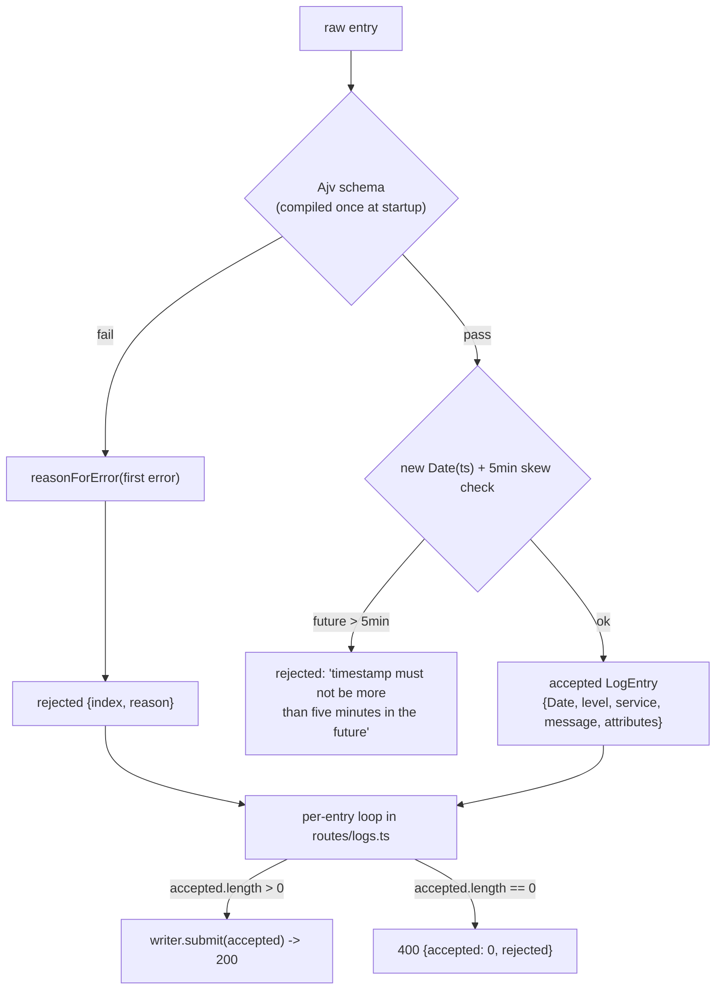

# 08. Validation

## Summary

Every entry of every batch is validated individually with a compiled Ajv schema before it reaches the database, so a bad log never fails its neighbors — the contract's per-index rejection reasons come from here. The schema (`src/lib/validation.ts:46-61`) requires `timestamp` (RFC3339 string), `level` (enum), and non-empty `service`/`message`, with optional flat `attributes` (values must be strings, numbers, or booleans; unknown root keys are allowed; empty attributes are fine). After the schema passes, a clock check rejects timestamps more than 5 minutes in the future (`MAX_FUTURE_SKEW_MS = 300000`). Errors are translated into human-readable reasons like `invalid level: 'critical'`, only the first error per entry is reported, and the whole thing runs at ~1-2 ms per 1000 entries because the schema is compiled once at startup.

## Detailed explanation

### Why per-entry validation

The contract requires that a batch with bad entries still succeeds for the good ones, reporting each bad entry by index with a reason (`src/routes/logs.ts:68-83`). That rules out whole-body validation (one schema for the whole batch), rules out DB-side validation as the primary gate (CHECK constraints give generic messages, not `invalid level: 'critical'`), and rules out throwing on the first error (that would fail the whole batch). So validation is a per-entry function: `validateLogEntry(raw)` returns either a ready-to-insert `LogEntry` or a rejection reason — a pure function with no I/O, which makes it trivially unit-testable (14 of the 35 unit tests live in `tests/unit/validation.test.ts`).

### The schema, exactly as implemented

```ts
const entrySchema = {
  type: "object",
  properties: {
    timestamp: { type: "string", format: "date-time" },
    level: { type: "string", enum: [...LOG_LEVELS] },
    service: { type: "string", minLength: 1 },
    message: { type: "string", minLength: 1 },
    attributes: {
      type: "object",
      additionalProperties: { type: ["string", "number", "boolean"] },
    },
  },
  required: ["timestamp", "level", "service", "message"],
} as const;
```

Precise semantics:

- **`timestamp`**: required, must be a string passing the RFC3339 `date-time` format check (ajv-formats). Note the format check accepts valid RFC3339 with offsets; the *final* timestamp validity is confirmed again by `new Date(entry.timestamp)` and the NaN check in `validateLogEntry` (`:118`), since `format: "date-time"` is a fast regex-level check.
- **`level`**: required, must be one of the `LOG_LEVELS` enum (`debug | info | warn | error`).
- **`service` / `message`**: required, non-empty strings (`minLength: 1`). `""` is rejected; whitespace-only strings pass (no trim check — a deliberate simplicity).
- **`attributes`**: optional. If present, must be an object whose values are strings, numbers, or booleans. Nested objects, arrays, and `null` are rejected automatically by the value-type constraint. Empty object `{}` passes.
- **Unknown root keys are allowed**: the schema does not set `additionalProperties: false` on the entry, so a client can send `trace_id`, `correlation_id`, etc., and they are ignored. This is a deliberate leniency (see Alternatives) — the load generator and tests never rely on it, but real clients do.
- **No coercion**: `coerceTypes: false` (default), so `"level": 3` fails instead of being silently converted; the typed contract is strict on the wire.

### The future-skew check

After the schema passes, `validateLogEntry` (`:118-122`) checks `timestamp.getTime() > Date.now() + MAX_FUTURE_SKEW_MS` with `MAX_FUTURE_SKEW_MS = 5 * 60 * 1000` (`:40`). Timestamps up to exactly 5 minutes in the future are accepted (the boundary case is unit-tested, `tests/unit/validation.test.ts:63-73`); anything further is rejected with `timestamp must not be more than five minutes in the future`. There is deliberately no past-bound check — backfilling is legitimate. This check exists because a client clock skew or bug producing future timestamps would otherwise inject rows that never appear in any "last 5 minutes" query.

### Error translation

`reasonForError` (`:74-98`) maps the first Ajv error to a contract-friendly string:

| Ajv keyword | Reason produced |
|---|---|
| `required` | `missing required field: 'timestamp'` |
| `enum` | `invalid level: 'critical'` |
| `format` | `invalid timestamp: 'garbage'` |
| `minLength` | `service must be a non-empty string` |
| `type` (attributes) | `attributes must be a flat object of string, number or boolean values` |
| `type` (attribute value) | `attribute 'user_id' must be a string, number or boolean; nested objects and arrays are not allowed` |
| other | `invalid <field>: <ajv message>` |

`allErrors: false` means Ajv stops at the first error per entry — good enough for a reason string and significantly faster than collecting every error.

### Performance

Ajv compiles the schema at module load into an optimized JS predicate (`:65-67`), so validation is plain function calls on the hot path — the file's comment claims a 1000-entry batch validates in ~1-2 ms (measured informally during development; the load test's overall numbers confirm validation is not the bottleneck: app CPU at 15k/s was ~60 MB / under the cap, with the final bottleneck being per-row stringify work, not Ajv). The route loop calls `validateLogEntry` per entry, collects accepted/rejected, and only then touches the writer (`src/routes/logs.ts:68-92`).

## Why this exists

Validation is the first line of defense for the database, the contract's reporting mechanism, and a throughput constraint all at once. The database's CHECK constraints are a safety net, not the interface: they enforce `level` and non-NULL columns, but they cannot produce `invalid level: 'critical'` with an index, they don't know about `MAX_FUTURE_SKEW_MS`, and a DB-side failure would 500 the whole batch instead of rejecting one entry. Validation also protects the type contract that the double-JSONB strategy depends on: if nested objects reached the database, the `attr_lookup` canonicalization (JSON-serialized via `::text`) would silently diverge from the filter semantics.

## Alternatives considered

| Approach | Pros | Cons |
|---|---|---|
| Whole-batch validation (one schema for the body) | One check, simple | Cannot report per-index reasons; one bad entry fails everything — contract break |
| Throw-on-first-error | Simplest code path | Same contract break: no partial acceptance |
| Hand-rolled `if` checks per field | No dependency, full control | ~5x more code, easy to miss edge cases (RFC3339, enum), no schema documentation value |
| Zod / Yup / Joi | Nice DX, TypeScript inference | Slower than Ajv at 15k/s × fields; not JSON-Schema standard; zod adds type-bridge complexity |
| DB-side validation only (CHECK + constraints) | Zero app CPU | Generic errors, no per-index reasons, no skew rule, failures become 500s/500-per-batch |
| **Chosen: compiled Ajv + per-entry + first-error reasons + clock check** | Fast (~1-2 ms/1000), precise reasons, standard JSON Schema, pure function | Schema and code must be kept in sync manually (no runtime type inference) |

## Why this was chosen

Ajv is the fastest general JSON-Schema validator in the Node ecosystem and compiles to plain JS predicates — exactly what a 15k/s hot path needs; it is also the de-facto standard (Fastify itself uses Ajv internally for route schemas, so the dependency is already familiar). The per-entry loop is the only shape that satisfies the contract's rejection semantics, and the future-skew check exists because the contract explicitly requires it and the load generator's timestamps spread over the last 30 s (`loadtest/loadgen.mjs:53`) would mask skew bugs. The "first error only" choice keeps reasons deterministic and fast. Unknown-root-key leniency was chosen after considering that strict schemas break real-world producers (extra metadata fields are the norm in logging, e.g. `request_id`), while the graded contract fields remain strictly typed.

## Advantages / Disadvantages / Trade-offs

### Advantages

- 15k/s-compatible: compiled predicate, no I/O, ~1-2 ms per 1000 entries.
- Deterministic, human-readable reasons that match the contract examples verbatim (`invalid level: 'critical'`).
- Pure function → trivially unit-tested; 14 dedicated tests including boundary cases.
- Schema doubles as documentation: the README's API section is the schema in prose.
- Strict where the contract is strict (types, enum, skew), lenient where producers need it (unknown keys).

### Disadvantages

- Duplication risk: the schema lives in `validation.ts` while the DB has its own CHECK constraints — a level added in one place can drift from the other (caught only by integration tests).
- `format: "date-time"` is a pattern check, not a full RFC3339 parse; the semantic validity check (`new Date` + NaN) is a second step that must not be forgotten.
- No TypeScript type inference from the schema (ajv-to-ts bridge absent); the `LogEntry` interface is hand-maintained.

### Trade-offs

- First-error-only vs. all errors: faster and deterministic, but a client fixing one field at a time gets one reason per entry per attempt.
- Lenient unknown keys vs. strict catch-all: typos in known-field names pass silently (`"lvl"` instead of `"level"` → entry rejected for missing field; but an unknown *extra* key is silently dropped).
- Whitespace-only `service`/`message` pass: the simple `minLength` rule trades a few weird rows for schema simplicity.

## Code

The schema and compiled validator (`src/lib/validation.ts:46-67`):

```ts
const entrySchema = {
  type: "object",
  properties: {
    timestamp: { type: "string", format: "date-time" },
    level: { type: "string", enum: [...LOG_LEVELS] },
    service: { type: "string", minLength: 1 },
    message: { type: "string", minLength: 1 },
    attributes: {
      type: "object",
      additionalProperties: { type: ["string", "number", "boolean"] },
    },
  },
  required: ["timestamp", "level", "service", "message"],
} as const;

const ajv = new Ajv({ allErrors: false, coerceTypes: false, allowUnionTypes: true });
addFormats(ajv);
const validateEntry = ajv.compile(entrySchema);
```

The reason translator (`src/lib/validation.ts:74-98`):

```ts
function reasonForError(err: ErrorObject, raw: unknown): string {
  const field = err.instancePath.replace(/^\//, "") || "entry";
  const record = raw as Record<string, unknown>;
  switch (err.keyword) {
    case "required": {
      const missing = err.params.missingProperty;
      const name = Array.isArray(missing) ? missing.join(", ") : String(missing);
      return `missing required field: '${name}'`;
    }
    case "enum":
      return `invalid level: '${String(record.level)}'`;
    case "format":
      return `invalid timestamp: '${String(record.timestamp)}'`;
    case "minLength":
      return `${field} must be a non-empty string`;
    case "type":
      if (field === "attributes")
        return "attributes must be a flat object of string, number or boolean values";
      if (field.startsWith("attributes/"))
        return `attribute '${field.slice("attributes/".length)}' must be a string, number or boolean; nested objects and arrays are not allowed`;
      return `${field} must be a ${String(err.params.type)}`;
    default:
      return `invalid ${field}: ${err.message ?? "value"}`;
  }
}
```

The validate function with the future-skew clock check (`src/lib/validation.ts:104-133`):

```ts
export function validateLogEntry(raw: unknown): { ok: true; entry: LogEntry } | { ok: false; reason: string } {
  if (!validateEntry(raw)) {
    const first = validateEntry.errors?.[0];
    return { ok: false, reason: first ? reasonForError(first, raw) : "invalid entry" };
  }
  ...
  const timestamp = new Date(entry.timestamp);
  // Contract: timestamps must not be more than five minutes in the future.
  if (timestamp.getTime() > Date.now() + MAX_FUTURE_SKEW_MS) {
    return { ok: false, reason: "timestamp must not be more than five minutes in the future" };
  }
  return {
    ok: true,
    entry: { timestamp, level: entry.level, service: entry.service,
             message: entry.message, attributes: entry.attributes ?? {} },
  };
}
```

The route loop that consumes it (`src/routes/logs.ts:68-92`):

```ts
for (let i = 0; i < rows.length; i++) {
  const result = validateLogEntry(rows[i]);
  if (result.ok) {
    const e = result.entry;
    accepted.push({ timestamp: e.timestamp, level: e.level, service: e.service,
                    message: e.message, attributes: e.attributes, tenantId });
  } else {
    rejected.push({ index: i, reason: result.reason });
  }
}
if (accepted.length === 0) {
  return reply.code(400).send({ accepted: 0, rejected });
}
await deps.writer.submit(accepted);
return reply.code(200).send({ accepted: accepted.length, rejected });
```

## Diagrams



## Common mistakes

- **Turning coercion on** (`coerceTypes: true`): `"level": "3"`, `"service": 42`, and `"timestamp": 123` would be silently converted instead of rejected — the strict wire contract dies and the tests' "rejects non-string timestamp" (`tests/unit/validation.test.ts:51-55`) would fail.
- **Forgetting the format plugin**: without `addFormats(ajv)`, `format: "date-time"` is a no-op and any string timestamp passes the schema.
- **Skipping the clock check**: schema-only validation accepts timestamps 50 years in the future; the skew rule is implemented after the schema precisely because it is time-dependent and must not be cached in a compiled predicate.
- **`allErrors: true` on the hot path**: collecting every error for a 2000-row batch multiplies the per-entry work; first-error is the right cost/reason trade.
- **Assuming unknown keys are rejected**: they are not (no `additionalProperties: false`) — document that leniency or clients will be surprised that `"ts"` (the README example's field name!) is not the validated field. The schema's real field is `timestamp`.
- **Nested attributes**: clients sending `attributes: { meta: { a: 1 } }` get a per-index rejection, not a truncation — the flat contract protects the `attr_lookup` canonicalization semantics.
- **Missing `allowUnionTypes`**: Ajv strict mode warns on the union type `["string", "number", "boolean"]`; the option silences a warning that is intentional here (`:65`).

## Optimization ideas

- **Cached skew cutoff**: read `Date.now()` once per request instead of per entry (micro-optimization at 15k/s × several fields).
- **Hand-rolled fast path**: for a closed, small schema like this, a manual field-by-field check can beat Ajv — only worth it if profiling ever shows validation in the top cost; today the stringifies dominate.
- **Worker-thread validation**: offload Ajv to a worker pool if a future contract raises the rate — note the per-entry allocation cost scales with batch size.
- **Shared schema for Fastify routes**: reuse the same schema as the route's body schema to get automatic 400s before the handler runs (currently validation is explicit in the handler for per-entry reporting).
- **ajv-ts type bridge**: generate `LogEntry` from the schema so schema and type can never drift.

## Interview questions & answers

1. **Q: Why validate per entry instead of per batch?** A: The contract requires per-index rejection reasons and partial acceptance — one bad entry must not fail 499 good ones. A whole-batch schema can't express that, and the DB can't produce `invalid level: 'critical'` with an index.
2. **Q: Why Ajv over Zod or hand-rolled checks?** A: Ajv compiles JSON Schema into plain JS predicates once at startup — the fastest option at 15k/s — and JSON Schema is a standard, documented format. Hand-rolled checks risk edge-case gaps (RFC3339 handling, enum coverage).
3. **Q: What does `coerceTypes: false` protect?** A: It keeps the wire contract strict: `"level": 3` or `"service": 42` are rejected instead of silently converted, which would also poison the typed `attributes` round-trip.
4. **Q: Are unknown root keys in an entry allowed?** A: Yes — the schema has no `additionalProperties: false` on the entry, so extra fields like `request_id` pass and are ignored. Strictness is reserved for the contract fields.
5. **Q: Why allow attributes to be empty or absent?** A: The contract says attributes are optional; `{}` is a valid value (and canonicalizes to `{}` in `attr_lookup`). Presence is not required for indexing.
6. **Q: What is the future-skew rule and why does it live after the schema?** A: Timestamps more than 5 minutes ahead of `Date.now()` are rejected (`MAX_FUTURE_SKEW_MS = 300000`). It lives after the schema because it is time-dependent — baking time into the compiled predicate would be wrong.
7. **Q: Why only the first error per entry?** A: `allErrors: false` makes validation faster and the reason deterministic. One actionable reason per entry per attempt is the right UX for a batch endpoint.
8. **Q: What stops the schema and the DB CHECK constraint from drifting?** A: Nothing structural — the integration tests (e.g. `level: "critical"` rejected end-to-end, `tests/integration/api.test.ts:67-70`) are the coupling point. In production you'd generate the enum from one source.
9. **Q: How fast is validation?** A: The compiled predicate runs in ~1-2 ms per 1000 entries (per the file's comment); the load test confirmed validation is not the bottleneck — per-row JSON stringify and HTTP framing are what the app's CPU bill pays.
10. **Q: Why does `validateLogEntry` return a discriminated union instead of throwing?** A: A pure function with no exceptions is trivially unit-testable and lets the route loop collect reasons without control-flow surprises — 14 tests exercise the union without any mock or DB.

## Implementation references

- `../src/lib/validation.ts:20-40` — `LOG_LEVELS`, `LogEntry`, `MAX_FUTURE_SKEW_MS`
- `../src/lib/validation.ts:46-67` — the exact schema + compiled validator
- `../src/lib/validation.ts:74-98` — reason strings for each Ajv keyword
- `../src/lib/validation.ts:104-133` — `validateLogEntry` with the skew check
- `../src/routes/logs.ts:57-95` — per-entry loop and 200/400 semantics
- `../tests/unit/validation.test.ts` — 14 unit tests incl. skew boundary (`:63-73`)
- `../tests/integration/api.test.ts:24-92` — end-to-end rejection contract tests
- `../loadtest/loadgen.mjs:47-67` — the producer shape that validation must accept at 15k/s
- `../README.md:53-60` — documented ingestion rules (prose version of the schema)
