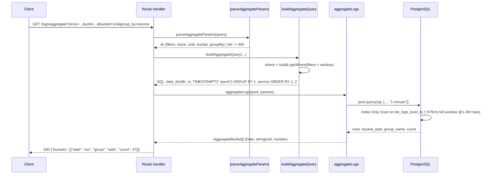

# 10. Aggregation — time-bucketed counts with date_bin

## Summary

`GET /logs/aggregate` returns per-bucket log counts over a `since`/`until` window, optionally grouped by `service` or `level`. The SQL is built by `buildAggregateQuery` ([src/lib/queryParams.ts:269](../src/lib/queryParams.ts#L269)) and executed by `aggregateLogs` ([src/services/logService.ts:70](../src/services/logService.ts#L70)). Buckets are produced by `date_bin($interval, ts, TIMESTAMPTZ 'epoch')`, which aligns every bucket to the Unix epoch — making bucket boundaries timezone-independent and identical for every client. Empty buckets are omitted (GROUP BY only emits buckets with rows), the result is ordered ascending by bucket then group, and `count(*)::int` keeps the payload small. Measured at the contract scale, aggregates stay far below the 1-second p95 budget: 42ms p50 / 73ms p95 at rest on 1.2M rows, 162ms p95 even while 15k logs/s are being ingested.

## Detailed explanation

**Parameter validation.** `parseAggregateParams` ([src/lib/queryParams.ts:141](../src/lib/queryParams.ts#L141)) reuses the list parser for shared filters (service, level, q, attr pairs, tenant) and then enforces the aggregate-specific contract: `since`, `until` and `bucket` are required; `bucket` must be one of `1m | 5m | 1h | 1d` (from the `BUCKET_INTERVALS` map at [src/lib/queryParams.ts:121](../src/lib/queryParams.ts#L121)); `group_by` must be `service` or `level`, taken from the compile-time `GROUP_COLUMNS` whitelist ([src/lib/queryParams.ts:130](../src/lib/queryParams.ts#L130)). Anything else yields a 400 with the specific error.

**The bucketing expression.** The heart of the query is

```sql
date_bin($n::interval, ts, TIMESTAMPTZ 'epoch') AS bucket_start
```

`date_bin` (PostgreSQL 14+) snaps each `ts` down to the most recent multiple of the interval from a given origin. Using `TIMESTAMPTZ 'epoch'` (1970-01-01T00:00:00Z) as the origin has two consequences that matter here:

1. **Epoch alignment** — bucket boundaries fall exactly on whole-minute/hour/day marks relative to the epoch (`10:00:00`, `10:05:00`, ...), which is what a log UI's chart axis expects. With an arbitrary origin (e.g. `date_trunc` on the window start), the same wall-clock minute could land in different buckets depending on the window, producing chart drift between successive queries.
2. **Timezone independence** — `date_bin` on a `timestamptz` column computes in UTC internally, so the same log row lands in the same bucket no matter which client timezone or session setting issued the query. The pool also normalizes sessions with `-c timezone=UTC` ([src/db/pool.ts:30](../src/db/pool.ts#L30)) so `::text` casts in any incidental path are deterministic.

This was a real design point: the earlier `date_trunc`-based approach anchored buckets to the window start, so `since=10:00:00` produced boundaries at `10:00:00`, but `since=10:00:01` shifted them all — the same events could be counted in different buckets across queries (see Common mistakes).

**GROUP BY and ordering.** `group_name` is either the whitelisted column or `NULL::text` when no grouping was requested (the contract requires `group: null` rows in the ungrouped case). The GROUP BY clause groups by `1` (bucket) plus the column when present, and the query orders by `1 ASC, 2 ASC` — ascending buckets with groups ascending within each bucket, as the contract specifies. `count(*)::int` is cast so the JSON response carries plain integers. Because GROUP BY emits only buckets with at least one matching row, zero-count buckets are absent from the response; the client fills gaps on the chart side.

**Execution and mapping.** `aggregateLogs` ([src/services/logService.ts:70](../src/services/logService.ts#L70)) runs the statement and maps rows to `{start, group, count}`, with `start` converted to ISO in the handler ([src/routes/logs.ts:172](../src/routes/logs.ts#L172)). Like every other query, filters are parameterized; the interval string is the single appended parameter (`$params.length + 1`, [src/lib/queryParams.ts:286](../src/lib/queryParams.ts#L286)).

**Measured performance.** At rest on 1.2M rows, a full-window EXPLAIN shows an Index Only Scan on `idx_logs_level_ts` costing ~575ms (with ~55k heap fetches), and real queries run p50 42ms / p95 73ms warm. During the 15k/s ingestion run, the concurrent 1/s aggregate hit p95 162ms — comfortably under the <1s target, with the read pool keeping it isolated from the writer.

**The rollup escape hatch.** The documented limitation: a full-window group-by is ~O(window size). At 1M rows this is fine (<600ms), but as data grows multi-GB, per-query scans of the whole window degrade. The planned escape hatch is a pre-aggregated rollup table (`bucket, group, count`), maintained incrementally by the ingestion writer — every flush adds `+count` to the affected bucket(s) — so aggregates become point lookups instead of scans. It is deliberately out of scope for the contract's 1M-row target, which is comfortably met.

## Why this exists

Dashboards need "logs per minute, optionally per service" over a window, computed on the server so clients don't download millions of rows to count them. The endpoint exists to satisfy the contract's aggregation requirement with math that is (a) correct — deterministic, timezone-free bucket boundaries; (b) fast — index-only scans at the target scale; and (c) safe — whitelisted grouping, parameterized filters, bounded payloads.

## Alternatives considered

| Alternative | Pros | Cons |
|---|---|---|
| `date_trunc('minute', ts)` | Simple, well known | Buckets anchor to an arbitrary origin; boundaries shift with `since`; timezone-dependent if misused |
| `extract(epoch ...) / 60` floor division | Explicit math | Ugly, easy to get wrong with `::int` rounding, no native interval handling |
| Client-side bucketing | Zero DB work | Downloads every row in the window; defeats the purpose at 1M+ rows |
| Pre-aggregated rollup table always-on | Fastest queries | Complexity now (incremental maintenance, backfill); unnecessary at 1M rows — kept as the escape hatch |
| TimescaleDB continuous aggregates | Built-in rollups | Extra extension/ops dependency; overkill for one container |

## Why this was chosen

`date_bin` with an epoch origin is the smallest correct solution: one built-in function gives epoch-aligned, timezone-independent buckets, and it integrates with the existing `(level, ts DESC)` index so a full-window aggregate is an Index Only Scan at 1.2M rows (~575ms cold EXPLAIN, 42ms p50 warm). The measured p95 of 162ms *during* 15k/s ingestion is 6× under the 1s budget on a 1-CPU database. The whitelist approach for `group_by` keeps "dynamic SQL" to a provably safe minimum, and the rollup table remains a documented, unimplemented escape hatch rather than premature complexity.

## Advantages / Disadvantages / Trade-offs

### Advantages
- Deterministic buckets: identical boundaries for every client, every window, every timezone.
- Index-only scan performance at contract scale; no temp tables or materialized data to keep fresh.
- `group_by` is compile-time whitelisted — no injection surface at all.
- Small response payload: one row per non-empty bucket, integer counts.
- Shared filter machinery with GET /logs, so aggregation supports the same filters for free.

### Disadvantages
- Zero-count buckets are absent — charting clients must fill gaps themselves (contract dictates this shape).
- O(window size) scan cost; the full-window cold query is ~575ms and grows with data.
- Only `count` is aggregated; no sums/percentiles on attributes (out of contract).

### Trade-offs
- Correctness of bucket math is concentrated in one SQL expression, which is powerful but hard to unit-test without a DB — the integration tests cover it against real PostgreSQL.
- The interval whitelist (1m/5m/1h/1d) limits flexibility vs. arbitrary durations, in exchange for bounded, validated input.
- Rollup table deferred: faster queries later would come at the cost of writer complexity now.

## Code

**Aggregate query builder** ([src/lib/queryParams.ts:269](../src/lib/queryParams.ts#L269)):

```ts
export function buildAggregateQuery(opts: {
  filters: ListFilters;
  since: Date;
  until: Date;
  bucket: Bucket;
  groupBy: GroupColumn | null;
  tenantId?: TenantScope;
}): AggregateQuery {
  const where = buildLogsWhere({
    filters: { ...opts.filters, since: opts.since, until: opts.until },
    tenantId: opts.tenantId,
  });

  // groupBy comes from a compile-time whitelist (GROUP_COLUMNS); `group_name`
  // is NULL::text when no grouping is requested, which the contract requires.
  const groupExpr = opts.groupBy ?? "NULL::text";
  const groupByClause = opts.groupBy ? `GROUP BY 1, ${opts.groupBy}` : "GROUP BY 1";
  const intervalParam = `$${where.params.length + 1}`;

  return {
    sql: `SELECT date_bin(${intervalParam}::interval, ts, TIMESTAMPTZ 'epoch') AS bucket_start,
                 ${groupExpr} AS group_name,
                 count(*)::int AS count
            FROM logs ${where.sql}
           ${groupByClause}
           ORDER BY 1 ASC, 2 ASC`,
    params: [...where.params, BUCKET_INTERVALS[opts.bucket]],
  };
}
```

`date_bin($4::interval, ts, TIMESTAMPTZ 'epoch')` pins the origin to the epoch; `GROUP BY 1, <col>` groups by bucket then whitelisted column; `ORDER BY 1 ASC, 2 ASC` gives ascending buckets then groups; `count(*)::int` casts the count to a plain integer.

**Service mapping** ([src/services/logService.ts:70](../src/services/logService.ts#L70)):

```ts
export async function aggregateLogs(
  pool: Pool,
  params: AggregateParams,
  tenantId: TenantScope = undefined
): Promise<AggregateBucket[]> {
  const { sql, params: queryParams } = buildAggregateQuery({ ...params, tenantId });
  const res = await pool.query(sql, queryParams);
  return res.rows.map((r) => ({
    start: (r as { bucket_start: Date }).bucket_start,
    group: (r as { group_name: string | null }).group_name,
    count: Number((r as { count: number }).count),
  }));
}
```

**Parameter validation for aggregates** ([src/lib/queryParams.ts:141](../src/lib/queryParams.ts#L141)) — `since`, `until`, `bucket` are required; `bucket` and `group_by` must hit their whitelists, producing specific 400 errors otherwise.

## Diagrams



## Common mistakes

- **Using `date_trunc` anchored to the window.** Buckets then depend on `since`: `since=10:00:00` gives boundaries at `10:00:00`, but `since=10:00:01` shifts every boundary — the same minute of data lands in different buckets across queries, and charts "drift" between refreshes. `date_bin` with an epoch origin fixes this. (Real issue hit in this project.)
- **Forgetting `TIMESTAMPTZ 'epoch'`.** `date_bin` defaults to `TIMESTAMPTZ '2000-01-01'` as origin; boundaries would be aligned to the year 2000, which is still deterministic but surprising and misaligned with what charting libraries assume.
- **Grouping by an unvalidated parameter.** `group_by` must come from a compile-time whitelist; interpolating user text here is the only real injection risk in this query.
- **Assuming empty buckets appear.** GROUP BY emits only non-empty buckets; clients must fill gaps.
- **Casting `count(*)` to JS without `::int`.** `count` returns bigint; without the cast it arrives as a string and serializes differently in JSON.
- **Expecting the aggregate to stay O(result)** — it is O(window scan); fine at 1M rows, needs rollups at multi-GB scale.

## Optimization ideas

- **Rollup table** maintained by the writer (`bucket, group, count` with UPSERT `+count` per flush) — aggregates become index lookups; backfill script needed for existing data.
- **`GROUP BY` on the index order** (`level, ts`) already yields Index Only Scans; consider a composite `(ts, level)`-ordered rollup for service grouping.
- **Materialized view + REFRESH CONCURRENTLY** for rarely-changing windows (e.g. daily charts over a month).
- **Parallel workers / pg_parallel** on multi-core deployments (marginal on 1 CPU).
- **Approximate counting** (HyperLogLog via `count(distinct)` extensions) if distinct-value charts are ever added.
- **Pre-computed daily buckets at ingestion time** — the writer already groups by flush; appending a bucket increment costs a second small statement.

## Interview questions & answers

**Q1: Why `date_bin` instead of `date_trunc`?**
A1: `date_trunc` truncates to the nearest boundary *from an arbitrary point* — effectively from the epoch in PG's implementation — but `date_bin` explicitly takes an origin, so we can pin it to `TIMESTAMPTZ 'epoch'` and guarantee identical bucket boundaries for every query, client and timezone. Anchoring to the window start (the naive pattern) shifts boundaries when `since` changes.

**Q2: What does `TIMESTAMPTZ 'epoch'` do and why does it matter?**
A2: It sets the bucket origin to 1970-01-01T00:00:00Z. Buckets become exact multiples of the interval from the epoch (aligned to whole minutes/hours/days), and since `timestamptz` values are computed in UTC, the same row lands in the same bucket regardless of client or session timezone.

**Q3: The contract returns `group: null` for ungrouped queries. How is that produced?**
A3: `group_name` is set to `NULL::text` when no grouping is requested, so each row carries `group: null` as required; when grouping, the whitelisted column is used directly.

**Q4: Why aren't empty buckets returned?**
A4: GROUP BY aggregates only rows that exist; zero-count buckets are simply absent from the result. Returning them would require generating a bucket series (e.g. `generate_series`) and left-joining, which costs extra rows and complexity for data that is easily filled on the client side. The contract specifies the current shape.

**Q5: How was aggregation validated to be under 1 second?**
A5: Three measurements: cold full-window EXPLAIN ~575ms via Index Only Scan on `idx_logs_level_ts` at 1.2M rows; warm queries p50 42ms / p95 73ms at rest; and p95 162ms while ingesting 15k/s. All under the 1s target, with the dedicated write pool keeping ingestion from interfering.

**Q6: What does "O(window size)" mean for the aggregate, and what is the escape hatch?**
A6: The scan cost is proportional to the number of rows in the requested window, not the result size. At 1M rows that's sub-second; at multi-GB scale it degrades super-linearly as data outgrows the cache. The documented escape hatch is a writer-maintained rollup table so queries become point lookups.

**Q7: How is `group_by` safe from injection if it's dynamic SQL?**
A7: It is not user-provided SQL — `parseAggregateParams` accepts only the exact strings `service` or `level` from the compile-time `GROUP_COLUMNS` tuple, and the query builder only interpolates those constant values.

**Q8: Why is the interval parameter `$n::interval` and not a fixed string?**
A8: It keeps the statement parameterized (one prepared statement for all bucket widths) while the whitelist map (`1m → '1 minute'`) guarantees the interval text is always valid PostgreSQL syntax.

**Q9: Would `group_by=level` perform differently from `group_by=service`?**
A9: Yes — the dedicated `(level, ts DESC)` index directly serves level grouping (Index Only Scan); service grouping uses `idx_logs_service_level_ts` or falls back to a wider scan. The measured 575ms full-window figure is for the level-ordered scan.

**Q10: How would you add a `count`/`sum` over an attribute value?**
A10: Add whitelisted aggregate expressions (e.g. `sum((attributes->>'latency_ms')::numeric)`), still fully parameterized; validation rejects malformed numeric casts with 400 per the contract's error style.

**Q11: Why does the query order `1 ASC, 2 ASC` rather than by name?**
A11: Positional ordering is concise and unambiguous here; the output order (bucket, then group) is what the contract specifies for the response array.

**Q12: What happens if `until` is far in the past and the window covers nothing?**
A12: The WHERE clause filters to zero rows, GROUP BY emits nothing, and the response is `{"buckets": []}` — correct and cheap because the index bounds the scan.

## Implementation references

- [src/lib/queryParams.ts:121](../src/lib/queryParams.ts#L121) — `BUCKET_INTERVALS` (1m/5m/1h/1d)
- [src/lib/queryParams.ts:130](../src/lib/queryParams.ts#L130) — `GROUP_COLUMNS` whitelist
- [src/lib/queryParams.ts:141](../src/lib/queryParams.ts#L141) — `parseAggregateParams`
- [src/lib/queryParams.ts:269](../src/lib/queryParams.ts#L269) — `buildAggregateQuery` (date_bin, NULL::text, count::int, ORDER BY)
- [src/services/logService.ts:70](../src/services/logService.ts#L70) — `aggregateLogs`
- [src/routes/logs.ts:172](../src/routes/logs.ts#L172) — aggregate handler
- [src/db/pool.ts:30](../src/db/pool.ts#L30) — session timezone normalization
- [../README.md:86](../README.md#L86) — aggregate contract
- [../README.md:146](../README.md#L146) — measured aggregate latencies
- [../README.md:164](../README.md#L164) — documented rollup-table limitation
