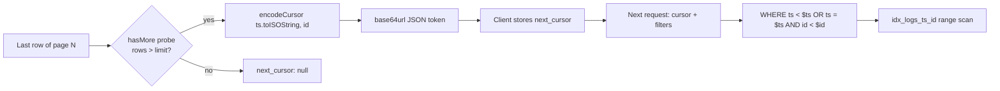

# 11. Pagination — keyset (cursor-based) vs offset

## Summary

Pagination returns one page of logs with an opaque `next_cursor` instead of page numbers. The cursor is a base64url-encoded JSON object `{"ts": "...", "id": "..."}` referencing the last row of the previous page; the next query resumes with a tuple predicate `(ts < $ts OR (ts = $ts AND id < $id))` and `ORDER BY ts DESC, id DESC`. This keyset scheme costs O(page size) per page regardless of depth, and — critically — pages cannot drift when new rows are inserted between requests, which offset pagination suffers from. The cursor is strictly validated on decode, so malformed cursors yield HTTP 400, never a crash or an accidental full scan. Cursor logic lives entirely in [src/lib/cursor.ts](../src/lib/cursor.ts), with encode/decode, and the "more pages" decision uses a limit+1 probe in the service layer.

## Detailed explanation

**Why keyset at all.** Offset pagination (`LIMIT n OFFSET k`) re-scans and discards `k` rows on every page — O(n²) total work for deep walks — and, worse, pages shift as rows are inserted or deleted: the same row can appear on two pages, or be skipped entirely. In a log-ingestion service, writes arrive continuously *while the user is paging* (the load generator ingests 15k/s while the tester pages through results), so offset is structurally wrong here. Keyset pagination instead remembers "where the last page ended" and resumes from there, so the result set is anchored to a point in time and space; new rows inserted *after* that point never disturb the pages already seen.

**Why the tuple `(ts, id)`.** `ts` alone is not unique — the ingestion writer batches 2000 rows per statement, many sharing the same millisecond timestamp. Resuming on `ts` alone would either skip or repeat every row sharing the last page's boundary timestamp. Adding the row id — which is globally unique via BIGSERIAL — makes the resume point unique. The predicate

```sql
WHERE (ts < $ts) OR (ts = $ts AND id < $id)
ORDER BY ts DESC, id DESC
```

is exactly "strictly before the cursor row in the same ordering", and because both columns are in the ordering, PostgreSQL can use `idx_logs_ts_id (ts DESC, id DESC)` for both the ORDER BY and the resume predicate — no sort step, no offset skip.

**The limit+1 probe.** `buildLogsQuery` fetches `LIMIT <limit+1>` ([src/lib/queryParams.ts:260](../src/lib/queryParams.ts#L260)); the service checks `rows.length > limit` ([src/services/logService.ts:45](../src/services/logService.ts#L45)) and slices off the extra row. If the extra row exists, another page is guaranteed and the cursor is encoded from the last row of the *sliced* page. This is cheaper and race-free compared to a separate `SELECT count(*)`, because the decision comes from the same query snapshot that produced the page.

**Cursor encoding.** `encodeCursor` ([src/lib/cursor.ts:24](../src/lib/cursor.ts#L24)) produces `base64url(JSON.stringify({ts: ts.toISOString(), id}))`. Base64url (not plain base64) because the cursor travels in URLs: standard base64's `+` and `/` are legal-but-awkward in query strings and would need escaping; base64url substitutes `-` and `_` and drops padding, yielding a fully URL-safe token. Both fields are strings in the JSON: `ts` is kept as an ISO string "to avoid TZ drift", and `id` is a string because BIGSERIAL exceeds `Number.MAX_SAFE_INTEGER` at 2^53 rows — a JSON number would silently lose precision on large ids.

**Strict decode.** `decodeCursor` ([src/lib/cursor.ts:29](../src/lib/cursor.ts#L29)) rejects empty or >2048-char tokens, non-object JSON, non-string fields, unparsable timestamps, and ids that fail `/^\d{1,19}$/`. Any failure returns `null`, and the parser turns that into `invalid cursor` → HTTP 400 ([src/lib/queryParams.ts:92](../src/lib/queryParams.ts#L92)). This is a contract requirement: a malformed cursor must be a clean 400, never a 500 from a thrown decode error, and never a wildcard query that scans everything.

**Stability under inserts.** Consider paging through rows with `ts DESC` while the writer inserts new rows with *newer* timestamps: offset pagination would re-discover those new rows at the top of every subsequent page, pushing already-seen rows into later pages (duplicates) or out (misses). The keyset cursor points at the last-seen row, so new rows are simply not part of the remaining result set. Rows inserted *between* the first and last row of an already-fetched page can still shift things within a page boundary, which is why the common production rule is: keyset pagination is stable for *newer* rows (the common case in logs) and approximately stable otherwise. Also note the `(ts, id)` ordering makes `id` the tie-breaker for equal timestamps — deterministic, and covered by the index.

**Where the pieces live.** Parse-time cursor handling is in `parseListParams` ([src/lib/queryParams.ts:92](../src/lib/queryParams.ts#L92)); the WHERE predicate is built in `buildLogsWhere` ([src/lib/queryParams.ts:219](../src/lib/queryParams.ts#L219)), where the ts placeholder is bound once and reused so two cursor fields cost only one parameter; the service encodes `nextCursor` ([src/services/logService.ts:60](../src/services/logService.ts#L60)). The index backing everything is `idx_logs_ts_id` ([src/db/migrations.ts:43](../src/db/migrations.ts#L43)).

## Why this exists

Paging through a continuously-growing log stream is the most common read pattern, and it must be correct (no dupes, no misses), cheap (constant per page), and safe (no injection, no crash on bad input). Offset pagination fails the correctness test under concurrent ingestion — which this project exercises directly — and the O(depth) scan cost fails at scale. Keyset pagination with an opaque, validated token satisfies all three.

## Alternatives considered

| Alternative | Pros | Cons |
|---|---|---|
| `OFFSET` / page numbers | Simple, natural for jumping to page N | O(depth) scan cost; pages drift under inserts (dupes/misses); measured here as the root of the drift bug |
| `LIMIT` + `count(*)` to know total pages | Lets UI show "5 of 20" | Extra full-range count on every request; counts are stale the instant ingestion writes |
| Time-based cursor only (ts) | Smaller cursor | Duplicates/skips rows sharing a timestamp — the writer makes timestamps densely duplicated |
| Sealed/immutable pagination (snapshot ID) | Perfect stability | Requires MVCC snapshot plumbing (repeatable-read transaction or export token); heavyweight for a stateless API |
| Global cursor per query (all pages) vs per-window | — | Per-window is simpler; a global cursor would need a full result materialization to be honest |

## Why this was chosen

The project's own failure story decided this: offset pagination produced page drift under the concurrent 15k/s load generator — rows appeared twice or vanished between requests — exactly the "cursor" scenario the contract hints at. Keyset is also the cheapest correct option on a 1-CPU database: each page is a single index range scan with no skipped rows, which at 1M rows is milliseconds. The (ts, id) tuple is mandatory given the writer's batch semantics (2000 rows per commit share millisecond timestamps), and the base64url JSON token is simple enough to implement in ~20 lines with strict validation, keeping the contract's "invalid cursor → 400" behavior without any external pagination library.

## Advantages / Disadvantages / Trade-offs

### Advantages
- O(page size) cost per page regardless of depth — no offset re-scan.
- Stable under concurrent inserts for the common case (newer rows arriving).
- Uses the existing `(ts DESC, id DESC)` index for both ORDER BY and predicate.
- Opaque token = no implementation details leaked, no tampering surface beyond validation.
- Malformed input is a clean 400, by construction (decode returns null, parser fails).

### Disadvantages
- No random access: "jump to page 5" is impossible without walking pages.
- Total result count is unknown (the contract doesn't promise one).
- Cursor is tied to the ordering; changing ORDER BY silently invalidates semantics.
- State must be carried by the client (stateless server, which is a feature, but the client must persist the token).

### Trade-offs
- Per-window cursors (anchor + filters + ordering in the token) vs. stateless-by-filtering: we keep filters in the URL and only the anchor in the cursor, so filter changes are safe but a *combined* cursor+filter change can return unexpected pages.
- `id` as string in the token costs a few bytes per cursor in exchange for precision beyond 2^53.
- Stability is directional: perfect for append-only logs; not a substitute for snapshot pagination on heavily edited data.

## Code

**Cursor codec with strict validation** ([src/lib/cursor.ts:17](../src/lib/cursor.ts#L17)):

```ts
export interface Cursor {
  /** ISO 8601 timestamp of the last row, kept as string to avoid TZ drift. */
  ts: string;
  /** Row id as string — BIGSERIAL exceeds Number.MAX_SAFE_INTEGER at 2^53 rows. */
  id: string;
}

export function encodeCursor(ts: Date, id: string): string {
  return Buffer.from(JSON.stringify({ ts: ts.toISOString(), id })).toString("base64url");
}

/** Decode and strictly validate a cursor. Returns null when malformed. */
export function decodeCursor(raw: string): Cursor | null {
  if (typeof raw !== "string" || raw.length === 0 || raw.length > 2048) return null;
  try {
    const parsed: unknown = JSON.parse(Buffer.from(raw, "base64url").toString("utf8"));
    if (typeof parsed !== "object" || parsed === null) return null;
    const { ts, id } = parsed as { ts?: unknown; id?: unknown };
    if (typeof ts !== "string" || typeof id !== "string") return null;
    if (Number.isNaN(Date.parse(ts))) return null;
    if (!/^\d{1,19}$/.test(id)) return null;
    return { ts, id };
  } catch {
    return null;
  }
}
```

**Keyset predicate in the WHERE builder** ([src/lib/queryParams.ts:219](../src/lib/queryParams.ts#L219)):

```ts
if (cursor) {
  // Keyset resume: strictly before (ts, id) in descending order.
  // The ts placeholder is bound once and reused — fewer params to send.
  const tsParam = t(cursor.ts);
  const idParam = t(cursor.id);
  clauses.push(`(ts < ${tsParam} OR (ts = ${tsParam} AND id < ${idParam}))`);
}
```

**limit+1 probe and cursor production** ([src/services/logService.ts:44](../src/services/logService.ts#L44) and [src/services/logService.ts:57](../src/services/logService.ts#L57)):

```ts
// We fetched limit+1 rows: the extra row proves a next page exists.
const hasMore = rows.length > limit;
const page = hasMore ? rows.slice(0, limit) : rows;
// ...
const last = page[page.length - 1];
return {
  logs,
  nextCursor: hasMore && last ? encodeCursor(last.ts, String(last.id)) : null,
};
```

The statement itself orders by `ts DESC, id DESC` and limits to `limit + 1` ([src/lib/queryParams.ts:257](../src/lib/queryParams.ts#L257)).

## Diagrams

```mermaid
sequenceDiagram
    participant C as Client
    participant S as Service (queryLogs)
    participant D as PostgreSQL

    C->>S: page 1: GET /logs?limit=2
    S->>D: SELECT ... ORDER BY ts DESC, id DESC LIMIT 3
    D-->>S: rows A, B, C (3 rows = probe fired)
    S->>S: page = [A, B]; next_cursor = encode({ts: B.ts, id: B.id})
    S-->>C: {logs: [A, B], next_cursor: "eyJ0cyI6...In0"}
    C->>S: page 2: GET /logs?limit=2&cursor=eyJ0cyI6...In0
    S->>D: WHERE (ts < $tsB) OR (ts = $tsB AND id < $idB) ... LIMIT 3
    D-->>S: rows D, E (2 rows = no more pages)
    S-->>C: {logs: [D, E], next_cursor: null}
```



## Common mistakes

- **Using offset under concurrent ingestion** — the real failure this project hit: while the load generator wrote 15k/s, offset pages duplicated and skipped rows between requests (rows shifted into a page they'd already been seen on). Keyset anchors the page to the last-seen row.
- **Resuming on `ts` only** — with a coalescing writer, thousands of rows share one millisecond timestamp; a ts-only cursor drops or repeats every row at the boundary.
- **Making the cursor tamperable or unvalidated** — a malformed cursor must be a 400 (`invalid cursor`); decode is `try/catch` + strict field checks precisely so no malformed token can reach the SQL layer.
- **Encoding the cursor with plain base64** — `+` and `/` require URL escaping and can be mangled by proxies; base64url is the URL-safe alphabet.
- **Encoding `id` as a JSON number** — beyond 2^53 precision is lost; the id must stay a string.
- **Fetching `limit` rows and guessing at more** — without the probe, the last page is indistinguishable from a full page; the probe is what makes `next_cursor: null` trustworthy.
- **Reusing a cursor with different filters** — the anchor is (ts, id) in the default ordering; applying it to a different filter set is legal but the semantics ("resume from here") only hold for the same filter set.

## Optimization ideas

- **Include filter state in the token** (hash of filters) to detect client misuse and return a 400 instead of silent wrong pages.
- **Compress / compact cursors** for very long walks (e.g. time + id in a fixed-width encoding) to shave token size.
- **Backwards paging**: a `before` cursor variant using the inverse predicate `(ts > $ts) OR (ts = $ts AND id > $id)` with `ORDER BY ASC`, then reversing — one index, same cost.
- **Page-size heuristics**: adaptive `limit` based on row width to bound response bytes rather than row count.
- **Snapshot-consistent paging** for export jobs: wrap the walk in a repeatable-read transaction so the whole export sees one MVCC snapshot (heavier, only for bulk jobs).
- **Keyset + OFFSET hybrid for jump-to-page-N** when a UI insists, bounded by "offset beyond 10k is rejected".

## Interview questions & answers

**Q1: What is the difference between offset and keyset pagination?**
A1: Offset skips `k` rows per page (re-scanning them each time) and re-evaluates against the live table, so inserts/deletes between requests shift pages — duplicates and misses. Keyset remembers the last row of the previous page and resumes with a tuple predicate, so each page costs O(page size) and newly-arriving rows don't disturb already-visited pages.

**Q2: Why is the cursor the tuple `(ts, id)` and not just `ts`?**
A2: `ts` is not unique: the coalescing writer commits thousands of rows per flush sharing the same millisecond. Resuming on ts alone skips or repeats all rows at the boundary; appending the unique BIGSERIAL id makes the resume point unambiguous.

**Q3: How does the query use the index for the cursor predicate?**
A3: The predicate `(ts < $ts) OR (ts = $ts AND id < $id)` is exactly "the previous row in the same order", matching `idx_logs_ts_id (ts DESC, id DESC)`; PostgreSQL turns it into an index range scan with no sort and no skipping.

**Q4: Why base64url instead of plain base64?**
A4: Cursors travel in URLs; plain base64's `+`, `/` and padding need escaping and can be mangled by intermediaries. Base64url uses `-` and `_` and omits padding — a token that is safe to paste into any URL verbatim.

**Q5: How do you know there is a next page without a count query?**
A5: Fetch `limit+1` rows: if the result exceeds `limit`, a next page exists; the extra row is dropped. The decision comes from the same snapshot that produced the page, so it cannot race with concurrent writes.

**Q6: What happens if a client sends a malformed cursor?**
A6: `decodeCursor` returns null on any malformed input (length, base64, JSON, field types, timestamp, id shape), `parseListParams` maps that to `invalid cursor`, and the route returns HTTP 400 `{"error":"invalid cursor"}`. Never a 500, never a full scan.

**Q7: What does "stable under concurrent inserts" mean exactly?**
A7: Rows inserted with timestamps newer than the cursor do not appear in remaining pages (no duplicates). Rows inserted *between* previously-fetched rows can still shift a page's composition within its boundaries — keyset pagination guarantees no dupes/misses only against rows arriving after the cursor point, which is the common case for log streams.

**Q8: Why is `id` a string inside the cursor JSON?**
A8: BIGSERIAL ids exceed `Number.MAX_SAFE_INTEGER` at 2^53 rows; a JSON number would lose precision during encode/decode. As a string it round-trips exactly.

**Q9: How would you implement "previous page" navigation?**
A9: A `before` cursor with the inverted predicate `(ts > $ts) OR (ts = $ts AND id > $id)`, `ORDER BY ts ASC, id ASC`, fetch limit+1, and reverse the returned rows before serving — the same index covers it.

**Q10: Why can't clients jump to page 5?**
A10: Keyset has no absolute position — it only knows "after this row". Total counts and arbitrary offsets are deliberately unsupported; deep jumps would require walking pages (or an OFFSET fallback with a safety bound).

**Q11: What was the measured failure of offset pagination in this project?**
A11: Under the concurrent 15k/s load test, offset pages drifted: rows shifted between pages as new rows landed on top, causing duplicates and missed entries. The keyset cursor removed the entire class of bug, at a cost of a few bytes per request.

**Q12: Where is pagination wired in the codebase?**
A12: Parse in `parseListParams` (cursor → 400 on failure, [src/lib/queryParams.ts:92](../src/lib/queryParams.ts#L92)); predicate in `buildLogsWhere` ([src/lib/queryParams.ts:219](../src/lib/queryParams.ts#L219)); probe + `nextCursor` in `queryLogs` ([src/services/logService.ts:44](../src/services/logService.ts#L44)); codec in [src/lib/cursor.ts:24](../src/lib/cursor.ts#L24); index in [src/db/migrations.ts:43](../src/db/migrations.ts#L43).

## Implementation references

- [src/lib/cursor.ts:17](../src/lib/cursor.ts#L17) — Cursor interface (ts/id as strings)
- [src/lib/cursor.ts:24](../src/lib/cursor.ts#L24) — `encodeCursor` (base64url JSON)
- [src/lib/cursor.ts:29](../src/lib/cursor.ts#L29) — `decodeCursor` strict validation
- [src/lib/queryParams.ts:92](../src/lib/queryParams.ts#L92) — cursor param → `invalid cursor` 400
- [src/lib/queryParams.ts:219](../src/lib/queryParams.ts#L219) — keyset WHERE predicate
- [src/lib/queryParams.ts:257](../src/lib/queryParams.ts#L257) — `ORDER BY ts DESC, id DESC LIMIT limit+1`
- [src/services/logService.ts:44](../src/services/logService.ts#L44) — limit+1 probe, page slice
- [src/services/logService.ts:60](../src/services/logService.ts#L60) — `nextCursor` encoding
- [src/db/migrations.ts:43](../src/db/migrations.ts#L43) — `idx_logs_ts_id` index
- [../README.md:72](../README.md#L72) — cursor contract notes
