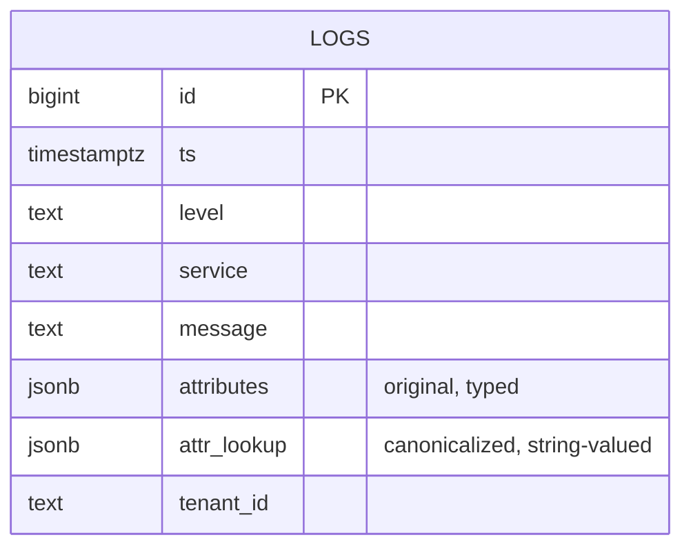

# 12. Attributes — the double-JSONB strategy

## Summary

Every log entry carries an `attributes` object whose values are typed (string, number, boolean) and must round-trip with their original types, while attribute filters must match values **as strings**: `attr.retries=3` must match the number `3`. Those two demands conflict with a single JSONB column, so the schema stores **two** JSONB columns: `attributes` (the original, typed payload returned to clients) and `attr_lookup` (the same object with every value canonicalized to a string, built server-side at INSERT time). All attribute filters run `@>` containment against `attr_lookup`, backed by a GIN `jsonb_path_ops` index, making `attr.<key>=<value>` an index-supported equality match. Canonicalization is done inside the INSERT SQL (`jsonb_each` + `jsonb_object_agg`), moving the extra stringification cost off the CPU-saturated app and onto PostgreSQL, which has headroom.

## Detailed explanation

**The conflict.** The contract has two clauses that a single column cannot serve at once:

1. *Typed round-trip*: `attributes: {"retries": 3}` returned by GET /logs must come back with `retries: 3` as a JSON number.
2. *String equality*: the filter `attr.retries=3` must match entries whose value is the number `3` (and `attr.flag=true` must match boolean `true`).

A plain `@>` containment check against the typed `attributes` column compares values with their JSON types: the string `"3"` is not contained in `{"retries": 3}`. So either filters are wrong, or the response loses types. The resolution is the double-JSONB strategy documented in [../README.md:111](../README.md#L111):

- `attributes JSONB NOT NULL DEFAULT '{}'::jsonb` — the original payload, returned verbatim ([src/db/migrations.ts:37](../src/db/migrations.ts#L37)).
- `attr_lookup JSONB NOT NULL DEFAULT '{}'::jsonb` — every value coerced to its string form, used exclusively for filtering ([src/db/migrations.ts:38](../src/db/migrations.ts#L38)).

**Canonicalization in SQL.** The lookup copy is derived at insert time in the same statement that inserts the rows, via a `CROSS JOIN LATERAL` ([src/services/ingestWriter.ts:58](../src/services/ingestWriter.ts#L58)):

```sql
SELECT COALESCE(
  jsonb_object_agg(
    e.key,
    CASE WHEN jsonb_typeof(e.value) IN ('object', 'array')
         THEN e.value::text
         ELSE e.value #>> '{}'
    END
  ),
  '{}'::jsonb
) AS lookup
FROM jsonb_each(u.attrs) AS e(key, value)
```

`jsonb_each` unnestls each top-level attribute; scalars are stringified with `#>> '{}'` (the canonical JSON-to-text extraction), while nested objects/arrays become their JSON text via `::text` (matching the contract's "nested values serialized as JSON" rule); `jsonb_object_agg` reassembles them; `COALESCE` turns empty objects into `'{}'`. Doing this in SQL means the app pays only one `JSON.stringify` per row (for the typed column), and the second stringify + object clone happens on PostgreSQL, which has idle CPU — this was one of the measured bottlenecks (see Common mistakes).

**Filtering with containment.** The filter `attr.<key>=<value>` becomes `attr_lookup @> $n::jsonb` where `$n` is `JSON.stringify({[key]: value})` ([src/lib/queryParams.ts:208](../src/lib/queryParams.ts#L208)). `@>` (contains) semantics: the operand `{"retries": "3"}` is contained if `attr_lookup` has the key `retries` with value `"3"` — an exact string equality, which is precisely the contract ("attribute values compared as strings"). The operand is always one key, so it is an equality lookup, not a substring match.

**Index and operator class.** The GIN index is `CREATE INDEX idx_logs_attr_lookup ON logs USING GIN (attr_lookup jsonb_path_ops)` ([src/db/migrations.ts:59](../src/db/migrations.ts#L59)). `jsonb_path_ops` was chosen over the default `jsonb_ops`: for the `@>` operator with flat single-key objects it is exactly as correct, and it builds a substantially smaller index (it hashes the full JSON path rather than indexing every key/value separately). The migration comment records this reasoning ([src/db/migrations.ts:57](../src/db/migrations.ts#L57)). At 1.2M rows the whole table plus five indexes is ~629MB — the GIN index being compact matters at the 1GB container budget.

**Storage cost.** The double column doubles the attribute payload's storage footprint: at 1.2M rows with 5 attributes each, table+indexes total ~629MB. PostgreSQL's TOAST and `jsonb` storage make this acceptable — and the write amplification is bounded because the lookup column is derived in the same INSERT, not a second statement.

**Response path stays typed.** Queries `SELECT ... attributes` only ([src/lib/queryParams.ts:257](../src/lib/queryParams.ts#L257)) — the lookup column is never returned, so clients always see original types. Validation constrains attributes to a flat object of string/number/boolean at the API boundary ([src/lib/validation.ts:55](../src/lib/validation.ts#L55)), so nested structures only ever arrive as the stringified JSON the contract permits.

## Why this exists

The contract's simultaneous demands — typed response values and string-based filter matching — are genuinely incompatible in one JSONB column, and the project needed an index-supported way to answer attribute equality at 1M+ rows on a 1-CPU database. The double-JSONB strategy is the minimal design that satisfies both clauses exactly, keeps filtering on an index, and preserves the typed response with no post-processing.

## Alternatives considered

| Alternative | Pros | Cons |
|---|---|---|
| EAV table (`attr_key, attr_value` rows) | Normalized, indexable per attribute | Joins on every query, bloat (one row per attribute), painful to reassemble as JSON |
| Single typed JSONB + `@>` on typed values | One column, typed round-trip | Fails the string-equality contract: `attr.retries=3` (string) would not match `3` (number) |
| Single JSONB + filters with `(attributes->>'retries') = '3'` | No second column | Expression cannot use a plain GIN index effectively; per-attribute functional index needed |
| `jsonb_path` / JSONPath queries | Powerful, standard-ish | Heavier parse per query; less efficient than `@>` for equality; harder to whitelist |
| Generated column (`GENERATED ALWAYS AS (...) STORED`) | Single source of truth | Still a second column; the canonicalization expression duplicates the SQL; no practical gain here |
| hstore | Simple key/value | Text-only values, no nested JSON, no `@>`-style typed containment; legacy option |
| Per-key partial indexes on `attributes->>key` | Targeted | One index per attribute key — unbounded index growth, unknown attribute keys at design time |
| Single JSONB returning stringified values | One column | Breaks the typed round-trip clause of the contract |

## Why this was chosen

The double-JSONB strategy is the only option that satisfies both contract clauses with index-backed filtering and near-zero app cost. The lookup column is derived entirely in SQL at insert, so the app's per-row cost stays at one `JSON.stringify` — critical on the 0.5-CPU/256MB app, where measured CPU saturation (after pooling and chunking fixes) was the final bottleneck before hitting exactly 15,000 logs/s ([../README.md:159](../README.md#L159)). The `jsonb_path_ops` GIN keeps the index small enough for the 1GB database, and the design keeps the response path trivially typed (only `attributes` is ever selected). The ~2× attribute storage cost is a small, predictable price paid only where attributes exist, and the whole scheme is testable via integration tests against real PostgreSQL.

## Advantages / Disadvantages / Trade-offs

### Advantages
- Both contract clauses hold exactly: typed responses, string-valued filter equality.
- `attr.<k>=<v>` is an indexed equality lookup (GIN `@>`), sub-millisecond at 1M rows.
- App CPU cost is one stringify per row; canonicalization runs on idle PG CPU.
- No application-side maintenance: the lookup copy can never drift from the source because it is derived in the same INSERT.
- Flexible to arbitrary attribute names at query time — no per-key schema, no per-key indexes.

### Disadvantages
- 2× storage footprint for attribute payloads (part of the measured ~629MB at 1.2M rows).
- Write-path cost: the LATERAL `jsonb_each`/`jsonb_object_agg` per row adds PG CPU per INSERT.
- Values are matched as strings only — no type-aware filters (a documented contract property, not a bug).
- Two columns to keep conceptually in sync when writing new features.

### Trade-offs
- Storage vs. index-supported filtering: the GIN `jsonb_path_ops` shrinks the index side of the ledger.
- Canonicalization in SQL vs. in JS: correctness is a bit harder to eyeball, but it offloads CPU from the saturated app — measured as the difference between ~98% of target and exactly 15,000/s.
- GIN `jsonb_path_ops` vs `jsonb_ops`: smaller/faster for `@>` with path hashing; cannot be used for `?`/`?|` key-existence queries the same way (not needed here).

## Code

**Schema** ([src/db/migrations.ts:31](../src/db/migrations.ts#L31)):

```sql
CREATE TABLE IF NOT EXISTS logs (
  id          BIGSERIAL PRIMARY KEY,
  ts          TIMESTAMPTZ NOT NULL,
  level       TEXT NOT NULL CHECK (level IN ('debug', 'info', 'warn', 'error')),
  service     TEXT NOT NULL,
  message     TEXT NOT NULL,
  attributes  JSONB NOT NULL DEFAULT '{}'::jsonb,
  attr_lookup JSONB NOT NULL DEFAULT '{}'::jsonb
);
```

**GIN index with jsonb_path_ops** ([src/db/migrations.ts:57](../src/db/migrations.ts#L57)):

```sql
-- The workhorse of attr.<key>=<value> filtering. jsonb_path_ops is
-- smaller and exactly as useful as jsonb_ops for the @> operator we use.
CREATE INDEX IF NOT EXISTS idx_logs_attr_lookup
  ON logs USING GIN (attr_lookup jsonb_path_ops);
```

**Server-side canonicalization inside the INSERT** ([src/services/ingestWriter.ts:65](../src/services/ingestWriter.ts#L65)):

```sql
CROSS JOIN LATERAL (
  SELECT COALESCE(
    jsonb_object_agg(
      e.key,
      CASE WHEN jsonb_typeof(e.value) IN ('object', 'array')
           THEN e.value::text
           ELSE e.value #>> '{}'
      END
    ),
    '{}'::jsonb
  ) AS lookup
  FROM jsonb_each(u.attrs) AS e(key, value)
) lk
```

**Filter clause** ([src/lib/queryParams.ts:208](../src/lib/queryParams.ts#L208)):

```ts
for (const [key, value] of filters.attrPairs) {
  // String comparison against the canonicalized lookup column — indexed by GIN.
  clauses.push(`attr_lookup @> ${t(JSON.stringify({ [key]: value }))}::jsonb`);
}
```

## Diagrams

```mermaid
flowchart LR
    subgraph Ingest [INSERT path - single statement]
        A[attributes JSONB<br/>typed payload] --> B[jsonb_each]
        B --> C{jsonb_typeof}
        C -- scalar --> D["#>> '{}' (to text)"]
        C -- object/array --> E["::text (JSON serialized)"]
        D --> F[jsonb_object_agg]
        E --> F
        F --> G[attr_lookup JSONB<br/>string-valued copy]
    end

    subgraph Query [Query path]
        H[attr.k=v filter] --> I["attr_lookup @> {"k":"v"}::jsonb"]
        I --> J[GIN jsonb_path_ops<br/>index scan]
    end

    subgraph Response [Response path]
        K[SELECT ... attributes only] --> L[original types returned]
    end

    A --> K
    G --> I
```



## Common mistakes

- **Filtering against `attributes` instead of `attr_lookup`** — the typed column makes `attr.retries=3` (string) miss the number `3`; every filter must target the canonicalized column.
- **Canonicalizing in the app** — the first attempt did the second stringify in JS per row; on the 0.5-CPU app this kept throughput at ~98% of the 15k/s target. Moving it into the INSERT (PG had idle CPU) is what achieved exactly 15,000/s.
- **Canonicalizing scalars with `::text`** — `::text` on a JSONB scalar yields the JSON-quoted form (`"3"` with quotes); `#>> '{}'` returns the unquoted string. Using the wrong one silently breaks matching.
- **Indexing with default `jsonb_ops`** — it works but builds a much larger index than `jsonb_path_ops`; at 1.2M rows within a 1GB container the size difference is material.
- **Forgetting `COALESCE` for empty objects** — `jsonb_object_agg` over zero rows returns NULL; the column is NOT NULL DEFAULT, so inserts would fail without the `COALESCE('{}'::jsonb)`.
- **Treating `@>` as substring matching** — it is exact containment: `{"key": "a"}` does NOT match `{"key": "abc"}`; the query string is the entire value.
- **Allowing nested values into `attributes` unchecked** — validation ([src/lib/validation.ts:55](../src/lib/validation.ts#L55)) rejects nested objects/arrays at the boundary; the SQL canonicalization still handles them defensively per the contract.

## Optimization ideas

- **Composite GIN** (`gin (attr_lookup jsonb_path_ops, ...)`) if attr filters combine with other hot predicates.
- **Deduplicate `attr_lookup` for low-cardinality sets** — store only a pointer via a dictionary table (only worth it at multi-GB scale).
- **Move canonicalization to a BEFORE INSERT trigger** for non-JS writers (same SQL, moved to the DB side permanently).
- **Partial GIN indexes per high-traffic attribute key** (e.g. only index rows where `attr_lookup ? 'http_status'`) to shrink the index further.
- **Jsonb compression**: PostgreSQL 16's per-value compression (LZ4) helps the 2× payload; verify with `pg_column_size` on representative rows.
- **Rollup tables keyed by attribute** for attribute-based dashboards (count per `http_status` per bucket) — the same escape-hatch as aggregation.

## Interview questions & answers

**Q1: Why two JSONB columns instead of one?**
A1: The contract demands typed round-trip in responses and string-valued equality in filters. A single typed column can't match `attr.retries=3` (string) against the number 3; a single stringified column breaks typed responses. Two columns serve each clause from its own physical copy.

**Q2: How does the `attr_lookup` column stay in sync?**
A2: It is derived in the same INSERT statement (`CROSS JOIN LATERAL jsonb_each ... jsonb_object_agg`), so the lookup copy is computed from the exact row being written — it can never drift from `attributes`.

**Q3: What is `#>> '{}'` and why not `::text` for scalars?**
A3: `#>> '{}'` extracts a scalar's unquoted text (`3` from number 3), while `::text` gives JSON syntax (`"3"` for strings). Filters compare against the unquoted form, so `#>> '{}'` is the correct canonicalization; `::text` is used only for objects/arrays whose JSON text *is* the contract representation.

**Q4: Why `jsonb_path_ops` for the GIN index?**
A4: For the single-key `@>` containment we use, path-hashing semantics are identical to `jsonb_ops` but the index is substantially smaller and faster to scan — important in a 1GB container at 1.2M rows. We don't use key-existence operators (`?`, `?|`), where `jsonb_ops` would be needed.

**Q5: What exactly does `attr_lookup @> '{"retries":"3"}'` mean?**
A5: Containment: the lookup document must contain the key `retries` with the value `"3"` — an exact, whole-value string equality. It is not a substring match, and it works even when the stored value was a number or boolean, because lookup stores everything as strings.

**Q6: Why is canonicalization done in SQL rather than JavaScript?**
A6: The app is CPU-capped (0.5 CPU / 256MB); a second stringify + object clone per row pushed it to ~98% of the 15k/s target. PostgreSQL had idle CPU, so moving the work there — one JSON.stringify stays in the app for the typed column — achieved exactly 15,000/s.

**Q7: What is the storage cost of this design?**
A7: Attribute payloads are stored twice, so roughly 2× their raw size (part of the measured ~629MB table+indexes at 1.2M rows). The compact `jsonb_path_ops` GIN and TOAST keep it manageable within the 1GB DB limit.

**Q8: How would you add a "not equals" attribute filter?**
A8: `NOT (attr_lookup @> ...)` works, but is a scan against the GIN result — for common cases a `jsonb_path_ops`-friendly negation is hard to index; realistically you'd bound the time window and accept the scan, or use a different operator class.

**Q9: Could a generated column replace the writer's canonicalization?**
A9: Yes — `attr_lookup JSONB GENERATED ALWAYS AS (canonicalize(attributes)) STORED` would centralize derivation, at the cost of duplicating the SQL expression in schema DDL and giving up the current "computed inline in the INSERT" simplicity. It was considered and rejected: no practical gain for this project's single write path.

**Q10: Why not hstore?**
A10: hstore is text-only and cannot represent nested JSON or the typed round-trip clause; `@>` on JSONB with the canonicalized copy is strictly more capable with the same equality semantics.

**Q11: What if an attribute value is itself an object?**
A11: Validation rejects nested objects/arrays at the API boundary (400 with a specific reason), and the SQL canonicalization defensively serializes them as JSON text if they somehow appear — matching the contract's "nested values serialized as JSON" rule for the lookup side.

**Q12: How do you verify the double-JSONB behavior in tests?**
A12: Integration tests against real PostgreSQL: insert typed values (`retries: 3`), query with `attr.retries=3` and `attr.retries="3"`, and assert both match and that the response still contains the number 3 — covering the contract clauses end to end.

## Implementation references

- [src/db/migrations.ts:37](../src/db/migrations.ts#L37) — `attributes` (typed) and `attr_lookup` columns
- [src/db/migrations.ts:59](../src/db/migrations.ts#L59) — GIN `jsonb_path_ops` index
- [src/services/ingestWriter.ts:58](../src/services/ingestWriter.ts#L58) — INSERT_SQL with LATERAL canonicalization
- [src/lib/queryParams.ts:208](../src/lib/queryParams.ts#L208) — `attr_lookup @>` filter clause
- [src/lib/validation.ts:55](../src/lib/validation.ts#L55) — flat-object attributes validation
- [../README.md:111](../README.md#L111) — double-JSONB strategy explanation
- [../README.md:159](../README.md#L159) — measured CPU-saturation bottleneck and fix
- [../README.md:138](../README.md#L138) — 629MB table+indexes at 1.2M rows
