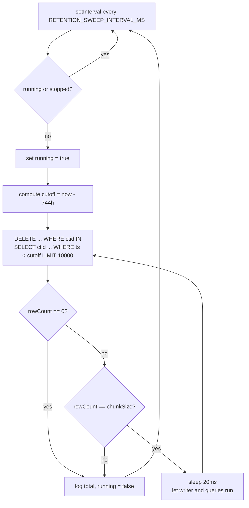
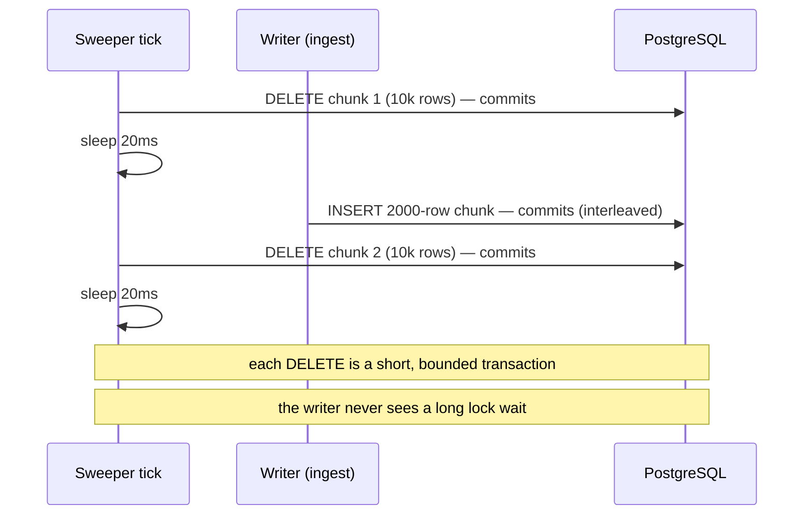

# 13. Retention — chunked deletes and the sweeper

## Summary

Logs older than `RETENTION_HOURS` (default 744 = 31 days) are removed by a background sweeper that runs every `RETENTION_SWEEP_INTERVAL_MS` (default 15 minutes). Instead of one giant `DELETE FROM logs WHERE ts < cutoff`, the sweeper deletes bounded chunks of rows using `DELETE ... WHERE ctid IN (SELECT ctid FROM logs WHERE ts < $1 LIMIT $2)` and sleeps 20ms between chunks, so a sweep never holds the whole table locked, never builds a gigantic transaction, and never starves concurrent writers or readers. A reentrancy guard prevents overlapping sweeps from stacking when a sweep takes longer than the interval. This lives entirely in [src/services/retention.ts](../src/services/retention.ts), wired at startup from config defaults documented in [src/config.ts:49](../src/config.ts#L49).

## Detailed explanation

**Why not one big DELETE.** Deleting months of rows in a single statement has three failure modes at this project's scale:

1. **Lock duration** — the DELETE holds row locks on everything it touches until commit; concurrent ingestion INSERTs and queries would block or deadlock against it. On a 1-CPU database with a live writer, that's unacceptable.
2. **Transaction/WAL size** — a multi-million-row delete builds a huge transaction: enormous WAL volume, a huge snapshot, and checkpoint pressure.
3. **Vacuum amplification** — every deleted row leaves a dead tuple. One gigantic delete produces millions of dead tuples at once; autovacuum can't keep up, the table bloats, and index scans degrade.

**The chunked shape.** `sweepExpired` ([src/services/retention.ts:25](../src/services/retention.ts#L25)) loops: each iteration runs

```sql
DELETE FROM logs
  WHERE ctid IN (SELECT ctid FROM logs WHERE ts < $1 LIMIT $2)
```

Why `ctid IN (SELECT ctid ... LIMIT n)` instead of `WHERE ts < $1 LIMIT $2` directly? PostgreSQL DELETE doesn't accept LIMIT, and `ctid` is the cheapest "any N rows" handle — the subquery grabs N ctids that satisfy the horizon (index- or seq-scan, bounded), and the DELETE removes exactly those physical row pointers. Each statement is bounded, commits independently, and produces at most `CHUNK_SIZE` (10,000) dead tuples per transaction.

**The pause.** When a chunk comes back full (exactly `chunkSize` rows deleted, meaning more may remain), the loop sleeps `CHUNK_PAUSE_MS` (20ms) before continuing ([src/services/retention.ts:43](../src/services/retention.ts#L43)). That 20ms gap is a yield window: the writer's INSERTs and user queries get the CPU and the write locks between chunks. The loop stops when a chunk deletes fewer rows than `chunkSize` (or zero), i.e. the horizon is fully swept; `total` is returned for the log line.

**Reentrancy guard.** `startRetentionSweeper` ([src/services/retention.ts:56](../src/services/retention.ts#L56)) runs the sweep on a `setInterval` but sets a `running` flag around each tick: if a sweep is still in progress when the next tick fires, the tick returns immediately. Without this, a slow DB plus a short interval would stack concurrent sweeps on top of each other — a DELETE storm hammering the same rows and doubling contention. The returned stop function clears the interval for graceful shutdown, and the timer is `unref()`'d so it never keeps the process alive.

**Coexistence with the writer.** The chunked design is what lets the sweeper share the 1-CPU database with the ingestion writer: each DELETE transaction is short (bounded rows, index-assisted subquery), commits, yields. Even a pathological full sweep is a long sequence of cheap statements rather than one catastrophic one. Config defaults: `RETENTION_HOURS=744`, `RETENTION_SWEEP_INTERVAL_MS=900000` ([src/config.ts:49](../src/config.ts#L49) and [src/config.ts:50](../src/config.ts#L50)).

**The honest limitation.** Chunked deletes still produce dead tuples that autovacuum must reclaim — they bound the blast radius but don't eliminate vacuum work. At production scale the canonical answer is time-based table partitioning (`DROP PARTITION` is O(1), lock-free, bloat-free), as the module's own doc comment records ([src/services/retention.ts:15](../src/services/retention.ts#L15)). For this project's size — 1M rows, 31-day horizon — chunked deletes are the right balance of simplicity and correctness: partitions add schema complexity, partition maintenance, and query-planning considerations that the contract's scale doesn't justify.

## Why this exists

An unbounded log table is a slowly leaking disk: storage fills, scans degrade, and every query gets slower as dead data accumulates. The contract's "zero-config" posture still requires a working default — 31-day retention, 15-minute cadence — implemented so that deleting old data can never take the service down or starve the writer that is, at contract scale, sustaining 15k rows/s. The sweeper exists to make retention correct, cheap, and self-scheduling with nothing to configure.

## Alternatives considered

| Alternative | Pros | Cons |
|---|---|---|
| Single `DELETE WHERE ts < cutoff` | One statement, simple | Long locks block the writer; giant transaction/WAL; millions of dead tuples at once → vacuum stalls; hit as the naive first attempt |
| Chunked deletes by `ctid` (chosen) | Bounded locks per transaction, yields between chunks, simple, no schema change | Still leaves dead tuples for autovacuum; sweep of a huge backlog takes a long wall-clock time |
| Time-based table partitioning + `DROP PARTITION` | O(1) drop, no locks, no dead tuples, zero vacuum | Schema/maintenance complexity, partition planning overhead, migration cost — overkill at 1M rows |
| Delete by primary key ranges (id) | Bounded, index-friendly | Requires knowing id ranges per time window; couples retention to id distribution; ctid is cheaper |
| Archive-to-cold-storage + delete | Keeps history | Out of contract scope; no cold storage in the container budget |
| No retention (never delete) | Zero risk | Disk fills; contract's default is 744h retention |

## Why this was chosen

The constraints — 1 CPU / 1GB PostgreSQL with a writer sustaining 15k/s — punish long lock holders and big transactions, and the naive single DELETE was the real failure that motivated the design (see Common mistakes). Chunked `ctid` deletes give bounded per-statement work, explicit yield windows, and no schema changes, which is the minimum correct design for the measured scale: 1.2M rows, 31-day horizon, one 15-minute sweep that completes in a handful of chunks. Partitioning was consciously deferred: it is strictly better at multi-GB scale but its complexity is not justified by a 1M-row contract, and it is documented as the production escape hatch in both the module doc ([src/services/retention.ts:15](../src/services/retention.ts#L15)) and the README ([../README.md:165](../README.md#L165)).

## Advantages / Disadvantages / Trade-offs

### Advantages
- Bounded locks: no transaction ever touches more than 10,000 rows.
- Writer-friendly: 20ms yields between chunks let INSERTs and queries interleave.
- No schema changes, no partition migration, trivially configurable (hours + interval env vars).
- Reentrancy guard makes overlapping sweeps impossible — no DELETE storms.
- `ctid` subquery is the cheapest possible "any N rows" selection; each statement is index- or seq-scan bounded.
- Failures are logged and the sweeper simply tries again next tick (self-healing).

### Disadvantages
- Dead tuples remain for autovacuum to reclaim — chunked deletes bound, but don't eliminate, vacuum amplification.
- A multi-year backlog makes a sweep long in wall-clock time (many chunks × 20ms).
- `ctid`-based selection is physical, not logical — fine for deletes, but not a general-purpose API.
- Sweeps run synchronously within their tick; a very slow database can make a tick last minutes.

### Trade-offs
- Simplicity vs. operational elegance: chunked deletes are "many small transactions" vs. partitions' "one metadata operation" — at 1M rows the former's simplicity wins.
- Write contention: sweeps consume write-path CPU on the same 1-CPU DB as the writer; the 15-minute cadence keeps duty cycle tiny.
- Autovacuum pressure is traded for availability (locks) — the same trade partition drops avoid entirely.

## Code

**Chunked sweep loop** ([src/services/retention.ts:22](../src/services/retention.ts#L22) and [src/services/retention.ts:25](../src/services/retention.ts#L25)):

```ts
const CHUNK_SIZE = 10_000;
const CHUNK_PAUSE_MS = 20;

export async function sweepExpired(
  pool: Pool,
  retentionHours: number,
  chunkSize = CHUNK_SIZE
): Promise<number> {
  const cutoff = new Date(Date.now() - retentionHours * 3_600_000);
  let total = 0;

  for (;;) {
    // ctid IN (SELECT ctid ... LIMIT n): cheap, bounded work per statement.
    const res = await pool.query(
      `DELETE FROM logs
        WHERE ctid IN (SELECT ctid FROM logs WHERE ts < $1 LIMIT $2)`,
      [cutoff, chunkSize]
    );
    const deleted = res.rowCount ?? 0;
    if (deleted === 0) break;
    total += deleted;
    if (deleted === chunkSize) {
      // More may remain — yield to other work before the next chunk.
      await new Promise((r) => setTimeout(r, CHUNK_PAUSE_MS));
    }
  }
  return total;
}
```

**Reentrancy-guarded scheduler** ([src/services/retention.ts:56](../src/services/retention.ts#L56)):

```ts
export function startRetentionSweeper(
  pool: Pool,
  config: Config,
  onError: (err: Error) => void = (err) => console.error("[retention]", err.message)
): () => void {
  let running = false;
  let stopped = false;

  const tick = async (): Promise<void> => {
    if (running || stopped) return;
    running = true;
    try {
      const deleted = await sweepExpired(pool, config.retentionHours);
      if (deleted > 0) console.log(`[retention] deleted ${deleted} expired logs`);
    } catch (err) {
      onError(err instanceof Error ? err : new Error(String(err)));
    } finally {
      running = false;
    }
  };

  const timer = setInterval(() => void tick(), config.retentionSweepIntervalMs);
  timer.unref?.();
  return () => {
    stopped = true;
    clearInterval(timer);
  };
}
```

**Defaults** ([src/config.ts:49](../src/config.ts#L49)): `retentionHours: int("RETENTION_HOURS", 744, 1, 24 * 365)` and `retentionSweepIntervalMs: int("RETENTION_SWEEP_INTERVAL_MS", 15 * 60 * 1000, 1000, 24 * 3600 * 1000)`.

## Diagrams





## Common mistakes

- **The naive single DELETE** — the first retention attempt deleted the whole horizon in one statement. During the load test it locked the table, blocked INSERTs (writer chunks started timing out), and produced tens of thousands of dead tuples that autovacuum couldn't keep up with — latency and vacuum bloat in one shot. Chunking fixed all three symptoms at once.
- **Forgetting the yield between chunks** — even chunked deletes without the 20ms pause monopolize the 1-CPU DB's write path; the pause is what makes ingestion and the sweep coexist.
- **No reentrancy guard** — if a sweep outlives the interval, stacked `tick()`s run the same deletion logic concurrently, doubling contention; the `running` flag prevents pile-up.
- **Using `LIMIT` directly in DELETE** — PostgreSQL doesn't support it; the `ctid IN (SELECT ... LIMIT n)` shape is the standard workaround.
- **Deleting by `ts` with a long window without an index** — the subquery would seq-scan; `(ts, ...)`-leading indexes make the probe cheap. For retention, any scan is acceptable since it's bounded by LIMIT, but index-assisted is much faster at 1M rows.
- **Tuning chunk size too large** — 10,000 rows × wide JSONB rows can still create noticeable WAL per chunk; chunk size is a knob (parameterized in `sweepExpired`) precisely so it can be lowered on constrained disks.
- **Sweeping while a checkpoint is running** — minor, but the pause also spreads WAL flushing so checkpoint peaks don't stack with delete bursts.

## Optimization ideas

- **Indexed horizon probe**: a `(ts)` leading index (already present via `idx_logs_ts_id`) keeps the `SELECT ctid` subquery index-assisted at scale.
- **Partitioning by month** (`logs_2026_08`) with `DROP PARTITION` — O(1), bloat-free; the documented production escape hatch ([src/services/retention.ts:15](../src/services/retention.ts#L15)).
- **Vacuum coordination**: `VACUUM logs` (or autovacuum tuning) right after a large sweep reclaims space sooner; `autovacuum_work_mem=64MB` already helps.
- **Adaptive pause**: scale `CHUNK_PAUSE_MS` by observed writer latency so the sweep backs off under load automatically.
- **Write-queue awareness**: have the sweeper consult the writer's pending count and skip a tick when a backlog exists.
- **Background worker / cron scheduling** instead of an in-process timer for multi-instance deployments (one sweeper per fleet, not per replica).

## Interview questions & answers

**Q1: Why not a single `DELETE WHERE ts < cutoff`?**
A1: It would hold row locks over the whole deleted set until commit (blocking the writer and queries), build a gigantic transaction with massive WAL, and produce millions of dead tuples at once — autovacuum falls behind and the table bloats. The project hit exactly this failure and replaced it with bounded chunks.

**Q2: What does `DELETE ... WHERE ctid IN (SELECT ctid ... LIMIT n)` do?**
A2: It selects up to n physical row pointers that satisfy the horizon in a bounded subquery, then deletes exactly those rows in one short transaction. `ctid` is the cheapest "any N rows" handle; DELETE has no LIMIT, so this is the idiomatic bounded delete.

**Q3: Why sleep between chunks?**
A3: The 20ms pause is a yield window: the ingestion writer and user queries get the CPU and write locks between DELETE transactions, so a sweep can't monopolize the shared 1-CPU database.

**Q4: What is the reentrancy guard and why is it needed?**
A4: `startRetentionSweeper` sets a `running` flag per tick; if a sweep is still active when the interval fires again, the new tick returns immediately. Without it, slow sweeps would stack concurrent DELETE storms.

**Q5: How does the sweeper coexist with the 15k/s writer?**
A5: Each chunk is a short, bounded transaction that commits independently, and the pause lets INSERTs interleave. At the 15-minute cadence the sweep's duty cycle is tiny relative to ingestion, so neither starves the other.

**Q6: What are the tuning knobs?**
A6: `RETENTION_HOURS` (default 744), `RETENTION_SWEEP_INTERVAL_MS` (default 900000), and in code `CHUNK_SIZE` (10,000) and `CHUNK_PAUSE_MS` (20) — chunk size is a function parameter so tests and operators can vary it.

**Q7: Does chunked deletion eliminate vacuum cost?**
A7: No — every deleted row leaves a dead tuple for autovacuum to reclaim. Chunking bounds the blast radius (10k dead tuples per transaction instead of millions) so autovacuum can keep up; it doesn't eliminate vacuum work. That's why partitions (DROP PARTITION) are the scale-up answer.

**Q8: Why weren't time-based partitions chosen?**
A8: At 1M rows and a 31-day horizon, partitioning adds schema and maintenance complexity (partition management, plan overhead) for a problem chunked deletes already solve acceptably. It's documented as the escape hatch for production scale rather than implemented now.

**Q9: What happens if a sweep fails mid-way?**
A9: The error is caught and logged (`onError`), the `running` flag is cleared in `finally`, and the next interval tick simply tries again — retention is self-healing and idempotent because each chunk re-evaluates `ts < cutoff` fresh.

**Q10: Why `ctid` instead of deleting by primary-key range?**
A10: `ctid` selection requires no knowledge of which ids fall in which time window — the subquery answers "which rows are expired" directly, and each statement is bounded by LIMIT. PK-range deletes would need extra bookkeeping for no benefit here.

**Q11: Could the sweep starve the read pool?**
A11: It uses its own pool query from the sweeper context; because chunks are small and commit fast, and the pool's max is sized for the workload, sweeps don't hold connections meaningfully. On a heavily loaded DB the pause between chunks bounds any impact.

**Q12: How is retention verified in tests?**
A12: Integration tests set a short `RETENTION_HOURS`, insert rows straddling the horizon, run `sweepExpired` (or trigger the sweeper), and assert expired rows are gone while recent rows remain — with chunk sizes small enough to exercise the multi-chunk loop.

## Implementation references

- [src/services/retention.ts:22](../src/services/retention.ts#L22) — CHUNK_SIZE / CHUNK_PAUSE_MS
- [src/services/retention.ts:25](../src/services/retention.ts#L25) — `sweepExpired` (ctid-chunked loop, inter-chunk pause)
- [src/services/retention.ts:56](../src/services/retention.ts#L56) — `startRetentionSweeper` (reentrancy guard, unref'd timer)
- [src/config.ts:49](../src/config.ts#L49) — RETENTION_HOURS default 744
- [src/config.ts:50](../src/config.ts#L50) — RETENTION_SWEEP_INTERVAL_MS default 900000
- [../README.md:132](../README.md#L132) — retention overview
- [../README.md:165](../README.md#L165) — documented partition escape hatch
