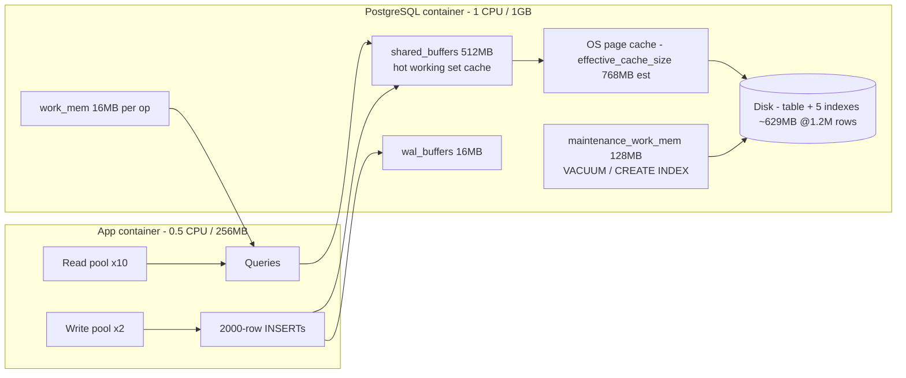

# 14. PostgreSQL tuning — every -c flag explained

## Summary

The PostgreSQL 16 container runs with eleven `-c` flags tuned for the project's hard budget: 1 CPU / 1GB container, 15k logs/s writes, 1M+ row queries. The headline change is `shared_buffers=512MB`: at the default 256MB, the 629MB working set (table + five indexes at 1.2M rows) spilled to disk and the insert path was measured doing 736 page reads per 500-row INSERT; raising it made the working set cache-resident. The rest of the flags — `effective_cache_size`, `work_mem`, `maintenance_work_mem`, `max_connections`, `wal_buffers`, `checkpoint_completion_target`, `max_wal_size`, `min_wal_size`, `autovacuum_work_mem`, `timezone=UTC` — tune the planner's assumptions, the write path, and vacuum behavior for this specific shape of workload. All flags live in [docker-compose.yml:17](../docker-compose.yml#L17), with the reasoning summarized in the compose comment block.

## Detailed explanation

PostgreSQL's defaults are designed for generic, larger machines; a 1-CPU/1GB container needs explicit overrides. Each flag in [docker-compose.yml:17](../docker-compose.yml#L17):

- **`shared_buffers=512MB`** — PostgreSQL's own buffer cache. The rule of thumb is up to ~25% of RAM for dedicated databases; with 1GB we take 512MB. The measured justification is the load-test story: at 256MB, the 629MB working set could not fit, index pages were read from disk on every insert (736 page reads per 500-row INSERT), and raising it to 512MB made the working set cache-resident. (Failure story c; see [../README.md:160](../README.md#L160).)
- **`effective_cache_size=768MB`** — the planner's estimate of OS-level cache available *in addition to* shared_buffers (the OS page cache counts). It doesn't allocate memory; it biases the planner toward index scans when it believes the hot working set is cached. 768MB ≈ 75% of 1GB, a sensible middle ground.
- **`work_mem=16MB`** — per-operation memory for sorts and hash aggregates. 16MB is conservative because work_mem applies *per sort/hash operation* across all concurrent backends; on a 1GB box, 10 read connections each sorting with 16MB is 160MB worst case — a deliberate cap to protect the container from aggregate/sort spikes.
- **`maintenance_work_mem=128MB`** — memory for maintenance operations (VACUUM, CREATE INDEX). Index rebuilds (five indexes at ingest time) and autovacuum benefit directly; 128MB is a large slice of 1GB but maintenance is infrequent and short.
- **`max_connections=50`** — PostgreSQL's connection ceiling. The app opens 10 (read pool) + 2 (write pool) connections ([src/db/pool.ts:23](../src/db/pool.ts#L23), [src/db/pool.ts:45](../src/db/pool.ts#L45)) plus transient migration/health checks; 50 leaves headroom for psql/load-test tooling without the memory cost of hundreds of backends.
- **`wal_buffers=16MB`** — shared memory for WAL before it's flushed to disk. A bigger buffer smooths write bursts — relevant because the writer commits 2000-row chunks, each generating a burst of WAL.
- **`checkpoint_completion_target=0.9`** — spreads checkpoint writes across 90% of the checkpoint interval instead of a final spike. Smooths the dirty-page flush that otherwise competes with ingestion.
- **`max_wal_size=2GB` / `min_wal_size=256MB`** — the band in which checkpoints are driven by WAL volume. 2GB allows checkpoints to be relatively rare during the 15k/s write stream (less checkpoint overhead stealing CPU from inserts); 256MB prevents checkpointing too eagerly at idle.
- **`autovacuum_work_mem=64MB`** — memory for autovacuum's dead-tuple tracking and index cleanup. Retention deletes (study/13) generate dead tuples in bursts; this gives autovacuum room to reclaim indexes efficiently.
- **`timezone=UTC`** — session timezone normalization. `date_bin`/`date_trunc` on `timestamptz` are timezone-independent, but this removes any surprise in `::text` casts and keeps bucket math and diagnostics deterministic. The app pool sets the same via `options: "-c timezone=UTC"` ([src/db/pool.ts:30](../src/db/pool.ts#L30)).

**Why 512MB shared_buffers fits the container.** shared_buffers is only part of PostgreSQL's memory; the rest (backend work_mem, OS cache) also lives in the 1GB cap. 512MB + 16MB wal_buffers + backend overhead (~5-10MB per connection × 50 max, realistically 12-15 active) plus the OS page cache stays within the limit — measured DB memory during the load run was ~790MB/1GB ([../README.md:149](../README.md#L149)). The evidence-driven choice was: start low, measure page reads with EXPLAIN (BUFFERS), raise until the working set stops spilling.

**How to diagnose (the toolset used here).**
- `EXPLAIN (ANALYZE, BUFFERS)` — see actual scan strategy and shared/local blocks touched per node; the 736-page-reads-per-insert figure came from this.
- `pg_stat_activity` — connection counts, long-running queries (used to find the read-pool starvation during load tests).
- `pg_stat_bgwriter` / `pg_stat_checkpointer` — checkpoint counts and written-buffers totals; a high `buffers_backend` count signals shared_buffers pressure.
- `pg_stat_user_tables` — dead-tuple counts, last_vacuum times (autovacuum keeping up with retention deletes).
- `EXPLAIN` plan quality after changing `effective_cache_size`/`work_mem` — the planner's cost estimates shift with these knobs.

## Why this exists

Default PostgreSQL settings are tuned for "unspecified shared server" — safe, generic, and wrong for a container with a hard 1GB cap and a sustained write stream. The measured alternative is concrete: at stock settings the insert path read index pages from disk constantly (736 page reads per 500-row INSERT), which capped write throughput and queued behind slow checkpoints. The flag set exists to (a) make the hot working set cache-resident, (b) keep planner estimates honest, (c) smooth the write path (WAL/checkpoint), and (d) keep maintenance (autovacuum) out of the critical path — all inside a strict memory budget.

## Alternatives considered

| Alternative | Pros | Cons |
|---|---|---|
| Stock/default settings | Zero config, known behavior | Measured: 736 page reads per 500-row insert; cache-miss-bound inserts; checkpoint spikes under load |
| Postgres tuning image (e.g. PGTune-style templates) | Convenient, comprehensive | Opaque; templates assume dedicated hardware, often over-allocate memory for containers |
| Container autotuning (e.g. `pgtune` wrapper in entrypoint) | Adapts to limits | Adds a startup dependency; hides decisions; hard to reason about deterministically |
| Reducing to fewer flags | Simpler to audit | The workload genuinely touches planner, WAL, and vacuum knobs — cutting any of these reappears as a measured bottleneck |
| Sidecar metrics (pg_stat collector based dashboards) | Visibility | Monitoring-only; doesn't fix the settings; not part of the container budget |

## Why this was chosen

Every flag is either planner-reasoning (cache sizes), write-path smoothing (WAL/checkpoint), or maintenance budgeting (work_mem variants) — chosen because the project's measured evidence named the exact failure: index pages read from disk on every insert, checkpoints colliding with the write stream, and autovacuum chasing retention deletes. The decision procedure was empirical: change one knob, re-run the contract-scale load, read EXPLAIN (BUFFERS) and pg_stat_bgwriter, keep what moved the numbers. The result fits the 1GB limit (790MB peak measured under load) and sustains the target without parallelism — on a single CPU, tuning the cache is the only way to make the working set fit.

## Advantages / Disadvantages / Trade-offs

### Advantages
- Measured, evidence-driven: each flag maps to a real bottleneck observed in the load run.
- Cache-resident working set: inserts and aggregates stop touching disk for index pages.
- Checkpoint smoothing keeps write bursts off the ingest path.
- Autovacuum keeps up with retention churn (dead-tuple bursts from chunked deletes).
- Reproducible: the full tuning lives in one compose command block, visible and diffable.

### Disadvantages
- Memory budget is tight: 512MB shared_buffers + WAL + backends leaves less headroom for spike-y sorts (work_mem is deliberately conservative).
- Settings are tuned for *this* workload; a dramatically different workload (e.g. wide analytical scans) would want different values.
- `effective_cache_size` is a planner hint — it can mislead if the OS cache is actually evicted (e.g. container pressure).

### Trade-offs
- Cache memory (shared_buffers) vs. connection count (50 max): both draw from 1GB; the app's 12 connections are what make the rest possible.
- Checkpoint infrequency (max_wal_size=2GB) vs. crash-recovery time: longer recovery window in exchange for less CPU stealing.
- work_mem 16MB protects the container from sort bombs but may force disk sorts for very large GROUP BYs — acceptable, since aggregation scans stay index-only at 1M rows.

## Code

**The full flag set** ([docker-compose.yml:17](../docker-compose.yml#L17)):

```yaml
    command: >
      postgres
      -c shared_buffers=512MB
      -c effective_cache_size=768MB
      -c work_mem=16MB
      -c maintenance_work_mem=128MB
      -c max_connections=50
      -c wal_buffers=16MB
      -c checkpoint_completion_target=0.9
      -c max_wal_size=2GB
      -c min_wal_size=256MB
      -c autovacuum_work_mem=64MB
      -c timezone=UTC
```

**Why 512MB** — the compose comment records the measured motivation ([docker-compose.yml:12](../docker-compose.yml#L12)):

```yaml
    # PostgreSQL tuning for 1 CPU / 1 GB. These are the knobs that matter for
    # high-throughput ingestion + fast aggregations (see study/14-postgresql.md).
    # shared_buffers=512MB: the table+index working set exceeds 256MB even at
    # ~1M rows; index pages were being read from disk on every insert (see
    # measured results in README).
```

**Matching session timezone in the app pool** ([src/db/pool.ts:26](../src/db/pool.ts#L26)):

```ts
    application_name: "log-service",
    // Guarantee bucket alignment: date_bin/date_trunc of timestamptz are
    // timezone-independent, but we normalize the session anyway to avoid any
    // surprise in ::text casts of timestamps.
    options: "-c timezone=UTC",
```

**Resource limits that frame the tuning** ([docker-compose.yml:40](../docker-compose.yml#L40)): the db service is capped at `cpus: "1.0"` / `memory: 1g`, the app at `cpus: "0.5"` / `memory: 256m` ([docker-compose.yml:61](../docker-compose.yml#L61)) — tuning must fit inside those.

## Diagrams



## Common mistakes

- **Setting shared_buffers too low for the working set** — the project's own measured failure: at 256MB, EXPLAIN showed 736 page reads per 500-row insert because index pages lived on disk; raising to 512MB made the working set cache-resident and insert latency dropped sharply.
- **Ignoring the container cap** — PostgreSQL doesn't know it's inside 1GB; stock defaults can overshoot and get the container OOM-killed. Every knob here was validated against the measured ~790MB peak.
- **Treating `effective_cache_size` as memory to allocate** — it's a planner estimate of OS cache; setting it beyond what the OS actually caches produces plans that assume warm data that isn't.
- **Setting `work_mem` too high** — it multiplies across concurrent backends (10 read + 2 write + extras); 64MB × 12 = 768MB would blow the budget. 16MB is the disciplined choice.
- **Frequent small checkpoints** — defaults checkpoint by WAL volume too eagerly under a 15k/s write stream; `max_wal_size=2GB` keeps checkpoint CPU off the ingest path.
- **Forgetting autovacuum under delete-heavy workloads** — retention (study/13) produces dead-tuple bursts; `autovacuum_work_mem=64MB` plus the observed `last_vacuum` timestamps in `pg_stat_user_tables` are how it stays ahead.
- **Diagnosing without BUFFERS** — `EXPLAIN ANALYZE` without `(ANALYZE, BUFFERS)` hides the disk-read story; the 736-page-reads metric only exists because the plan was read with buffers on.

## Optimization ideas

- **`wal_compression=on` + `wal_log_hints`** (as appropriate) to shrink WAL under heavy writes.
- **`synchronous_commit=off`** for the write pool only — trades a fsync for durability per chunk; not done here because the contract demands "200 only after commit".
- **`max_wal_senders`/replication off** — already zero-replica; keep it that way to save CPU.
- **Per-connection `work_mem` tuning** for the aggregate pool if sorts ever appear (disk-sort detection via EXPLAIN).
- **`huge_pages`/`shared_memory_type`** — irrelevant in a container, noted as a common production-setup rabbit hole to skip.
- **Dedicated monitoring via `pg_stat_statements`** — top-N queries by total time, to validate the tuning as data grows past 1M rows.
- **`autovacuum_vacuum_scale_factor=0.05` on the logs table** — tune vacuum frequency for the append-mostly table with chunked deletes.

## Interview questions & answers

**Q1: Why 512MB shared_buffers in a 1GB container?**
A1: Because the measured working set is ~629MB at 1.2M rows. At 256MB, EXPLAIN (BUFFERS) showed 736 page reads per 500-row insert — index pages coming from disk. At 512MB the working set is cache-resident, and peak DB memory stayed ~790MB/1GB during the load run.

**Q2: What does `effective_cache_size` actually do?**
A2: It's a planner hint: the estimated OS page-cache available beyond shared_buffers. It allocates nothing; it biases cost estimates toward index scans when data is assumed cache-warm. 768MB ≈ 75% of the container is a sane estimate of what the OS can cache.

**Q3: Why is work_mem only 16MB?**
A3: It's per-operation per-backend: 12 app connections × 16MB worst case is ~192MB. A bigger value risks OOM under concurrent sorts; on this workload aggregations are index-only scans, so sorts rarely need more.

**Q4: What is checkpoint_completion_target and why 0.9?**
A4: It spreads checkpoint dirty-buffer writes across 90% of the checkpoint interval instead of dumping them at the end. With a 15k/s write stream, that smoothing keeps checkpoint I/O from colliding with ingestion bursts.

**Q5: Why max_wal_size=2GB?**
A5: Checkpoints are driven by WAL volume; 2GB makes them rare during sustained writes, so less CPU/IO is stolen from INSERTs. The trade-off is a longer crash-recovery replay window, which is fine for a single-container service.

**Q6: How did you diagnose the shared_buffers problem?**
A6: EXPLAIN (ANALYZE, BUFFERS) on the insert path: the plan showed hundreds of shared-block reads per statement (736 per 500-row insert), and pg_stat_bgwriter showed backend-written buffers climbing — both signs of a working set that doesn't fit. Raising shared_buffers made both metrics collapse.

**Q7: Why `-c timezone=UTC` on the server?**
A7: `date_bin` on timestamptz is timezone-independent, but session timezone affects `::text` casts and any incidental formatting; normalizing it makes bucket math and diagnostics deterministic. The app pool mirrors it via `options: "-c timezone=UTC"`.

**Q8: Why 50 max_connections with only ~12 used?**
A8: 10 read + 2 write covers the app; 50 leaves room for migration/healthcheck connections, psql, and load-test tooling — while avoiding the memory cost of hundreds of backends in a 1GB container.

**Q9: How does autovacuum_work_mem interact with retention?**
A9: Chunked deletes (study/13) generate bursts of dead tuples. 64MB gives autovacuum room to clean heap and index pages efficiently; `pg_stat_user_tables` (`last_vacuum`, `n_dead_tup`) is how we verify it stays ahead.

**Q10: Could you raise maintenance_work_mem further?**
A10: Yes for isolated index builds, but it competes with shared_buffers for the same 1GB; 128MB already covers the five-index migration and autovacuum, and memory is shared across operations.

**Q11: What would you check if aggregates suddenly slow down as data grows?**
A11: EXPLAIN (ANALYZE, BUFFERS) for a seq scan (planner believes data isn't cached → check effective_cache_size honesty), shared_buffers hit ratio, `pg_stat_bgwriter` buffers_backend, and autovacuum dead-tuple counts — plus the documented rollup-table escape hatch (study/10).

**Q12: Is this tuning portable to a production VM?**
A12: The *method* is (measure with BUFFERS, tune cache sizes to the working set, smooth WAL/checkpoint, budget maintenance) but the *values* are container-specific — a production box with more RAM would raise shared_buffers/effective_cache_size and re-validate.

## Implementation references

- [docker-compose.yml:17](../docker-compose.yml#L17) — full `-c` flag block
- [docker-compose.yml:12](../docker-compose.yml#L12) — measured rationale for shared_buffers=512MB
- [docker-compose.yml:40](../docker-compose.yml#L40) — db resource limits (1 CPU / 1GB)
- [docker-compose.yml:61](../docker-compose.yml#L61) — app resource limits (0.5 CPU / 256MB)
- [src/db/pool.ts:23](../src/db/pool.ts#L23) — read pool sizing
- [src/db/pool.ts:26](../src/db/pool.ts#L26) — application_name + `-c timezone=UTC`
- [src/db/pool.ts:42](../src/db/pool.ts#L42) — dedicated write pool
- [../README.md:160](../README.md#L160) — the 256→512MB measured fix
- [../README.md:138](../README.md#L138) — 629MB working set, ~790MB peak DB memory
