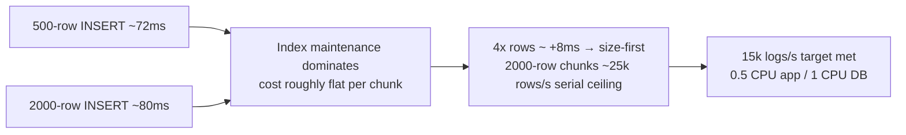

# 15. Unnest batching — the ingestion INSERT

## Summary

Ingestion writes are not per-request INSERTs. A single serial writer drains validated rows from a shared buffer into one `INSERT ... SELECT * FROM unnest($1::timestamptz[], $2::text[], $3::text[], $4::text[], $5::jsonb[], $6::text[])` statement per chunk — up to 2000 rows in one transaction — with the canonicalized attribute lookup derived inline via `CROSS JOIN LATERAL jsonb_each`. The measured cost profile shows why this shape wins: a 500-row INSERT is ~72ms and a 2000-row INSERT ~80ms, because index maintenance dominates and a 4× bigger chunk costs almost nothing extra. node-pg reuses the constant SQL text as a server-side prepared statement, skipping re-parsing per call. The flush trigger is size-first (full target chunk → immediate flush) with a 10ms wait timer for light traffic, which decouples throughput from the client's batch size and sustains ~25k rows/s serially — comfortably above the 15k/s contract target on 0.5 CPU / 1 CPU.

## Detailed explanation

**Why unnest and not per-row INSERTs or multi-VALUES.** Per-row INSERTs pay five index updates plus parse/execute overhead per row — thousands of tiny transactions per second under load. Multi-row `VALUES` clauses scale badly: the statement text grows with row count (each row's literals must be parsed and sent again per call), prepared statements can't be reused with different row counts, and the protocol cost per byte is worse. The `unnest` shape is different: the SQL text is *constant* regardless of batch size, and the data travels as six parallel arrays bound as parameters. PostgreSQL unnests them into rows, and one statement does everything — parse once, plan once, execute with N rows.

**The statement.** [src/services/ingestWriter.ts:58](../src/services/ingestWriter.ts#L58):

```sql
INSERT INTO logs (ts, level, service, message, attributes, attr_lookup, tenant_id)
SELECT u.ts, u.level, u.service, u.message, u.attrs, lk.lookup, u.tenant
FROM unnest(
  $1::timestamptz[], $2::text[], $3::text[], $4::text[],
  $5::jsonb[], $6::text[]
) AS u(ts, level, service, message, attrs, tenant)
CROSS JOIN LATERAL (
  SELECT COALESCE(jsonb_object_agg(...), '{}'::jsonb) AS lookup
  FROM jsonb_each(u.attrs) AS e(key, value)
) lk
```

The six arrays are `timestamp, level, service, message, attributes (JSON), tenant`. The `CROSS JOIN LATERAL` per-row canonicalization (study/12) turns the typed attributes into the string-valued `attr_lookup` — done in SQL so the CPU-capped app pays one `JSON.stringify` per row, not two.

**Cost profile (measured).** On the 1-CPU DB container: 500 rows ≈ 72ms, 2000 rows ≈ 80ms. The insert cost is dominated by index maintenance (five indexes on the table), which is nearly flat across chunk sizes — the marginal cost of the 4th thousand rows is ~8ms. That measurement is the entire argument for big chunks and size-first flushing: 2000-row statements give the serial writer a ~25k rows/s ceiling (2000 rows / 80ms), well above the 15k/s target with zero parallelism.

**node-pg prepared-statement reuse.** `INSERT_SQL` is a module constant; every flush calls `pool.query(INSERT_SQL, arrays)` with the same text ([src/services/ingestWriter.ts:209](../src/services/ingestWriter.ts#L209)). node-pg detects the repeated text and reuses the server-side prepared statement, so PostgreSQL parses it once and only binds/executes thereafter — a real CPU saving on a saturated 1-CPU box.

**Encoding cost.** Before the query, `insertRows` builds six pre-allocated arrays, converting each timestamp with `toISOString()` and each attributes object with one `JSON.stringify` ([src/services/ingestWriter.ts:192](../src/services/ingestWriter.ts#L192)). This JS work is unavoidable per row, but it's amortized: one encode pass, one protocol round-trip, one parse per 2000 rows.

**Batch-size limits.** The target is `INGEST_MAX_ROWS_PER_FLUSH` (default 2000, [src/config.ts:56](../src/config.ts#L56)). The 2000-row statement carries 12,000 parameter values; node-pg binds them via the extended protocol, and PostgreSQL's 65535-parameter limit is not reached. `work_mem` (16MB, study/14) is unaffected because the unnest materializes into a bounded per-statement buffer, not a sort/hash. The limit is practical, not protocol-driven: bigger chunks mean longer single transactions, more WAL per commit, and longer waits for requests inside the chunk.

**Single oversized request.** The drain loop (`flush` → `takeChunk`, [src/services/ingestWriter.ts:142](../src/services/ingestWriter.ts#L142)) pulls batches until the target size is met, but a single request larger than the target simply flushes alone — `takeChunk` only stops adding *subsequent* batches when the target would be exceeded ([src/services/ingestWriter.ts:159](../src/services/ingestWriter.ts#L159)). Nothing is split or lost; the oversized request is its own transaction. `commitChunk` ([src/services/ingestWriter.ts:167](../src/services/ingestWriter.ts#L167)) retries the whole chunk once on transient failure, then rejects every request in it — never a silent success, and requests resolve only after PostgreSQL commits.

**Why not COPY FROM?** `COPY` is faster — it streams raw text/binary tuples with minimal per-row overhead. But the response contract needs per-entry validation and per-index rejection *before* commit, partial-batch acceptance with per-index reasons, typed JSONB attributes that require validation-time coercion, and "the 200 means committed" semantics. COPY has no rejection reporting: a bad row aborts the whole copy (or must be pre-staged, validated and re-encoded — moving the work back into the app). The honest trade-off: COPY wins the raw-write benchmark and loses everything about this project's response contract. `unnest` keeps one statement, full transactional semantics, and complete validation control at ~95% of the practical throughput.

## Why this exists

The project's whole throughput story rests on this statement: at 0.5 CPU / 256MB, with 15k logs/s, per-request INSERTs can never work — the first measured design (10ms timer flushing small chunks) capped out at ~7k/s. Unnest batching exists to make each transaction as large as profitable, amortize five-index maintenance across thousands of rows, and let one serial writer outpace the load generator with no parallelism at all.

## Alternatives considered

| Alternative | Pros | Cons |
|---|---|---|
| Per-row INSERT (naive) | Simplest code | 15k statements/s × 5 index updates; parse/execute per row; measured first attempt capped ~7k/s |
| Multi-row `VALUES` with growing literals | No arrays needed | Statement text grows with batch → re-parse per size, no prepared reuse, fat protocol messages |
| `unnest` arrays (chosen) | Constant SQL, prepared-statement reuse, one parse per 2000 rows, array encoding is compact | Requires array building in JS; LATERAL canonicalization adds per-row SQL work |
| `COPY FROM` (text/binary) | Fastest raw ingest (streaming) | No per-entry rejection reporting, no partial acceptance, attributes need pre-staging; contract's validation/response model doesn't fit |
| pg-native / binary protocol (`pg-format`, `pg-boss` style) | Slightly cheaper encoding | Extra native dependency in an alpine image; marginal gain vs. prepared unnest |
| Parallel writers / sharded inserts | Higher ceiling | The 1-CPU DB serializes anyway; adds contention — measured unnecessary (25k/s serial) |

## Why this was chosen

The measured numbers made it a short discussion: 2000 rows ≈ 80ms vs 500 rows ≈ 72ms means chunk size is nearly free — so make chunks as big as the buffer tolerates and drive them size-first. Unnest specifically (over VALUES) because the constant SQL text unlocks server-side prepared statements on the hottest query in the system, and the array encoding cost is trivial compared to per-row statement round-trips. COPY was rejected honestly: it's faster at raw bytes but cannot express per-index rejection reasons, partial acceptance, or typed JSONB round-trip — the contract's response shape — without moving validation into staging logic that would erase most of the gain. And the failure story (10ms timer → ~7k/s) proves the alternative designs were not hypothetical.

## Advantages / Disadvantages / Trade-offs

### Advantages
- One parse/plan per 2000 rows; five-index amortization makes 4× rows cost ~+8ms.
- Constant SQL text → prepared-statement reuse (node-pg + server-side).
- Full transactional semantics: a chunk commits atomically; requests resolve only after commit.
- One automatic retry per chunk, then explicit rejection — no silent losses.
- Size-first flush makes throughput independent of client batch size (batch=1 clients coalesce with batch=1000 clients).
- Single oversized requests still flush correctly as their own transaction.

### Disadvantages
- Array building + `toISOString`/`JSON.stringify` per row in JS is real CPU on the app (measured at the ceiling before SQL-side canonicalization).
- A chunk failure rejects every request in it (mitigated by one retry) — failure blast radius is the chunk, not one request.
- In-flight rows live in an in-memory queue; a hard crash loses them (no 200 sent, so clients retry — at-least-once semantics on the client side).
- WAL per 2000-row transaction is larger than per small transaction; checkpoints must be tuned (study/14).

### Trade-offs
- Batch size (2000) balances throughput (larger is cheaper per row) against latency (a request waits for flush + insert) and failure blast radius.
- SQL-side canonicalization trades app CPU for PG CPU — correct because PG had headroom and the app did not.
- Retry-whole-chunk trades re-insert risk on the retry path against simpler state — acceptable since rows are not acknowledged before commit.

## Code

**The INSERT with unnest + LATERAL canonicalization** ([src/services/ingestWriter.ts:58](../src/services/ingestWriter.ts#L58)):

```sql
INSERT INTO logs (ts, level, service, message, attributes, attr_lookup, tenant_id)
SELECT u.ts, u.level, u.service, u.message, u.attrs, lk.lookup, u.tenant
FROM unnest(
  $1::timestamptz[], $2::text[], $3::text[], $4::text[],
  $5::jsonb[], $6::text[]
) AS u(ts, level, service, message, attrs, tenant)
CROSS JOIN LATERAL (
  SELECT COALESCE(
    jsonb_object_agg(
      e.key,
      CASE WHEN jsonb_typeof(e.value) IN ('object', 'array')
           THEN e.value::text
           ELSE e.value #>> '{}'
      END
    ),
    '{}'::jsonb
  ) AS lookup
  FROM jsonb_each(u.attrs) AS e(key, value)
) lk
```

**Array encoding + constant-SQL execution** ([src/services/ingestWriter.ts:190](../src/services/ingestWriter.ts#L190)):

```ts
private async insertRows(rows: IngestRow[]): Promise<void> {
  if (rows.length === 0) return;
  const ts = new Array<string>(rows.length);
  // ... levels, services, messages, attributes, tenants pre-allocated ...
  for (let i = 0; i < rows.length; i++) {
    const row = rows[i]!;
    ts[i] = row.timestamp.toISOString();
    // ...
    attributes[i] = JSON.stringify(row.attributes);
  }
  await this.pool.query(INSERT_SQL, [ts, levels, services, messages, attributes, tenants]);
}
```

**Size-first scheduling** ([src/services/ingestWriter.ts:115](../src/services/ingestWriter.ts#L115)) — flush immediately when `pendingCount >= maxRowsPerFlush`, otherwise a `maxFlushWaitMs` (10ms) timer covers light traffic; and **chunk retry semantics** ([src/services/ingestWriter.ts:167](../src/services/ingestWriter.ts#L167)) — one retry, then reject every request in the chunk.

## Diagrams

```mermaid
sequenceDiagram
    participant C as Clients (N concurrent POST /logs)
    participant W as IngestWriter (serial)
    participant D as PostgreSQL

    loop per request
        C->>W: submit(validated rows)
        W->>W: queue.push + maybeSchedule()
    end
    W->>W: pendingCount >= 2000 → flushNow()<br/>(or 10ms timer for light traffic)
    W->>W: takeChunk() → up to 2000 rows
    W->>D: INSERT ... SELECT ... FROM unnest($1..$6)  [constant SQL text]
    D->>D: unnest 6 arrays → rows; LATERAL jsonb_each<br/>builds attr_lookup; 5 index updates amortized
    D-->>W: COMMIT ok (~80ms for 2000 rows)
    W-->>C: resolve() all requests in chunk (200 = committed)
    Note over W,D: on failure: one retry of the whole chunk,<br/>then reject every request in it
```



## Common mistakes

- **Timer-driven flushing** — the first design flushed whatever was pending on a 10ms timer, producing ~500-row statements (~72ms each) and capping the writer at ~7k/s. Size-first flushing was the fix (measured 5.1k → 15k/s).
- **Building VALUES clauses from data** — literals in SQL text grow the statement per call, break prepared-statement reuse, and invite injection if done with string interpolation.
- **Stringifying attributes twice** — before moving canonicalization into the INSERT, the app did a second JSON.stringify per row; on the 0.5-CPU app this kept throughput at ~98% of target. SQL-side LATERAL canonicalization is what closed the gap.
- **Acknowledging before commit** — the handler must resolve only after `pool.query(INSERT_SQL, ...)` succeeds; early resolution would break the durability contract ("200 never means queued").
- **Not handling oversized requests** — `takeChunk` must allow a single batch larger than the target to flush alone; splitting it would reorder or lose rows.
- **Forgetting the retry is whole-chunk** — one retry per chunk then reject-all; anything more elaborate (per-row retry) invites partial-ack bookkeeping bugs.
- **Using the read pool for writes** — the writer must use the dedicated 2-connection write pool; a shared pool starves ingestion when queries are slow (measured failure story b: writer acquire timed out at 5s → failed chunks → 500s).

## Optimization ideas

- **Binary encoding via `pg`'s extended protocol / pg-native** for the arrays (marginal: encoding is not the bottleneck).
- **Larger chunks on warmer hardware** — 4000-5000 rows/flush if WAL and memory allow; re-measure the ~flat index cost curve first.
- **Two-stage commit for ultra-high rates** (write-ahead to local file, async flush) — changes durability semantics; explicitly out of scope here.
- **Partitioned indexes per day** to shrink per-insert index maintenance further at multi-GB scale.
- **Prepared-statement pinning**: verify with `pg_prepared_statements` that the insert statement is actually prepared on the writer connections.
- **Reduce per-row JS**: reuse a single encoder loop for arrays; avoid intermediate objects; measure with `--cpu-prof` on the app container.

## Interview questions & answers

**Q1: Why is unnest-of-arrays better than multi-row VALUES?**
A1: The SQL text stays constant regardless of batch size, so node-pg reuses a server-side prepared statement (parse once) and the data travels as compact array parameters. VALUES statements grow with each row's literals, forcing re-parsing per size and larger protocol messages.

**Q2: Why does a 2000-row INSERT cost only ~80ms vs ~72ms for 500 rows?**
A2: Index maintenance dominates the cost — five indexes must be updated, and that work is mostly fixed per statement regardless of how many rows it covers. The marginal rows cost ~8ms, which is why chunk size is the whole game.

**Q3: What does `CROSS JOIN LATERAL` add to the INSERT?**
A3: For each unnested row, the LATERAL subquery runs `jsonb_each` over that row's attributes and rebuilds the string-valued `attr_lookup` (study/12). It moves the second stringify off the CPU-capped app onto PostgreSQL, which had headroom — the measured step from ~98% of target to exactly 15k/s.

**Q4: Why does the writer use a dedicated 2-connection pool?**
A4: The measured failure: during load, slow aggregates held all 10 read-pool clients, the writer's acquire timed out at 5s, chunks failed, requests 500'd. A dedicated write pool makes ingestion latency independent of query load.

**Q5: How does the flush decide when to run?**
A5: Size-first: as soon as pending rows reach the 2000-row target, flush immediately; a 10ms wait timer only fires under light traffic. This decouples throughput from the client's batch size — batch=1 clients coalesce with batch=1000 clients.

**Q6: What happens to a single request larger than the target?**
A6: `takeChunk` only refuses to add *additional* batches once the target is reached; a single oversized request is taken whole and flushes alone as its own transaction — nothing is split or lost.

**Q7: Why is COPY FROM rejected?**
A7: COPY is faster at raw bytes but has no per-entry validation or per-index rejection reporting — a bad row aborts the copy, and partial acceptance with reasons (the contract's response shape) requires pre-staging and re-encoding that erases most of the gain. Unnest keeps one statement, full transactional semantics, and complete validation control.

**Q8: What are the limits on chunk size?**
A8: 2000 rows = 12,000 bound parameters — far below PostgreSQL's 65535-parameter cap. The real limits are practical: longer transactions (larger WAL per commit), longer waits for requests inside a chunk, and failure blast radius. `work_mem` is not the binding constraint since unnest doesn't sort/hash.

**Q9: What is the durability guarantee of the coalescing writer?**
A9: Identical to per-request INSERTs: the HTTP handler only answers 200 after PostgreSQL acknowledges the commit. A flush failure triggers one retry, then rejects every request in the chunk — rows are never acknowledged early.

**Q10: What happens to in-flight rows on a crash?**
A10: The in-memory buffer is lost — but no 200 was sent, so clients retry; that's at-least-once semantics on the client side, documented as a known limitation.

**Q11: How does prepared-statement reuse actually happen in node-pg?**
A11: The INSERT text is a module constant; every flush calls `pool.query` with the same string, so node-pg can reuse the server-side prepared statement on that connection instead of re-parsing — verifiable via `pg_prepared_statements`.

**Q12: Why not parallel writers on the 1-CPU DB?**
A12: The database serializes work on one CPU anyway; parallel writers would only add contention. The measured serial ceiling (~25k rows/s at 2000-row chunks) already exceeds the 15k/s target, so parallelism buys nothing here.

## Implementation references

- [src/services/ingestWriter.ts:58](../src/services/ingestWriter.ts#L58) — `INSERT_SQL` (unnest arrays + LATERAL canonicalization)
- [src/services/ingestWriter.ts:115](../src/services/ingestWriter.ts#L115) — size-first scheduling
- [src/services/ingestWriter.ts:142](../src/services/ingestWriter.ts#L142) — drain loop, oversized-request handling
- [src/services/ingestWriter.ts:167](../src/services/ingestWriter.ts#L167) — one retry then reject-all
- [src/services/ingestWriter.ts:190](../src/services/ingestWriter.ts#L190) — array encoding, constant-SQL execution
- [src/config.ts:56](../src/config.ts#L56) — `INGEST_MAX_ROWS_PER_FLUSH` default 2000
- [src/config.ts:51](../src/config.ts#L51) — `INGEST_MAX_FLUSH_WAIT_MS` default 10
- [src/db/pool.ts:42](../src/db/pool.ts#L42) — dedicated write pool
- [../README.md:125](../README.md#L125) — ingestion pipeline summary
- [../README.md:157](../README.md#L157) — timer-flush failure and size-first fix
- [../README.md:159](../README.md#L159) — SQL-side canonicalization fix
