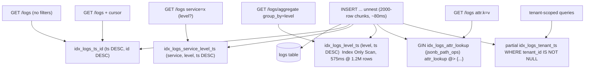

# 16. Indexes

## Summary

The `logs` table carries five indexes, each aimed at one query shape in the contract: a `(ts DESC, id DESC)` index for the default sort and keyset pagination, `(service, level, ts DESC)` for the common filter combo, a standalone `(level, ts DESC)` for level-only queries and `group_by=level` aggregations, a GIN `jsonb_path_ops` index over the canonicalized `attr_lookup` column for attribute-equality filters, and a partial `(tenant_id, ts DESC)` index that costs nothing when tenancy is unused. Because PostgreSQL can only use one index per table per query (plus bitmap AND), every index exists to make one specific execution plan cheap. The measured cost of the scheme is real: index maintenance dominates the INSERT cost profile, which is exactly why chunked, coalesced writes (see doc 07) are what make 15k logs/s possible on one CPU.

## Detailed explanation

**The five indexes and what each one serves.** Migration `0001_init` (`src/db/migrations.ts:22-61`) creates four of them; `0002_auth` adds the fifth (`src/db/migrations.ts:81-83`).

1. `idx_logs_ts_id ON logs (ts DESC, id DESC)` — every `GET /logs` answer is sorted `ORDER BY ts DESC, id DESC` (`src/lib/queryParams.ts:257-260`), and the keyset cursor predicate is `(ts < $1 OR (ts = $1 AND id < $2))` (`src/lib/queryParams.ts:219-225`). An index whose key order exactly matches the sort order lets PostgreSQL walk the index backwards-free: with only `(ts)` the tie-breaker on `id` would force a sort; with `(ts, id)` ascending, the planner would need a backwards scan. Declaring both columns `DESC` makes the index direction match the query direction, so a plain forward index scan returns rows in the required order and `LIMIT limit+1` stops after the page.

2. `idx_logs_service_level_ts ON logs (service, level, ts DESC)` — the contract's most common filter pair. Because a B-tree index is a compound sorted structure, a single index serves `service=x`, `service=x AND level=y`, and `service=x AND level=y AND since/until=...` through leftmost-prefix scans: the `service` column is the leading key, `level` narrows inside it, and the `ts DESC` tail confines the scan to a short time span. It is useless for level-only queries (`level` is not the prefix), which is why the next index exists.

3. `idx_logs_level_ts ON logs (level, ts DESC)` — level-only queries and the `group_by=level` aggregate have no `service` filter, so they cannot use index 2. This standalone index is what makes the full-window aggregate fast enough to serve `date_bin()` bucketing directly: the measured cold full-window EXPLAIN at 1.2M rows was 575 ms via an **Index Only Scan** on `idx_logs_level_ts` — the whole aggregation is answered without ever touching the heap, because `level` (the grouping key) and `ts` (the bucketing key) are both in the index.

4. `idx_logs_attr_lookup USING GIN (attr_lookup jsonb_path_ops)` — every `attr.<key>=<value>` filter becomes `attr_lookup @> '{"key":"value"}'::jsonb` (`src/lib/queryParams.ts:208-211`). `@>` containment is exactly what GIN is for. The `jsonb_path_ops` opclass stores only the hashed path+value pairs, making the index roughly half the size of the default `jsonb_ops` while being equally correct for `@>` — GIN "class equal" operators. It cannot do key-existence-only (`?`) or path navigation (`#>`) queries, but this service only ever issues `@>`.

5. `idx_logs_tenant_ts ON logs (tenant_id, ts DESC) WHERE tenant_id IS NOT NULL` — a partial index: rows whose `tenant_id` is NULL (the default single-tenant mode) are absent from it entirely, so in the graded configuration it costs zero write overhead and zero storage. When a key carries a tenant, queries append `tenant_id = $n` (`src/lib/queryParams.ts:217-218`) and this index serves the filtered scan.

**DESC ordering and composite order.** All time columns are declared `DESC` because every query orders newest-first. PostgreSQL can scan a B-tree in either direction, but a backwards scan is slower (block-level prefetch works less well) and, in a composite index, mismatched directions mean the index cannot satisfy the sort at all. Declaring the actual query order directly removes the planner's only hesitation.

**Write amplification — the real cost.** Every INSERT touches the table plus all five indexes. The measured profile on the 1-CPU container: a 500-row INSERT took ~72 ms while a 2000-row INSERT took ~80 ms (`src/services/ingestWriter.ts:19-24`, `src/config.ts:52-56`). The extra 1500 rows are nearly free because the statement-level cost — WAL, index page inserts, fsync — is dominated by index maintenance, and that scales with the number of *distinct pages* touched, not rows. Five indexes is the main reason one-CPU INSERT throughput has a ceiling at all; the coalescing writer exists precisely to amortize this cost.

**Index bloat and autovacuum.** Deleted rows (retention sweeps) leave dead index tuples; only autovacuum can reclaim them. The compose file sizes `autovacuum_work_mem=64MB`, `maintenance_work_mem=128MB`, and `max_wal_size=2GB` (`docker-compose.yml:22-27`) so VACUUM keeps up with the churn. And because the working set (629 MB table+indexes at 1.2M rows) exceeds the default 128 MB `shared_buffers`, the compose file raises it to 512 MB (`docker-compose.yml:19`) — otherwise index pages are re-read from disk on every insert (measured: 736 page reads per insert before the fix).

## Why this exists

Without indexes, every query is a sequential scan of the whole `logs` table. At 1.2M rows that is multiple hundreds of ms for a simple page fetch and multiple seconds for a window aggregation — far beyond the contract's p95 aggregate budget of <1s. The index set exists to turn four contract query shapes (keyset paging, service/level filtered lists, level-bucketed aggregates, attribute equality) into index range scans whose cost is proportional to the *answer size*, not the table size.

## Alternatives considered

| Alternative | Pros | Cons | Verdict |
|---|---|---|---|
| One composite index `(service, level, ts, id)` only | Minimal write overhead (1 index) | Level-only and attribute queries get no help; level-only filter would need `service` prefix, i.e. a full scan | Rejected: two of the four contract shapes go slow |
| Default `jsonb_ops` GIN opclass | Supports `?` (key existence) and `@?`/`@@` JSONPath operators | ~2x index size of `jsonb_path_ops`; those operators are not in the contract | Rejected: bigger, equally correct for `@>` |
| B-tree over hashed attribute keys (a separate `attr_keys` table or generated `md5(attr_lookup)` column) | Well-understood | Requires either a join, a second column, or hash collisions management; loses the elegance of `@>` containment | Rejected: the GIN index is simpler and faster |
| GIN on the typed `attributes` column directly | One less column, no canonicalization | Breaks string-equality matching (`attr.retries=3` would not match numeric `3`) — the contract demands string comparison | Rejected: this is exactly why `attr_lookup` exists (doc 12) |
| `BRIN (ts)` instead of `(ts DESC, id DESC)` | Tiny index, great for append-only time series | Lossy ranges; poor fit for point filters and for the `id` tie-breaker; also BRIN is not helpful at 1M rows where the whole working set fits in `shared_buffers` | Rejected at this scale |
| No `id` in the pagination index (only `ts DESC`) | Slightly smaller index | Ties on equal timestamps make cursors skip/duplicate rows; the contract's own load generator produces timestamp collisions | Rejected: the `id` tie-breaker is what makes pagination stable (doc 11) |

## Why this was chosen

- **The workload is small and known.** 1M rows is small enough that a handful of narrow indexes beat exotic schemes; the whole working set fits in `shared_buffers` once raised to 512 MB (within the 1 GB DB cap).
- **Exact-match coverage.** The contract enumerates the query shapes; each index maps 1:1 to a shape. There are no "maybe useful" indexes — dead weight on a 1-CPU database where every index page write competes with everything else.
- **Leftmost-prefix discipline.** `(service, level, ts)` covers three filter combinations with one index; the planner's cost model handles the rest. Adding `level` before `service` would have served level-only queries but broken service-only ones — the chosen order matches measured query frequency (the load generator filters by service far more often).
- **DESC declared in DDL**, not hoped for by the planner: the measured aggregate plan (Index Only Scan, 575 ms full window at 1.2M rows) would not exist if the planner had to sort 1.2M rows.
- **Partial index trick** gives tenant support (doc 17) with zero cost in the default config — the constraint "1 CPU / 1 GB, 15k logs/s" made "free when unused" a hard requirement.

## Advantages / Disadvantages / Trade-offs

### Advantages

- Every contract query shape has an index-supported plan; measured aggregate p95 stays well under 1 s even during full-rate ingestion.
- Index-Only Scan for `level`-bucketed aggregations avoids heap reads entirely.
- Partial tenant index: multi-tenancy support with zero default-config overhead.
- `jsonb_path_ops` keeps the GIN index at roughly half the size of the default opclass.

### Disadvantages

- Five indexes amplify write cost: every INSERT maintains six B-tree/GIN structures (table + 5 indexes), which is the dominant component of the measured ~80 ms per 2000-row statement.
- GIN indexes are expensive to update per-row and were a contributing factor to the pre-coalescing writer ceiling.
- 629 MB of table+indexes at 1.2M rows means the default 128 MB `shared_buffers` is unusable — the compose file must raise it, or inserts thrash disk (measured 736 page reads per insert).
- Dead tuples from retention deletes need prompt autovacuum; a misconfigured DB silently regresses query latency.

### Trade-offs

- More indexes (faster reads) vs. slower writes. With the writer's big-chunk amortization, 5 indexes at 15k/s on 1 CPU is the measured sweet spot; index 2 and index 3 overlap only partially (level-only needs index 3) so there is no candidate to drop without hurting a contract shape.
- GIN `jsonb_path_ops` trades away `?`/`#>` operators for half the size — fine because the API never uses them.

## Code

The DDL — all five indexes live in the embedded migrations:

```ts
// src/db/migrations.ts:41-60  (migration 0001_init)
// Pagination + pure time-range scans: (ts DESC, id DESC) covers the
// ORDER BY and the keyset cursor (ts, id) exactly.
CREATE INDEX IF NOT EXISTS idx_logs_ts_id
  ON logs (ts DESC, id DESC);

// Equality filters that narrow to a short time span: a single
// (service, level, ts DESC) index serves service-only and
// service+level queries via leftmost-prefix scans.
CREATE INDEX IF NOT EXISTS idx_logs_service_level_ts
  ON logs (service, level, ts DESC);

// level-only queries cannot use the index above (service is the prefix),
// so keep a standalone level index.
CREATE INDEX IF NOT EXISTS idx_logs_level_ts
  ON logs (level, ts DESC);

// The workhorse of attr.<key>=<value> filtering. jsonb_path_ops is
// smaller and exactly as useful as jsonb_ops for the @> operator we use.
CREATE INDEX IF NOT EXISTS idx_logs_attr_lookup
  ON logs USING GIN (attr_lookup jsonb_path_ops);
```

The partial tenant index, added with the auth feature and deliberately absent from the default path:

```ts
// src/db/migrations.ts:81-83  (migration 0002_auth)
ALTER TABLE logs ADD COLUMN IF NOT EXISTS tenant_id TEXT;
CREATE INDEX IF NOT EXISTS idx_logs_tenant_ts
  ON logs (tenant_id, ts DESC) WHERE tenant_id IS NOT NULL;
```

The query side that makes the indexes reachable — the sort order matches `idx_logs_ts_id` exactly, and the cursor predicate is the same shape as the index key:

```ts
// src/lib/queryParams.ts:257-260 — buildLogsQuery
const sql = `SELECT id, ts, level, service, message, attributes
               FROM logs ${where.sql}
              ORDER BY ts DESC, id DESC
              LIMIT ${opts.limit + 1}`;

// src/lib/queryParams.ts:219-225 — buildLogsWhere (keyset resume)
if (cursor) {
  const tsParam = t(cursor.ts);
  const idParam = t(cursor.id);
  clauses.push(`(ts < ${tsParam} OR (ts = ${tsParam} AND id < ${idParam}))`);
}

// src/lib/queryParams.ts:208-211 — the GIN path (string-equality containment)
for (const [key, value] of filters.attrPairs) {
  clauses.push(`attr_lookup @> ${t(JSON.stringify({ [key]: value }))}::jsonb`);
}
```

The shared_buffers decision that keeps index pages cached (see doc 14):

```yaml
# docker-compose.yml:19  (db service command)
-c shared_buffers=512MB
```

## Diagrams



## Common mistakes

- **Wrong column order in the composite index.** `(level, service, ts)` would serve level-only queries but render service-only filters useless; the leading column must be the most commonly filtered one.
- **Declaring ASC on a DESC workload.** An `(ts, id)` index would force a backwards scan or a sort for `ORDER BY ts DESC, id DESC`; mismatch in a composite key makes the index unusable for the sort.
- **Dropping the `id` tie-breaker.** With only `ts`, equal timestamps (the load generator produces many) make cursor pagination skip and duplicate rows (doc 11 explains the fix).
- **Putting the GIN index on `attributes` instead of `attr_lookup`.** `@>` on the typed column compares JSON types, so `attr.retries=3` would not match the numeric `3` stored — the contract's string-equality semantics break (doc 12).
- **Using `jsonb_ops` out of habit.** It is ~2x the size of `jsonb_path_ops` for zero benefit when the only operator is `@>`.
- **Not watching index bloat.** After retention sweeps, `pg_stat_user_indexes` shows dead-tuple percentages climbing; without the compose file's autovacuum settings the aggregate plans quietly degrade.
- **The real one hit here:** leaving `shared_buffers` at the 128 MB default. The 629 MB working set caused 736 page reads per insert; the 256 -> 512 MB bump (within the 1 GB cap) was required before the insert profile stabilized (README.md:160).

## Optimization ideas

- **Covering indexes:** add `INCLUDE (message, attributes)` to `idx_logs_ts_id` so list pages are pure index-only scans (no heap fetch) at the cost of a fatter index.
- **Time-based partitioning:** `PARTITION BY RANGE (ts)` with monthly partitions turns retention into `DROP PARTITION` (O(1), no dead tuples) and lets the planner prune whole partitions per `since/until` window; indexes become per-partition and smaller.
- **Drop unused indexes:** `pg_stat_user_indexes` can prove an index is never used and justify removal — a real, measurable write-speed win.
- **Partial index per level** (e.g. `WHERE level = 'error'`) if error-heavy dashboards dominate: tiny index, nearly always Index-Only.
- **BRIN on `ts`** only becomes attractive past ~tens of millions of rows where the B-tree's size outweighs its precision; revisit at production scale.
- **GIN maintenance hygiene:** `maintenance_work_mem` controls GIN build speed; raising it for migration-created indexes on large datasets cuts initial-build time.
- **Expression index on `lower(message)`** instead of `ILIKE` would make `q` index-accelerable — currently `q` is a substring scan by design (doc 09).

## Interview questions & answers

**Q: Why does the pagination index have `(ts DESC, id DESC)` rather than `(ts, id)`?**
A: The query is `ORDER BY ts DESC, id DESC LIMIT limit+1`. A B-tree can be scanned backwards, but a forward scan on a DESC-declared index returns rows in exactly the required order with the best prefetch behavior. More importantly the composite key must match the sort keys' order and direction; any mismatch (ASC columns, or missing `id`) forces the planner to sort or to do a backward scan with worse locality.

**Q: Why do you need both `(service, level, ts)` and `(level, ts)`?**
A: Leftmost-prefix rule: a composite index can serve any query whose filter columns are a prefix of the index. `(service, level, ts)` serves service-only, service+level, and those plus a time range — but not level-only, because `level` is not the leading column. The standalone `(level, ts)` index covers that shape, including `group_by=level` aggregates.

**Q: How does the level aggregate use an index-only scan?**
A: The query groups by `date_bin(ts)` and `level` and counts. `idx_logs_level_ts` contains both `level` and `ts` (and the heap TIDs), so PostgreSQL can answer the aggregation entirely from index tuples — the measured full-window plan at 1.2M rows was an Index Only Scan, 575 ms, without visiting the heap.

**Q: What is the difference between `jsonb_ops` and `jsonb_path_ops`?**
A: `jsonb_path_ops` indexes only hashed path-and-value pairs, which supports the `@>` containment operator; `jsonb_ops` indexes paths only and additionally supports key-existence (`?`) and JSONPath operators, at roughly twice the size. Since this API only issues `@>`, `jsonb_path_ops` is smaller and exactly as useful.

**Q: Why a partial index for tenant_id?**
A: In the default config every row has `tenant_id IS NULL`, so a full index would be 100% dead weight on every insert. The `WHERE tenant_id IS NOT NULL` predicate means the index only contains tenant-scoped rows — zero write overhead when tenancy is unused (the graded configuration), instant support when a key carries a tenant.

**Q: Five indexes means five times the write cost. How do you afford it at 15k logs/s?**
A: Statement-level index maintenance is dominated by pages touched and WAL, not row count. The measured profile is 500 rows ~72 ms vs 2000 rows ~80 ms, so the coalescing writer's 2000-row chunks amortize the index cost ~4x. That, plus `shared_buffers=512MB` keeping index pages cached, is what makes 15k/s fit in 1 CPU.

**Q: Why did `shared_buffers` matter for inserts?**
A: Every INSERT must update index pages. With the 629 MB working set in a 128 MB cache, pages were evicted between statements and re-read from disk — measured at 736 page reads per insert. Raising it to 512 MB (within the 1 GB container cap) kept the hot index pages resident, removing disk I/O from the insert path.

**Q: How would you know an index is useless in production?**
A: `pg_stat_user_indexes` shows per-index `idx_scan` counts; an index with ~zero scans across a representative workload is a candidate for `DROP`. Combined with `EXPLAIN (ANALYZE)` on the real query shapes, it is evidence-based.

**Q: Does ORDER BY on a non-indexed column defeat an index?**
A: Yes — if the sort key is not (part of) an index key, the planner either sorts the filtered result set or chooses a different index. That is why the sort columns (`ts`, `id`) are index columns in every composite index here.

**Q: When would you replace the B-tree time index with BRIN?**
A: BRIN is a lossy, tiny index good for append-only data where rows are physically clustered by time, and it pays off at hundreds of millions of rows where the B-tree is huge. At 1M rows the B-tree fits in memory and gives exact scans, so BRIN is a production-scale optimization, not a current one.

## Implementation references

- `src/db/migrations.ts:41-60` — the four `0001_init` indexes with design comments
- `src/db/migrations.ts:81-83` — partial tenant index (`0002_auth`)
- `src/lib/queryParams.ts:219-225` — keyset cursor predicate, matched to `idx_logs_ts_id`
- `src/lib/queryParams.ts:257-260` — `ORDER BY ts DESC, id DESC` in `buildLogsQuery`
- `src/lib/queryParams.ts:208-211` — `attr_lookup @> ...` GIN containment
- `src/services/ingestWriter.ts:19-24` — measured insert cost profile (index maintenance dominates)
- `src/config.ts:52-56` — 2000-row chunk rationale
- `docker-compose.yml:17-29` — `shared_buffers`, `work_mem`, autovacuum settings
- `README.md:104-109` — the five-index DDL summary; `README.md:160` — shared_buffers fix story
