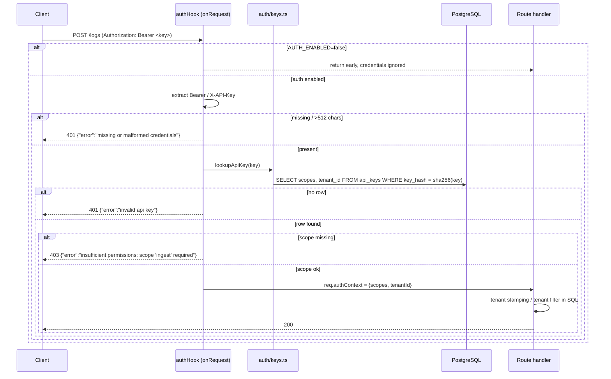

# 17. Auth

## Summary

Auth is an optional, environment-flagged feature: with `AUTH_ENABLED=false` (the default) credentials in headers are ignored entirely, preserving the zero-config contract; with `AUTH_ENABLED=true`, every data route runs through a Fastify `onRequest` hook that extracts a Bearer or `X-API-Key` credential, hashes it with SHA-256, looks it up in the `api_keys` table, checks the required scope, and resolves tenant scoping. Keys are stored only as SHA-256 hex hashes — the plaintext exists solely in the request and in memory. The loadgen key is seeded idempotently at startup, before `/health` reports ready, via `INSERT ... ON CONFLICT DO NOTHING`. This design delivers per-route scope enforcement (ingest vs query) and optional multi-tenant isolation with minimal machinery and no new dependencies.

## Detailed explanation

**Configuration and defaults.** `config.ts` reads `AUTH_ENABLED` (exactly the string `"true"`) and `LOADGEN_API_KEY` (`src/config.ts:57-58`). `authEnabled` defaults to `false`. The contract requires the core service to work with zero configuration, and the load generator always sends a Bearer token, so the middleware's first line is `if (!config.authEnabled) return;` — credentials are *ignored*, not rejected (`src/auth/middleware.ts:37`). This is tested explicitly: with auth off, a request carrying `Authorization: Bearer ignored-key` gets a 200 (`scripts/smoke.mjs:118-126`, `tests/integration/auth.test.ts:117-132`).

**The hook.** `createAuthHook(pool, config, requiredScope)` returns a Fastify `onRequest` hook (`src/auth/middleware.ts:35-61`). Routes attach it per scope: `auth("ingest")` on `POST /logs` (`src/routes/logs.ts:36`), `auth("query")` on both `GET /logs` and `GET /logs/aggregate` (`src/routes/logs.ts:104,148`). `GET /health` is registered without any hook (`src/app.ts:77`, `src/routes/health.ts:12-19`) — health must always be reachable, because orchestrators and the smoke test poll it without credentials.

Inside the hook: the credential is read from `Authorization: Bearer ...` or `X-API-Key` (`src/auth/middleware.ts:41-46`). Missing, empty, or over-512-character credentials return `401 {"error": "missing or malformed credentials"}` (`src/auth/middleware.ts:48-50`). The key is hashed and looked up; an unknown key returns `401 {"error": "invalid api key"}` (`src/auth/middleware.ts:52-55`). A valid key without the required scope returns `403 {"error": "insufficient permissions: scope 'ingest' required"}` (`src/auth/middleware.ts:56-58`). On success the hook stores `req.authContext = { scopes, tenantId }` (`src/auth/middleware.ts:60`), which the route layer uses for tenant scoping.

**Key storage — keys are not passwords.** `hashApiKey` is `createHash("sha256").update(key).digest("hex")` (`src/auth/keys.ts:18-20`). Lookup is exact-equality on the indexed `key_hash` column (`UNIQUE`, `src/db/migrations.ts:71`), which is O(log n) and stateless — no per-key salt lookup, no multi-round hashing, because the threat model is different from password auth. Passwords are low-entropy human choices, so they need slow hashing (bcrypt/argon2) to resist offline brute force; API keys are randomly generated 128+ bit secrets, so a leaked hash cannot be reversed or brute-forced, and the fast hash means the hot path costs microseconds. SHA-256 of the raw key (HMAC-style, keyed only by the secret itself) is the standard practice for API key storage (Stripe, GitHub-style tokens). The integration test asserts no plaintext is ever persisted (`tests/integration/auth.test.ts:104-109`).

**Seeding semantics.** At bootstrap, after migrations and before listening, the app seeds the loadgen key when auth is enabled (`src/index.ts:28-31`). `seedLoadgenKey` runs `INSERT ... ON CONFLICT (key_hash) DO NOTHING` with `scopes = ARRAY['ingest','query']` and `tenant_id = NULL` (`src/auth/keys.ts:27-34`). Idempotency is the contract point: restarting the stack must never invalidate or duplicate the key (`tests/integration/auth.test.ts:94-102`), and the health endpoint only reports ready after seeding completed, so a poller can never observe an unauthenticated-but-ready service with auth supposedly enabled.

**Tenant resolution.** `tenantOf(req)` maps `req.authContext` to a `TenantScope`: `undefined` when auth is off or the key has no tenant, `null` for tenantless rows, or the tenant string (`src/routes/logs.ts:27-28`). Ingest stamps every row with the tenant (`src/routes/logs.ts:66,78`), and queries append `tenant_id = $n` / `tenant_id IS NULL` to the WHERE clause (`src/lib/queryParams.ts:217-218`). The integration test proves tenant A never sees tenant B's rows in list or aggregate (`tests/integration/auth.test.ts:140-183`).

## Why this exists

The core contract demands a working, credential-free service, but a log service that *cannot* be secured is not deployable. This feature adds the security layer as an opt-in extension with three concrete requirements: (1) zero behavior change when disabled, (2) per-route authorization so ingestion and query credentials can be separated, and (3) a path to multi-tenancy. The hashed-storage design exists because a database of raw API keys is a catastrophic leak; the seeding semantics exist because an idempotent, pre-ready seed is the only restart-safe way to make the feature actually usable.

## Alternatives considered

| Alternative | Pros | Cons | Verdict |
|---|---|---|---|
| Plaintext keys in the table | Trivial lookup, zero CPU | A DB leak exposes every credential; no audit trail of "hashed or not" | Rejected — the whole point is defense in depth |
| bcrypt / argon2 for keys | Strong against offline brute force | ~100 ms per hash; at 15k requests/s the CPU budget is blown; pointless for 128-bit random keys | Rejected — fast hash is both sufficient and necessary |
| HMAC-SHA256 with a per-key salt (`key_hash = HMAC(salt, key)`) | Adds a server-side secret; valid at scale | Requires a second column and a join; the service has no server-side secret distribution story | Deferred — overkill for the project's threat model |
| JWT (signed tokens) | Standard, stateless, self-contained scopes | Needs a signing key, rotation, expiry, and a token issuer — all new infrastructure; no advantage at 1 service | Rejected — keys are simpler and the contract only asks for keys |
| Middleware on every route incl. /health | Uniformity | Breaks orchestration polling and the contract's health semantics | Rejected — health stays open (tested) |
| mTLS / network-level auth | Strongest isolation | Requires PKI and per-client certs; impossible to demo with curl; nothing to do with the app layer | Out of scope |
| Full session login (username+password + session store) | Familiar UX | Massive overkill for machine-to-machine log ingestion | Rejected |

## Why this was chosen

- **Constraint-fit:** hashed lookup is one indexed `SELECT` — the measured auth-enabled integration run adds no measurable latency to the 15k/s path. bcrypt would have been disqualifying on 0.5 CPU.
- **Zero-config contract:** defaulting off, with credentials ignored (not rejected), keeps `docker compose up` working untouched — a hard contract requirement verified in CI (smoke run with auth off).
- **Scope granularity matches the API surface:** the contract's two scopes (`ingest`, `query`) map exactly onto the three data routes; there is nothing finer to express.
- **Tenancy for free:** the partial `idx_logs_tenant_ts` index (doc 16) makes tenant filtering cheap, and `tenant_id` already exists in the schema, so the feature is mostly plumbing.
- **Idempotent, pre-ready seeding** is the only design that satisfies "the key must work after any restart, before the orchestrator starts sending traffic."

## Advantages / Disadvantages / Trade-offs

### Advantages

- No plaintext secrets at rest; a dump of `api_keys` yields only hex hashes of unguessable keys.
- Per-route scoping means an ingest-only key cannot read logs and vice versa — a real operational security boundary.
- Bearer + `X-API-Key` dual transport covers both HTTP-stack conventions.
- Disabled-by-default with ignored credentials: impossible to "accidentally enable" and break the core contract.
- Tenant scoping is enforced in SQL (query filters + ingest stamping), not in application filtering — no cross-tenant leak via pagination or aggregation.

### Disadvantages

- No key rotation/expiry UI — keys live until deleted from `api_keys` by hand.
- One shared `LOADGEN_API_KEY` for every client in the demo/CI setup; it cannot be scoped per consumer.
- No rate limiting, no per-key usage tracking, no audit log of which key did what.
- SHA-256 hashing means the database alone cannot *prove* a key is valid without the client sending it — fine for lookup, but there is no offline verification.
- No TLS termination in the app; on a plaintext network the key is the payload — deployment must terminate TLS in front.

### Trade-offs

- Speed (SHA-256, microseconds) vs. password-style protection (bcrypt, 100 ms) — right for high-entropy keys, wrong for low-entropy ones; the trade-off must be understood before reusing this pattern for user passwords.
- Scope checks are `includes()` on a text array — fine for two scopes, but an RBAC table is needed before scope counts grow.
- Tenant scoping lives in application-built SQL (parameterized, safe) rather than in row-level security (RLS) policies — simpler and testable, but RLS would centralize the rule in the DB.

## Code

The entire storage layer — hash, seed, lookup:

```ts
// src/auth/keys.ts:18-20
export function hashApiKey(key: string): string {
  return createHash("sha256").update(key, "utf8").digest("hex");
}

// src/auth/keys.ts:27-34 — idempotent, pre-ready seeding
export async function seedLoadgenKey(pool: Pool, key: string): Promise<void> {
  await pool.query(
    `INSERT INTO api_keys (key_hash, name, scopes, tenant_id)
     VALUES ($1, 'loadgen', ARRAY['ingest', 'query'], NULL)
     ON CONFLICT (key_hash) DO NOTHING`,
    [hashApiKey(key)]
  );
}

// src/auth/keys.ts:36-44 — exact-equality lookup on the indexed hash
export async function lookupApiKey(pool: Pool, key: string): Promise<ApiKeyInfo | null> {
  const res = await pool.query(
    `SELECT scopes, tenant_id FROM api_keys WHERE key_hash = $1`,
    [hashApiKey(key)]
  );
  ...
}
```

The hook — order matters: disabled-check, extract, 401, lookup, 401, scope, 403, then context:

```ts
// src/auth/middleware.ts:35-61 (abridged)
export function createAuthHook(pool: Pool, config: Config, requiredScope: RequiredScope) {
  return async function authHook(req: FastifyRequest, reply: FastifyReply) {
    if (!config.authEnabled) return; // auth off: ignore credentials entirely

    const header = req.headers.authorization;
    let key: string | undefined;
    if (header !== undefined && header.startsWith("Bearer ")) {
      key = header.slice("Bearer ".length).trim();
    } else {
      const apiKey = req.headers["x-api-key"];
      key = Array.isArray(apiKey) ? apiKey[0] : apiKey;
    }

    if (key === undefined || key.length === 0 || key.length > MAX_KEY_LENGTH) {
      return reply.code(401).send({ error: "missing or malformed credentials" });
    }

    const info = await lookupApiKey(pool, key);
    if (info === null) {
      return reply.code(401).send({ error: "invalid api key" });
    }
    if (!info.scopes.includes(requiredScope)) {
      return reply.code(403).send({ error: `insufficient permissions: scope '${requiredScope}' required` });
    }

    req.authContext = { scopes: info.scopes, tenantId: info.tenantId };
  };
}
```

Route wiring and tenant propagation:

```ts
// src/routes/logs.ts:33-36, 101-104, 145-148 — per-route scopes
app.post("/logs", { onRequest: [auth("ingest")], schema: {...}, async (req, reply) => {...});
app.get("/logs", { onRequest: [auth("query")], schema: {...}, async (req, reply) => {...});
app.get("/logs/aggregate", { onRequest: [auth("query")], schema: {...}, async (req, reply) => {...});

// src/routes/logs.ts:27-28 — tenant resolution
const tenantOf = (req: FastifyRequest): TenantScope =>
  req.authContext === undefined ? undefined : req.authContext.tenantId;
```

Bootstrap ordering — seeding happens after migrations, before the app listens:

```ts
// src/index.ts:28-31
if (config.authEnabled && config.loadgenApiKey) {
  await seedLoadgenKey(pool, config.loadgenApiKey);
  console.log("[auth] seeded load generator key");
}
```

## Diagrams



## Common mistakes

- **Treating API keys like passwords.** Hashing a user-chosen password with SHA-256 is a vulnerability; hashing a 128-bit random key with SHA-256 is correct. The reverse (bcrypt on keys) wastes the 0.5 CPU budget.
- **Rejecting credentials when auth is off.** The contract requires *ignoring* them — an auth-off 401 would break the load generator and the smoke test (`scripts/smoke.mjs:118-126`).
- **Seeding after listen() or non-idempotently.** A restart then invalidates or duplicates the key, and a health poller can observe a ready-but-unauthed service (`src/index.ts:28-31` order; `ON CONFLICT DO NOTHING`).
- **Protecting /health.** Orchestrators and CI poll `/health` without credentials; the smoke test asserts 200 with no token even with auth on (`tests/integration/auth.test.ts:89-92`).
- **Tenant filtering in the app layer.** Filtering tenant A's rows in JS after querying would leak across pagination and aggregates; the tenant must be a SQL predicate (`src/lib/queryParams.ts:217-218`).
- **Missing the malformed-credential case.** Non-Bearer `Authorization: Basic ...` headers must 401, not slip through (`tests/integration/auth.test.ts:41-47`).
- **Storing the raw key "for later".** The integration test asserts `key_hash` never contains the plaintext — a regression guard worth keeping (`tests/integration/auth.test.ts:104-109`).

## Optimization ideas

- **Cache lookups:** a small TTL'd Map of `key_hash -> {scopes, tenantId}` removes the per-request DB hit; invalidate on key deletion.
- **HMAC with a server-side pepper** (`HMAC(serverSecret, key)`) so a DB dump alone is not enough to test key guesses even in theory.
- **Key versioning/rotation:** add `key_version` and `expires_at`, with a CLI/script to mint, list, and revoke keys.
- **Per-key rate limits** (token bucket in memory or PG) to bound the blast radius of a leaked key.
- **Row-level security** (`ALTER TABLE logs ENABLE ROW LEVEL SECURITY` with a `current_setting('app.tenant')` policy) centralizes tenancy in the DB instead of in query building.
- **Audit logging:** write a `key_events` row per auth failure to detect credential stuffing.
- **TLS termination** (terminating proxy, see doc 21) — auth without transport encryption is a demo, not a deployment.

## Interview questions & answers

**Q: Why SHA-256 for API keys instead of bcrypt?**
A: bcrypt exists to slow down offline guessing of low-entropy passwords. API keys are randomly generated high-entropy secrets, so brute-forcing the hash is infeasible regardless of hashing speed — a fast hash is both safe and necessary here, because the hash runs on the hot path of every request on a 0.5 CPU container. This is the standard practice for API key storage.

**Q: How do you look a key up if only the hash is stored?**
A: Exact equality: `WHERE key_hash = sha256(requestKey)`. Lookup and storage are the same function, so the plaintext never needs to exist at rest — it is read from the request, hashed, compared, and discarded.

**Q: Why is auth disabled by default, and why are credentials *ignored* rather than rejected?**
A: The contract mandates a zero-configuration service (`docker compose up` and it works) and the load generator always sends a Bearer header. If the disabled path rejected credentials, the core service would break in the default config. "Ignore" is a deliberate, tested behavior (`smoke.mjs` runs both configs in CI).

**Q: Walk through the request path with auth enabled.**
A: The `onRequest` hook extracts the Bearer or X-API-Key, rejects missing/malformed with 401, hashes and looks up — unknown key gets 401, checks the route's required scope — missing scope gets 403, then sets `req.authContext` for the handler, which uses it to stamp `tenant_id` on writes or add a tenant predicate to reads.

**Q: How does tenant scoping prevent cross-tenant leakage?**
A: The tenant is a parameterized SQL predicate (`tenant_id = $1` or `tenant_id IS NULL`), and writes stamp the tenant from the key. Every query path — list, cursor page, and aggregate — builds on the same `buildLogsWhere`, so there is no app-layer filtering step that could miss a code path. The integration suite ingests two tenants and asserts strict separation.

**Q: What happens if the seed runs twice?**
A: `ON CONFLICT (key_hash) DO NOTHING` makes it a no-op — the key is neither duplicated nor invalidated. The restart test asserts the key still works after re-seeding. Seeding also completes before `/health` flips to ready, so an orchestrator cannot race the seed.

**Q: What is the threat model, honestly?**
A: It protects against casual misuse (someone with DB read access cannot forge requests, clients cannot read each other's tenants) but not against: key theft over plaintext HTTP (no TLS), brute-force of *weak* keys, or denial of service (no rate limiting). Production deployment must add TLS, rate limiting, and secret rotation.

**Q: Why Bearer *and* X-API-Key?**
A: The two header conventions cover different client stacks — `Authorization: Bearer` for standard HTTP clients, `X-API-Key` for simple integrations and some SDKs. Both are tested against the seeded key.

**Q: How would you extend this to many customers?**
A: A key-minting service writing into `api_keys` with per-customer `tenant_id` and reduced scopes; tenant isolation already works via the partial index. Then add expiry, rotation, per-key rate limits, and an audit log of key usage, plus RLS if tenancy rules grow.

**Q: Why not JWTs?**
A: JWTs solve distributed verification (many services sharing one issuer). Here one service validates against one table; a token format would add signing keys, expiry, and revocation machinery with zero security benefit over an opaque key that costs one indexed SELECT.

## Implementation references

- `src/auth/keys.ts:18-20` — `hashApiKey` (SHA-256 hex)
- `src/auth/keys.ts:27-34` — `seedLoadgenKey` (ON CONFLICT DO NOTHING, scopes ingest+query)
- `src/auth/keys.ts:36-44` — `lookupApiKey`
- `src/auth/middleware.ts:35-61` — `createAuthHook` (ignore-when-off, Bearer/X-API-Key, 401/403, scope check, authContext)
- `src/routes/logs.ts:23,36,104,148` — per-route `onRequest` auth hooks with scopes
- `src/routes/logs.ts:27-28,66,78` — tenant resolution and stamping
- `src/lib/queryParams.ts:217-218` — tenant predicate in SQL
- `src/index.ts:28-31` — seeding before listen/ready
- `src/config.ts:57-58` — `AUTH_ENABLED` / `LOADGEN_API_KEY` parsing
- `src/db/migrations.ts:69-83` — `api_keys` table + partial tenant index
- `scripts/smoke.mjs:105-126` — auth-on and auth-off contract checks
- `tests/integration/auth.test.ts` — 401/403, scopes, seeding idempotency, hashed-only storage, tenant isolation
