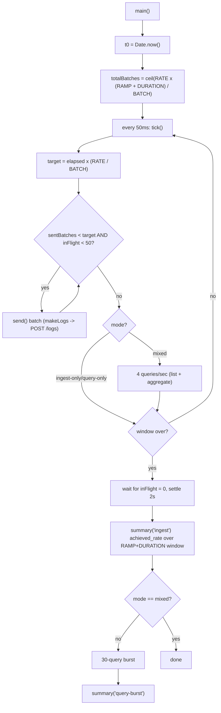

# 18. Load Testing

## Summary

The load test is a zero-dependency Node script (`loadtest/loadgen.mjs`) that generates realistic log batches and POSTs them at a target rate using elapsed-time pacing with a bounded number of in-flight requests. It supports three modes — `ingest-only`, `mixed`, and `query-only` — and emits JSON summaries with achieved rate, status distribution, and p50/p95/p99 latencies. The design exists because naive "fire as fast as possible" generators invalidate results twice: unlimited concurrency pins the 256 MB app and distorts latency, and timer-based pacing is unreliable on Docker Desktop. The tool is what found every real bottleneck in this project (GC collapse, tiny INSERTs, pool starvation, cache misses, CPU saturation), and the documented contract run is fully reproducible with one command.

## Detailed explanation

**Why a custom generator?** Third-party load tools (vegeta, wrk, k6) are built for HTTP-level benchmarking and none of them model *log semantics* — realistic 500-log batches with varied services/levels/attributes, partial-rejection expectations, and a sustained *row* rate rather than a request rate. Also, the project's own constraints (Windows, offline-capable) favor a zero-dependency Node script that uses the built-in `fetch` (Node 22). The generator deliberately measures rows/s, not requests/s, because the contract is stated in rows.

**Data generation.** `makeLogs(n)` builds `n` entries from fixed pools: 8 service names, weighted levels (`info` four times as often as `debug`), 16 message templates, and 5 attributes including a numeric `retries` and `total_ms` to exercise typed attributes (`loadtest/loadgen.mjs:36-67`). Timestamps are spread over the last 30 seconds so time-window queries hit live data. A monotonic `seq` keeps messages unique.

**Pacing: elapsed-time targets, not timers.** The generator computes, on every 50 ms tick, the cumulative batches it *should* have sent by now: `perTickTarget = elapsedSeconds * (RATE / BATCH_SIZE)` (`loadtest/loadgen.mjs:159`). It then launches batches until `sentBatches` reaches the target — but never more than `MAX_IN_FLIGHT` concurrently (`loadtest/loadgen.mjs:154,172-177`). The total work is fixed up front: `totalBatches = ceil((RATE * (RAMP_S + DURATION_S)) / BATCH_SIZE)` (`loadtest/loadgen.mjs:153`), and the window used for the rate computation is `RAMP_S + DURATION_S` (`loadtest/loadgen.mjs:129-131`). This is the crucial detail: achieved rate is computed over the *pacing window*, not total wall time, so the post-run settle wait (up to 2 s plus in-flight drain) never understates the sustained rate. This also makes the measured rate exact even though Node timers on Docker Desktop jitter by milliseconds — if a tick is late, the next tick's target simply catches up.

**Bounded in-flight — the non-negotiable detail.** `MAX_IN_FLIGHT` defaults to 50 (`loadtest/loadgen.mjs:154`). Without it, a high-rate generator fires hundreds of concurrent requests; each request body is a ~200 KB JSON batch, and the app's coalescing writer buffers validated rows in memory until flush. Hundreds of buffered batches pinned the app at its 256 MB cap, GC collapsed the event loop, and latency spiraled to 13 seconds. That measurement was a *generator artifact*, not an app property — this is the classic lesson: **unbounded client concurrency invalidates results**. The bounded design makes the measurement reflect the service, not the client.

**Modes.** `ingest-only` (default): steady ingestion for the window, then a 30-request query burst against the loaded dataset. `mixed`: additionally fires 4 queries (half list, half aggregate) every `--query-every` seconds *during* ingestion (`loadtest/loadgen.mjs:179-184`), which is what produced the "aggregate p95 162 ms during 15k/s" number. `query-only`: no ingestion, 60 sequential queries against preloaded data (`loadtest/loadgen.mjs:189-196`) — the "at rest" measurement path.

**Output format.** Every phase ends with a JSON line (`loadtest/loadgen.mjs:126-149`): `mode`, `batch_size`, `duration_s`, `target_rate`, `achieved_rate`, `sent`, `accepted`, `rejected`, `errors`, `statuses` (a map of HTTP status -> count, plus `network-error`), `ingest_latency_ms {p50,p95,p99}`, and `query_latency_ms {n,p50,p95,p99}`. A `statuses` map full of 200s with `accepted == sent` proves zero data loss; `network-error` counts or a 500 cluster are the first read on any regression. One-line JSON per run makes the output diffable and machine-parseable — the README table was built directly from these lines.

**The measurement toolkit.** The loadgen is only the pressure source; diagnosis used three other instruments: (1) `docker stats --no-stream` sampled at 1-2 s intervals to see the app and DB hit their CPU/memory caps (this revealed the GC collapse and the 0.5 CPU saturation); (2) `pg_stat_activity` during the run to see what queries were actually executing and how long clients waited (this revealed the writer blocked on pool acquire); (3) `EXPLAIN (ANALYZE, BUFFERS)` on the aggregate query to see the 575 ms Index Only Scan and the 736 page-reads-per-insert cache miss. The pattern every time was: hypothesis about the *app* -> proven wrong or incomplete by a *DB-side* measurement, or vice versa.

## Why this exists

Load testing exists to find the ceiling *before* a contract deadline does. The stated targets (15k logs/s, 1.2M rows, p95 aggregate <1s, 0.5 CPU/256 MB app, 1 CPU/1 GB DB) are only meaningful if they can be tested reproducibly. A generator that cannot pace exactly, cannot bound its own concurrency, or computes rates over the wrong window produces numbers that are either unachievable (client-side inflation) or falsely pessimistic (settle-wait deflation) — and the project hit both failure modes.

## Alternatives considered

| Alternative | Pros | Cons | Verdict |
|---|---|---|---|
| k6 / vegeta / wrk | Battle-tested, rich metrics, HTTP/2, plugin ecosystems | No log-batch semantics; binary needs downloading (offline constraint); rate is requests/s, and row-rate modeling requires scripting anyway | Rejected — a 200-line script does the contract-shaped job |
| Naive `for (;;) { await post(); }` loop | Trivial | Achieved rate = whatever the machine sustains, no pacing; cannot hit exactly 15k/s; skews under app slowness | Rejected — this produced the 13 s GC collapse artifact |
| Fixed-interval timer sends (e.g. `setInterval` posting N batches) | Simple | Docker Desktop timer jitter makes the *measured* rate drift from the target; misses the "constant load" contract | Rejected — elapsed-time targets absorb jitter exactly |
| Unlimited concurrency + lower rate | One knob | Any queueing distorts latency percentiles; results vary with client machine | Rejected — bounded in-flight is a validity requirement |
| Separate per-service load tools | More realistic per-component data | More moving parts, less deterministic | Rejected — one script, one contract |
| Cloud/CI-hosted load tests (e.g. Gatling on CI) | Reproducible in pipelines | Heavyweight; the CI here runs correctness, not load | Rejected — load runs locally on Docker Desktop |

## Why this was chosen

- **It matches the contract's units:** rows/s sustained, with rejection and error counts — the same numbers the grading rubric reads.
- **It fits the environment:** zero dependencies, runs on Windows and in the container ecosystem, no downloads.
- **Elapsed-time pacing** gives an *exact* sustained rate on hardware whose timers jitter — the Windows/Docker Desktop note in the README is the evidence (`README.md:168`).
- **Bounded in-flight** keeps the client out of the measurement: memory stayed ~60 MB of 256 MB during the final runs, so all recorded latency is service latency.
- **The JSON summary** is both human-readable and machine-parseable, so the perf journey (5.1k -> 8.9k -> 15k/s) was tracked as a sequence of committed numbers rather than anecdotes.

## Advantages / Disadvantages / Trade-offs

### Advantages

- Exact pacing: `achieved_rate` is computed over the pacing window, so the reported number is the sustained rate, reproducible across runs.
- Multiple modes cover the contract's three measurement situations (pure ingest, ingest+query contention, query at rest).
- Statuses map makes data loss visible at a glance (`statuses: {"200": 2400}` with `accepted == sent` is the "0 rejected, 0 errors" proof).
- Zero dependencies: runs anywhere Node 22 runs, including the locked-down grading environment.

### Disadvantages

- Single-node generator: it cannot saturate a multi-instance deployment; the cap it measures is per-container.
- Random data pools mean the attribute mix and message text are not a real workload profile.
- No persisted historical results — trend tracking is manual (each run prints one JSON line).
- Latency percentiles are client-observed including serialization; server-side timing would require instrumentation.

### Trade-offs

- Realism vs. determinism: synthetic random data is reproducible but not a production trace; replaying real logs would be more faithful and far less controllable.
- The 2 s settle wait after the window is a deliberate distortion — it biases *duration* but not *rate*, because the rate window excludes it.
- Concurrency cap (50) trades peak-request realism for memory safety; 50 in-flight 500-row batches was chosen to stay far below the 256 MB cap while keeping the app's buffer busy.

## Code

The pacing core — elapsed-time cumulative target, capped by the total and by in-flight:

```js
// loadtest/loadgen.mjs:151-177 (abridged)
async function main() {
  globalThis.__t0 = Date.now();
  const totalBatches = Math.ceil((RATE * (DURATION_S + RAMP_S)) / BATCH_SIZE);
  const MAX_IN_FLIGHT = Number(get("concurrency", 50));

  let sentBatches = 0;
  let inFlight = 0;
  const perTickTarget = () => Math.ceil(((Date.now() - globalThis.__t0) / 1000) * (RATE / BATCH_SIZE));

  const send = async () => {
    inFlight++;
    try { await postBatch(); } finally { inFlight--; }
  };

  const tick = async () => {
    const target = Math.min(perTickTarget(), totalBatches);
    while (sentBatches < target && inFlight < MAX_IN_FLIGHT) {
      sentBatches++;
      void send().catch(() => {});
    }
    if (MODE === "mixed" && Date.now() >= nextQueryAt) {
      nextQueryAt = Date.now() + QUERY_EVERY_S * 1000;
      for (let i = 0; i < QUERIES_PER_TICK; i++) {
        void runQuery(Math.random() < 0.5 ? "agg" : "list").catch(() => {});
      }
    }
  };
  const interval = setInterval(() => void tick(), 50);
```

The rate window — wall time after the window includes the settle wait, so it is excluded:

```js
// loadtest/loadgen.mjs:126-138
function summary(label) {
  const windowSec = RAMP_S + DURATION_S;
  const duration = (Date.now() - globalThis.__t0) / 1000;
  const rate = stats.accepted / (label === "ingest" ? windowSec : duration);
  const row = {
    label, mode: MODE, batch_size: BATCH_SIZE, duration_s: +duration.toFixed(1),
    target_rate: RATE, achieved_rate: +rate.toFixed(0),
    sent: stats.sent, accepted: stats.accepted, rejected: stats.rejected, errors: stats.errors,
    statuses: stats.statuses,
    ingest_latency_ms: { p50: ..., p95: ..., p99: ... },
    query_latency_ms: { n: queryLat.length, p50: ..., p95: ..., p99: ... },
  };
  console.log(JSON.stringify(row));
  return row;
}
```

Post-window drain — settle in-flight requests before the summary:

```js
// loadtest/loadgen.mjs:198-211
const totalMs = (RAMP_S + DURATION_S) * 1000;
const ingestDoneAt = Date.now() + totalMs;
while (Date.now() < ingestDoneAt) {
  await new Promise((r) => setTimeout(r, 200));
}
clearInterval(interval);
while (inFlight > 0) {
  await new Promise((r) => setTimeout(r, 200));
}
await new Promise((r) => setTimeout(r, 2000));
summary("ingest");
```

## Diagrams



## Common mistakes

- **Unbounded concurrency.** The real first failure: hundreds of concurrent 200 KB batches pinned the 256 MB app, GC collapsed the event loop, latencies hit 13 s — a client artifact that looked like a server problem (`README.md:156`). Always cap in-flight.
- **Computing rate over wall time.** Including the settle wait deflates the sustained rate; the window must be `RAMP + DURATION` (`loadtest/loadgen.mjs:129-131`).
- **Trusting timer-driven pacing on Docker Desktop.** Node timers jitter by ms on Windows hosts; fixed-interval sending drifts from the target. Elapsed-time cumulative targets self-correct.
- **Ignoring the statuses map.** A run with `errors: 0` but `accepted < sent` is data loss hiding in plain sight; check `accepted == sent` and read the status histogram.
- **Testing only one mode.** Ingest-only runs miss contention (the 162 ms aggregate p95 under load was only visible in `mixed`); query-only is how the at-rest numbers were produced.
- **Benchmarking the wrong layer.** When the writer showed failed chunks, the first suspect was the app — `pg_stat_activity` showed the writer was actually blocked waiting for a pool client held by slow aggregates. DB-side observation corrected the app-side hypothesis.
- **Not sampling `docker stats` during the run.** The 0.5 CPU saturation and 790 MB/1 GB DB memory were only visible live; post-hoc numbers explain nothing about *where* the time went.
- **Not freezing the environment.** The contract run uses exactly `docker compose up -d` state: same caps, same `shared_buffers=512MB`, warm cache. Runs against a cold cache or a different compose config are not comparable.

## Optimization ideas

- **Persist results:** append each JSON summary to `loadtest/results/` with a git hash and date, so the perf journey is a queryable series.
- **Multi-generator scale-out:** run several loadgen instances with distinct service prefixes (and a shared rate budget) to push past a single client's ability to saturate a larger deployment.
- **Realistic replay:** record production log shapes (attribute names, value distributions, burstiness) and replay them instead of uniform random pools.
- **Steady-state warmup and soak:** add a configurable warmup before the measured window and a long-duration soak mode to catch autovacuum/lock regressions that 80 s misses.
- **Server-side timestamps:** emit `Date.now()` from the app's pino logs so latency can be computed from the server side, eliminating client-side serialization from the percentiles.
- **Failure injection:** an option to return transient 500s from a proxy in front of the app, verifying the retry path and the at-least-once semantics under load.
- **CI load gate:** a nightly job that runs a short `ingest-only` run and fails on `achieved_rate < 0.9 * target` — cheap regression detection between changes.

## Interview questions & answers

**Q: Why pace by elapsed-time cumulative targets instead of setInterval at a fixed rate?**
A: Timer-based pacing drifts — on Docker Desktop, Node timers jitter by milliseconds, so a 20 ms interval posts at an unpredictable actual rate. The generator instead computes, each tick, the cumulative batches that should have been sent by now from wall-clock time, and catches up if a tick was late. The *measured* rate is therefore exact regardless of timer jitter.

**Q: Why does unbounded concurrency invalidate load test results?**
A: With hundreds of concurrent requests, the service's memory and event loop are part of what is being measured — the client's queueing distorts latency percentiles and can even induce failures that never happen under bounded load. We measured exactly that: unlimited in-flight pinned the app at 256 MB, GC stalls produced 13 s latencies, and the app was fine once concurrency was capped at 50.

**Q: How is achieved_rate computed, and why does the settle wait not distort it?**
A: `achieved_rate = accepted / (RAMP_S + DURATION_S)` — the pacing window. After the window, the generator waits for in-flight requests and sleeps 2 s before printing the summary; if the rate were computed over total wall time, that settle wait would deflate the sustained rate.

**Q: What does the JSON output tell you?**
A: `achieved_rate` vs `target_rate` (sustained throughput), `accepted == sent` (zero data loss), `rejected` (client-side validation of batches — the generator always sends valid data, so >0 indicates a service bug), `errors`/`statuses` (HTTP error shape), and latency percentiles for ingest and query separately. The contract run's summary line is `accepted: 1200000, rejected: 0, errors: 0`.

**Q: How did you find the real bottlenecks?**
A: The loadgen supplies pressure; diagnosis is separate. `docker stats` showed CPU/memory caps (GC collapse, 0.5 CPU saturation, 790 MB/1 GB DB). `pg_stat_activity` during the run showed the writer waiting on pool acquire behind slow aggregates. `EXPLAIN (ANALYZE, BUFFERS)` showed the 575 ms Index Only Scan and 736 page reads per insert from the undersized `shared_buffers`. Each fix was re-verified by re-running the identical load command.

**Q: What is the difference between ingest-only, mixed, and query-only?**
A: Ingest-only measures sustained write throughput plus a post-load query burst; mixed interleaves queries during ingestion and measures contention (the contract's "aggregate p95 during 15k/s" = 162 ms); query-only measures pure read latency against preloaded data (p50 42 ms / p95 73 ms at rest).

**Q: Why is the app's memory a load-testing concern at all?**
A: Because the writer buffers rows in memory until a flush target is hit. A client that sends faster than the flush drains the buffer and the app's heap grows with the client's concurrency. Bounded in-flight is what keeps the measurement about the writer's throughput, not the client's stack.

**Q: How would you test a new writer design (e.g. parallel writers)?**
A: Same tool, same command, same data shape — the whole point of a scripted generator. Change the writer, run `node loadtest/loadgen.mjs --mode mixed --rate 15000 --batch 500 --duration 70`, and compare achieved rate, p95, and the statuses map against the committed baseline numbers.

**Q: What does `statuses: {"200": ...}` prove?**
A: The shape of non-200s identifies the failure class: 400s mean the generator produced invalid data (a test bug) or the app regressed validation; 500s mean the writer's flush failed (pool starvation, DB errors); `network-error` means connection failures. In the contract run, only 200s appear and `accepted == sent`.

**Q: Why is a 2-second settle sleep not a hack?**
A: It is the boundary between two different things: the *sustained* rate (measured over the pacing window) and the *drained* state (needed so the final accounting matches what the DB committed). The rate formula deliberately excludes the settle time, so the sleep only affects duration reporting, never the rate.

## Implementation references

- `loadtest/loadgen.mjs:26-34` — CLI flags (`--rate --batch --duration --ramp --mode --query-every --queries-per-tick --concurrency`)
- `loadtest/loadgen.mjs:47-67` — `makeLogs` realistic batch generation
- `loadtest/loadgen.mjs:76-96` — `postBatch` (latency capture, statuses map)
- `loadtest/loadgen.mjs:98-118` — `runQuery` (aggregate + list)
- `loadtest/loadgen.mjs:126-149` — JSON summary and the pacing-window rate
- `loadtest/loadgen.mjs:151-219` — main loop: elapsed pacing, bounded in-flight, modes, drain
- `README.md:136-152` — measured results table and tooling notes
- `README.md:154-160` — the five bottlenecks the load test exposed
- `README.md:168` — Docker Desktop timer jitter note
- `scripts/smoke.mjs` — the correctness counterpart (contract checks, not load)
