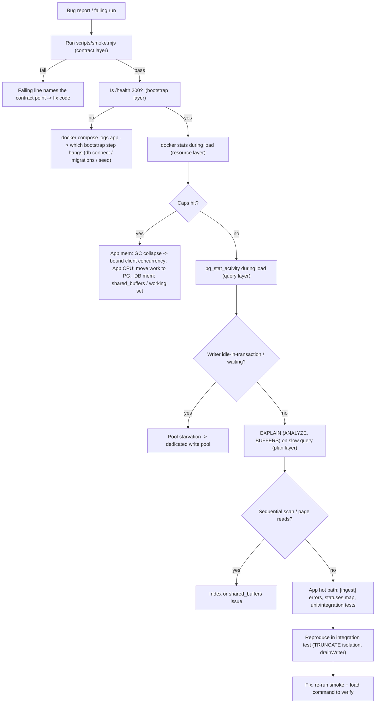

# 19. Debugging

## Summary

This doc is the debugging playbook that was actually used to ship the project: a layered process from contract checks (smoke test) through container observation (health, logs, `docker stats`) into the database (`pg_stat_activity`, `EXPLAIN`) and finally the app internals (writer diagnostics, integration-test isolation). The key lesson is that each layer has its own instrument — the smoke test proves contract conformance, the loadgen's statuses map and `[ingest]` error lines prove data-path health, and PostgreSQL's own views prove where time actually goes. Several failures were only found because the instrumentation layer matched the failure layer: the pool-starvation bug showed up in `pg_stat_activity` and in writer console errors, not in the app's HTTP logs. The doc also covers the Windows/Docker environment traps that wasted the most time (persistent volumes, `npm.cmd`, glob quoting, `process.exit` crashes).

## Detailed explanation

**Layer 1 — contract conformance: the smoke test.** `scripts/smoke.mjs` is the first thing run against a live stack. It checks health readiness, partial-rejection semantics, combined filters, typed-attribute round-trip, `next_cursor` presence, aggregate bucket math, the 400 error shape, and the auth matrix (`--auth` / `--key`) (`scripts/smoke.mjs:47-126`). Every check prints a pass/fail line and the run exits non-zero on any failure, so a failure names the exact contract point. Its other trick is namespacing: `SERVICE = "smoke-" + Date.now()` (`scripts/smoke.mjs:14-17`) makes it idempotent even though the `pgdata` volume persists between runs — exact-count assertions never collide with leftovers from a previous run.

**Layer 2 — container health and logs.** Bootstrap order is itself a diagnostic: `waitForDatabase` -> migrations -> seed key -> retention -> listen (`src/index.ts:21-46`). `/health` returns 503 until the app is listening (`src/routes/health.ts:13-18`), so a service that never flips to 200 tells you *which* bootstrap step hangs. `docker compose logs app` then answers the why: pino logs at `info`, `[auth] seeded load generator key`, `log-service listening on :8080`, and — critically — the `[ingest] flush of N rows failed: ...` line from the writer's `onError` callback (`src/services/ingestWriter.ts:232`). A failed chunk logs once and every request in it gets a 500; that single console.error line was the first signal of the pool-starvation bug (writer blocked on a 5 s acquire timeout because slow aggregates held all 10 read-pool clients). `[retention] deleted N expired logs` and `[retention] <err>` (`src/services/retention.ts:59,69-71`) track the sweeper independently.

**Layer 3 — resource caps: `docker stats`.** The container caps are the environment's ground truth: app 0.5 CPU / 256 MB, DB 1 CPU / 1 GB (`docker-compose.yml:40-45,61-66`). Sampling `docker stats --no-stream` every second during a load run showed: the app pinned at its memory cap with GC collapse (13 s latencies, unbounded-concurrency bug), the app at ~98% of 0.5 CPU (the CPU-saturation bottleneck), and the DB at ~790 MB/1 GB (why `shared_buffers` had room to grow to 512 MB). The lesson: when the symptom is latency, check whether a *cap* is the cause before profiling code.

**Layer 4 — inside the database.** `pg_stat_activity` during the load revealed what the app layer could not: the writer's INSERT waiting in `state = 'idle in transaction'` behind the read pool's acquired clients, i.e. the pool starvation. `EXPLAIN (ANALYZE, BUFFERS)` on the aggregate query produced the two decisive numbers: 575 ms Index Only Scan on `idx_logs_level_ts` at 1.2M rows (proof the index design works) and 736 page reads per insert (proof `shared_buffers` was undersized). EXPLAIN is the only tool that separates "the plan is wrong" from "the plan is fine but the machine is slow".

**Layer 5 — app internals: the loadgen's statuses map and latency percentiles.** The generator records every response status and p50/p95/p99 (`loadtest/loadgen.mjs:72,85-95,126-149`). Interpretation rules: `accepted < sent` with 200s only = validation regression in the app; a cluster of 500s = writer flush failures; `network-error` entries = client-side failures; p95 >> p50 with high `errors` = queueing collapse. This map is what separated "15k/s looks OK" from "statuses: {200: ...} but p99 668 ms".

**Layer 6 — integration tests as a debugger.** `tests/integration/helpers.ts` builds the real app against the real DB with `TRUNCATE logs, api_keys RESTART IDENTITY` for isolation (`tests/integration/helpers.ts:29-48`), and `drainWriter` waits for the coalescing buffer to empty before asserting (`tests/integration/helpers.ts:57-64`) — without it, tests would race the async writer. Tests run serially (`--test-concurrency=1`, `package.json:17`) because they share one database; the TRUNCATE-per-app guarantees each suite starts clean. The "restarting does not invalidate the key" test (`tests/integration/auth.test.ts:94-102`) is a regression test for a real class of bug (stateful seeding).

**Windows/Docker environment traps (all hit for real):**
- `npm` on Windows resolves `npm.ps1` first, which the execution policy blocks; `npm.cmd run ...` is the working form (`README.md:199-204`).
- `node --test` globs: unquoted globs are expanded differently by cmd/PowerShell, so the scripts quote them (`"tests/unit/*.test.ts"`) and Node's own glob handling wins (`package.json:16-17`).
- `process.exit()` after async work crashes with an undici/libuv teardown assertion; the smoke test sets `process.exitCode` (`scripts/smoke.mjs:129`) and lets the event loop drain naturally.
- The named `pgdata` volume survives `docker compose down`, so stale rows break exact-count assertions — the smoke test's unique service name is the workaround (`scripts/smoke.mjs:14-17`).
- Node timers jitter on Docker Desktop; anything time-based must use elapsed-time targets, not timer counts (doc 18).

**A real race to learn from.** An abandoned parallel-writer design used N worker loops sharing one in-flight counter; the completion handler decremented it *twice* for chunks that failed once and succeeded on retry, letting new chunks start while old ones still wrote — interleaved "serial" writers, out-of-order commits, confusing test failures. The fix was not a better counter but removing parallelism: a single serial drain loop with a reentrancy guard (`this.flushing`, `src/services/ingestWriter.ts:80-83,115-138`) has no shared counter to get wrong.

## Why this exists

Debugging a two-container system with hard resource caps needs a repeatable order of operations, because the failure layers are entangled: an app crash can be a DB problem, a load-test artifact can look like an app bug, and a Windows shell quirk can masquerade as a code bug. A playbook makes the search O(layers) instead of O(guesses): contract first, then process, then DB, then code — each layer's instrument either clears it or names the next step.

## Alternatives considered

| Alternative | Pros | Cons | Verdict |
|---|---|---|---|
| Full observability stack (Prometheus + Grafana + tracing) | Rich time-series, dashboards, correlation | Heavyweight for 2 containers; no metrics backend budget; overkill for the debugging volume | Rejected — `docker stats` + logs + PG views covered every case |
| `pino-pretty` + verbose request logging | Readable request-level flow | `disableRequestLogging` is on deliberately: per-request logs at 15k/s burn CPU and bury signals (`src/app.ts:25-30`) | Rejected — noise reduction is part of the design |
| Application-level metrics endpoint (`/metrics`) | Structured counters | New surface to maintain and secure; the statuses map and console lines already answered every question | Deferred |
| SQL logging / pg statement logging | See every statement | `log_statement` at 15k inserts/s would flood and slow the DB | Rejected — `pg_stat_activity` is sampled, not logged |
| Debugger stepping (node --inspect) | Fine-grained | Only helps the app layer, and only when the bug is reachable single-stepped; useless for concurrency/DB issues | Used once, never decisive |

## Why this was chosen

- **Constraint-fit:** no monitoring infra exists or is budgeted; the instruments chosen (built-in console, PG catalog views, Docker's own stats) are free and always present.
- **Signal density:** the project deliberately routes diagnostics to the right layer — writer failures to `[ingest]` console lines, bootstrap state to `/health`, query behavior to PG itself. Debugging is fast when each layer already shouts its own failures.
- **The smoke test as a canary** gives a 10-second verdict on the whole contract before any deep dive, which is exactly what a grading or CI context needs.
- **Deterministic integration tests** (TRUNCATE isolation, serial execution, drainWriter) convert flaky concurrency bugs into reproducible ones — the only way the double-decrement race and pool starvation were pinned down.

## Advantages / Disadvantages / Trade-offs

### Advantages

- Zero extra infrastructure: everything needed ships with the repo (scripts, console lines, compose config).
- Layer-appropriate instruments: each failure mode has exactly one tool that names it (pg_stat_activity for blocking, EXPLAIN for plans, docker stats for caps, statuses map for data loss).
- Reproducible: the same commands work on Windows, Linux, and CI; the smoke and integration tests encode the playbook as executable checks.
- Deterministic tests: TRUNCATE isolation plus serial execution mean failures reproduce, which is the prerequisite for fixing concurrency bugs.

### Disadvantages

- Console-error-driven debugging does not scale to multi-instance deployments (no log aggregation, no search).
- No persistent metrics: post-mortem analysis of a past run requires having been present during it (docker stats is not stored).
- The playbook is manual; each layer is checked by hand rather than automatically.

### Trade-offs

- `disableRequestLogging` trades per-request observability for CPU headroom — the right call at 15k/s, the wrong call for a debugging session that needs request traces (flip `LOG_LEVEL` to debug instead).
- `docker compose logs` shows stdout only; pino writes to stdout by design, but anything stderr-only (e.g. some third-party warnings) needs `2>&1`-style care in Windows PowerShell.
- Serial integration tests (needed for shared-DB isolation) trade CI wall-clock time for determinism.

## Code

Bootstrap ordering is the first diagnostic — each step must complete before the next can start:

```ts
// src/index.ts:24-34,44-47
const pool = createPool(config);
await waitForDatabase(pool);
await runMigrations(pool);

if (config.authEnabled && config.loadgenApiKey) {
  await seedLoadgenKey(pool, config.loadgenApiKey);
  console.log("[auth] seeded load generator key");
}

const writer = createWriter(createWritePool(config), config);
const stopRetention = startRetentionSweeper(pool, config);
...
await app.listen({ port: config.port, host: "0.0.0.0" });
readyState.ready = true;
console.log(`log-service listening on :${config.port} (auth=${config.authEnabled})`);
```

The writer's failure line — the single most useful console output during load debugging:

```ts
// src/services/ingestWriter.ts:228-233
export function createWriter(pool: Pool, config: Config): IngestWriter {
  return new IngestWriter(pool, {
    maxFlushWaitMs: config.ingestMaxFlushWaitMs,
    maxRowsPerFlush: config.ingestMaxRowsPerFlush,
    onError: (err, rows) => console.error(`[ingest] flush of ${rows} rows failed: ${err.message}`),
  });
}
```

The reentrancy guard that replaced the racy parallel-writer counter:

```ts
// src/services/ingestWriter.ts:115-138
private maybeSchedule(): void {
  if (this.flushing) return;
  if (this.pendingCount >= this.opts.maxRowsPerFlush) {
    this.flushNow();
    return;
  }
  ...
}
private flushNow(): void {
  this.flushing = true;
  void this.flush().finally(() => {
    this.flushing = false;
    if (this.pendingCount > 0) this.maybeSchedule();
  });
}
```

Integration test isolation — clean slate per app, drain before asserting:

```ts
// tests/integration/helpers.ts:36-40
await runMigrations(pool);
// Clean slate, preserving the sequence for predictable ids.
await pool.query("TRUNCATE logs, api_keys RESTART IDENTITY");

// tests/integration/helpers.ts:57-64
export async function drainWriter(writer: IngestWriter): Promise<void> {
  for (let i = 0; i < 200; i++) {
    if (writer.pendingCount === 0) return;
    await new Promise((r) => setTimeout(r, 10));
  }
  throw new Error("writer did not drain within 2s");
}
```

Windows-safe exit (avoids the undici/libuv teardown crash):

```js
// scripts/smoke.mjs:128-129
console.log(failures === 0 ? "\nSMOKE PASS" : `\nSMOKE FAIL (${failures})`);
process.exitCode = failures === 0 ? 0 : 1;
```

## Diagrams



## Common mistakes

- **Debugging the wrong layer.** Pool starvation looked like an app bug (500s from `/logs`); it was a DB-connection-allocation bug visible only in `pg_stat_activity`. Always check the layer whose instrument can see the symptom.
- **Trusting the health check blindly.** A 200 from `/health` only means "listening after migrations" — it says nothing about ingestion health. Use the statuses map and `[ingest]` lines for the data path.
- **Racing the async writer in tests.** Asserting immediately after a 200 can observe uncommitted rows (the writer flushes asynchronously). `drainWriter` is mandatory before assertions.
- **Shared-DB parallel tests.** `--test-concurrency=1` is not optional with one database and TRUNCATE isolation; parallel suites would truncate each other's data mid-test.
- **Windows shell quirks.** Unquoted globs (`tests/unit/*.test.ts` without quotes) and `npm` instead of `npm.cmd` fail in ways that look like code bugs; the package scripts encode the working forms.
- **`process.exit()` after async teardown.** It crashed with an undici/libuv assertion on Windows; `process.exitCode` lets Node finish its cleanup.
- **Forgetting the volume persists.** `docker compose down` keeps `pgdata`; exact-count smoke assertions then fail on stale rows — the unique `smoke-<timestamp>` service name is the fix.
- **The double-decrement race.** In the abandoned parallel-writer design, the shared in-flight counter was decremented twice for retried chunks, unblocking new chunks while old ones still wrote — interleaved "serial" writers, out-of-order commits. The robust fix is no shared counter at all: one serial loop guarded by a boolean (`src/services/ingestWriter.ts:115-138`).

## Optimization ideas

- **Structured logging to files:** pino transports (e.g. rotating file streams) so `docker compose logs` stops being the only record.
- **A `/metrics` endpoint** exposing counters (accepted/rejected/flushed/errors) in Prometheus text format — cheap to add with pino-level counters already in the writer.
- **`pg_stat_statements`:** enable the extension in compose to get normalized query timing without per-statement logging.
- **Automatic health composition:** extend `/health` to also check the writer's buffer depth (e.g. degraded status when `pendingCount` stays high), so readiness reflects ingestion health, not just bootstrap.
- **CI debug artifact collection:** on workflow failure, dump `docker compose logs`, `docker stats` snapshots, and integration-test output into the Actions artifact list.
- **Correlation IDs:** propagate the batch's request id into pino and the writer error lines so a failed chunk can be traced to its requests.

## Interview questions & answers

**Q: What was the first thing you ran when something broke?**
A: `node scripts/smoke.mjs` — the contract canary. It either names the failing contract point in seconds or clears the correctness layer so the investigation moves to load/behavior. Then `/health` to verify bootstrap, `docker compose logs` for bootstrap errors, `docker stats` for caps, `pg_stat_activity` for DB-level blocking, and `EXPLAIN` for plans.

**Q: How did you find the pool-starvation bug?**
A: The writer logged `[ingest] flush of N rows failed: ...` with acquire-timeout errors while HTTP looked fine. `pg_stat_activity` during the run showed the writer's INSERT sitting `idle in transaction` waiting for a client, while all 10 read-pool clients were held by slow aggregates. The fix was a dedicated 2-connection write pool so ingestion never queues behind queries.

**Q: Why does `/health` returning 200 not prove the service works?**
A: It proves bootstrap completed and the app is listening — nothing about the ingestion path. The data path has its own instruments: the loadgen's `statuses` map and `accepted == sent`, and the writer's error lines. A complete readiness story would also check writer buffer depth.

**Q: What was the double-decrement race, and what does it teach?**
A: An abandoned parallel-writer design shared a counter of in-flight chunks; chunks that failed once and succeeded on retry decremented it twice, allowing overlapping "serial" writers and out-of-order commits. The lesson: shared mutable counters are a correctness hazard; the replacement — a single serial loop with a `flushing` boolean guard — has no shared state to corrupt.

**Q: Why do integration tests truncate and run serially?**
A: They share one real database; TRUNCATE-with-RESTART-IDENTITY per app gives each suite a clean, deterministic slate; `--test-concurrency=1` prevents suites from truncating each other's data. Serial plus clean-slate is what turns flaky concurrency bugs into reproducible failures.

**Q: Why does `drainWriter` exist?**
A: The coalescing writer commits asynchronously after the 200 is possible to construct — actually, the handler awaits `submit()`, but rows from *other* concurrent tests' submissions may still be in the buffer. `drainWriter` waits for `pendingCount == 0`, so assertions never race in-flight flushes.

**Q: How do you tell a load-test artifact from a real bug?**
A: Repeat with bounded concurrency: unbounded in-flight produced 13 s latencies that were pure client-induced GC collapse. Then check whether the symptom reproduces at lower rate, in `query-only`, and via the integration tests. If `docker stats` shows the app at a hard cap, the cap is part of the diagnosis.

**Q: What did `EXPLAIN (ANALYZE, BUFFERS)` change about the investigation?**
A: It separated plan problems from environment problems: the 575 ms Index Only Scan proved the index design was right, while the 736 page reads per insert proved `shared_buffers` (not the schema) was the bottleneck. Without BUFFERS, both would have looked like "slow queries".

**Q: Which Windows-specific issues did you hit?**
A: Four: `npm` resolving the blocked `npm.ps1` (use `npm.cmd`); unquoted globs misbehaving under the Windows shell (quote them in package scripts); `process.exit()` crashing Node's undici teardown on Windows (use `process.exitCode`); and the named `pgdata` volume surviving restarts (unique smoke namespaces).

**Q: How would you debug a regression you cannot reproduce?**
A: Add the missing instrumentation at the layer the symptom suggests — e.g. `pg_stat_statements` for query-level timing, buffer-depth logging in the writer, longer soak runs — and make the integration test deterministic at the suspected boundary. Every unreproducible bug in this project became reproducible once the test raced the right layer (writer drain, pool acquisition, retention overlap).

## Implementation references

- `scripts/smoke.mjs:14-17` — unique-namespace idempotency (volume persistence)
- `scripts/smoke.mjs:47-126` — the contract checks per layer
- `scripts/smoke.mjs:128-129` — `process.exitCode` instead of `process.exit()`
- `src/index.ts:21-46` — bootstrap order (the readiness ladder)
- `src/routes/health.ts:13-18` — 503-until-ready semantics
- `src/services/ingestWriter.ts:115-138` — reentrancy-guarded serial flush
- `src/services/ingestWriter.ts:228-233` — `[ingest]` error line
- `src/services/retention.ts:56-82` — `[retention]` diagnostics + reentrancy guard
- `src/app.ts:25-30` — `disableRequestLogging` rationale
- `tests/integration/helpers.ts:29-64` — setupTestApp, TRUNCATE isolation, drainWriter
- `package.json:16-17` — quoted globs, `--test-concurrency=1`
- `README.md:199-204` — `npm.cmd` Windows note
- `loadtest/loadgen.mjs:72,85-95` — statuses map and error accounting
