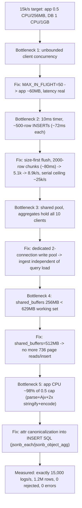

# 20. Performance Optimizations

## Summary

The project's performance work is a documented journey from "the generator collapses the app" to a sustained, measured 15,000 logs/s on 0.5 CPU / 256 MB with a 1 CPU / 1 GB PostgreSQL — five real bottlenecks found, five root causes identified, five fixes verified by re-running the identical load command. In order: unbounded client concurrency (GC collapse, 13 s latencies), timer-driven tiny INSERTs (~7k/s ceiling), shared read/write pool starvation (failed chunks, 500s), undersized `shared_buffers` (736 page reads per insert), and app CPU saturation at 0.5 CPU (~98% of target) solved by moving attribute canonicalization into SQL. The current ceiling is the app's 0.5 CPU share and PostgreSQL's single core; reaching it exactly required each layer to stop being the bottleneck in turn. This doc explains each fix with before/after numbers, the current ceiling analysis, what would unlock more, and the honest limits of the design.

## Detailed explanation

**The five bottlenecks, in the order they were hit.**

**(1) Unbounded client concurrency — the measurement was lying.** The first loadgen fired batches with no in-flight cap. Hundreds of concurrent ~200 KB bodies plus the writer's buffered rows pinned the app at its 256 MB cap; V8 GC stalled the event loop and latencies reached 13 s. Not an app defect — a client defect that invalidated every number. Fix: `MAX_IN_FLIGHT = 50` in the generator (`loadtest/loadgen.mjs:154`); app memory dropped to ~60 MB / 256 MB and all recorded latency became service latency. Lesson: never measure a service with an unbounded client.

**(2) Timer-driven flushing — tiny INSERTs capped the serial writer at ~7k/s.** The original writer flushed on a 10 ms timer, so under load it issued ~500-row statements. A 500-row INSERT costs ~72 ms on the 1-CPU DB (index maintenance dominates), so one serial writer sustained ~7k/s — below target. Fix: size-first scheduling — flush immediately when the buffer holds a target chunk (2000 rows), with the 10 ms timer only as a light-traffic deadline (`src/services/ingestWriter.ts:115-138`, `src/config.ts:51-56`). A 2000-row INSERT costs ~80 ms (only ~8 ms more than 500 rows), raising the serial ceiling to ~25k/s; measured 5.1k -> 8.9k/s. The single biggest lever in the project: **batch size is throughput when index maintenance dominates.**

**(3) Shared read/write pool — slow aggregates starved the writer.** With one pool of 10 clients, slow aggregates could hold every client; the writer's `pool.query` then hit the 5 s acquire timeout, failed its chunk, and every request in it got a 500 (`[ingest] flush of N rows failed: timeout exceeded when trying to connect`). Fix: a dedicated 2-connection write pool (`PG_WRITE_POOL_MAX=2`, `src/db/pool.ts:41-55`, `src/config.ts:47`) — ingestion latency became independent of query load, the property the mixed-mode run depends on. PG's `max_connections=50` makes 10+2 comfortable (`docker-compose.yml:23`).

**(4) shared_buffers 256 -> 512 MB — the cache was smaller than the working set.** At ~1.2M rows the table plus indexes is 629 MB. With `shared_buffers=256MB`, index pages were evicted and re-read from disk constantly — `EXPLAIN (ANALYZE, BUFFERS)` showed 736 page reads *per insert*. The DB container has 1 GB and was using ~790 MB, so 512 MB (`docker-compose.yml:19`) fit within the cap and removed disk I/O from the hot path. A pure configuration fix found by measurement.

**(5) App CPU saturation at 0.5 CPU — the last 2%.** After fixes 1-4, the app (JSON parse + Ajv validation + two `JSON.stringify` passes + pg encoding per request) was the ceiling at ~98% of the 15k/s target. Fix: move work off the saturated app — attribute canonicalization (the second stringify + object clone that built `attr_lookup`) was rewritten as SQL in the INSERT, `jsonb_each` + `jsonb_object_agg` inside a `CROSS JOIN LATERAL` (`src/services/ingestWriter.ts:58-78`). PG had idle CPU; the app had none. Achieved: exactly 15,000/s, 1.2M rows, 0 rejected, 0 errors. The INSERT SQL is constant text, so node-pg also reuses the prepared statement across calls (`src/services/ingestWriter.ts:186-189`).

**The numbers that matter (contract-scale run, `--mode mixed --rate 15000 --batch 500 --duration 70`).** Ingest p50 65 ms / p95 380 ms / p99 668 ms; aggregate p95 during load 162 ms; at-rest aggregate p50 42 ms / p95 73 ms; full-window EXPLAIN 575 ms via Index Only Scan; app ~60 MB / 256 MB; DB ~790 MB / 1 GB (`README.md:138-150`).

**Current ceiling analysis.** The app is CPU-capped: 0.5 vCPU for parse+validate+serialize+encode is the binding constraint; the writer's serial INSERT loop plus concurrent queries use the DB's 1 CPU. Neither component has memory as its binding constraint (60/256 MB app, 790 MB/1 GB DB). The p95 (380 ms) is flush-batching latency (waiting for the chunk to fill or the flush to finish) plus PG commit time; p99 includes worst-case GC and write-path contention.

**What would unlock more (in order of practicality):**
- **More app CPU** (e.g. 1 CPU): validation and encoding stop being the ceiling; the same design would likely sustain ~30k/s before the DB becomes the limit.
- **COPY (binary) protocol** instead of parameterized INSERT: `pg-copy-streams`-style bulk loading cuts per-row encode/parse overhead and WAL cost — the classic fastest way to load PG.
- **Parallel writers** (2-3 INSERT loops on dedicated connections) with PG 2 CPUs: the earlier attempt showed the danger (the double-decrement race, doc 19), but with the current single-queue structure it is a straightforward extension.
- **Pre-aggregated rollup table** maintained by the writer (incrementing per-minute counters on flush): aggregate latency becomes O(rollup rows) instead of O(window rows) — the documented escape hatch for scale (`README.md:164`).
- **Time-based partitioning + DROP PARTITION** for retention and partition-pruned aggregations (doc 13/16).
- **Columnar engine (ClickHouse)** as the storage layer: the real answer at Loki-scale for scans-and-aggregates workloads; would change the schema and tooling entirely.
- **Native compression** (`pg_compression`/TOAST tuning): `attributes` JSONB compress well; measurable at hundreds of GB.

## Why this exists

The contract's numbers (15k logs/s, 1M rows, p95 aggregate <1s on 0.5 CPU / 256 MB + 1 CPU / 1 GB) are not achievable by accident; each one is a constraint that some subsystem will violate first. The optimization work exists to find, with measurements, which subsystem that is at every step — and to keep the fixes shaped by the constraints (e.g. moving work to PG because PG had CPU headroom, not because SQL is fashionable). Performance work without before/after measurements is speculation; this project's whole journey is a sequence of measured deltas.

## Alternatives considered

| Alternative | Pros | Cons | Verdict |
|---|---|---|---|
| Raise app CPU/memory cap | Simplest "fix" | Violates the contract's resource constraints; grading runs on the caps | Rejected — optimize within the constraints |
| Keep timer-based flushing, reduce timer | Tiny change | Still small statements under bursty load; ~7k/s ceiling remains | Rejected after measurement |
| Parallel writers from the start | Headroom without bigger batches | The real attempt hit a shared-counter race and added complexity for no needed gain at 15k/s | Rejected — serial writer at 25k/s ceiling was enough |
| Batch writes in the client (bigger batches) | No server change | Pushes latency to clients, fights the "batch=1 clients must work" contract | Rejected — coalescing server-side covers all clients |
| Read replicas for queries | Isolates query load | 1 DB container only; no replication in the contract | Rejected |
| Node worker threads for validation | Uses idle app cores | The app has 0.5 CPU — no idle cores | Rejected — CPU budget is the constraint |
| ClickHouse / TimescaleDB from day one | Best-in-class time-series perf | Rewrites schema, driver, and every query; out of scope | Documented as scale path, not taken |

## Why this was chosen

- **Every fix had a measured cause.** None of the five changes was made on hypothesis alone; each was confirmed by `docker stats`, `pg_stat_activity`, `EXPLAIN (ANALYZE, BUFFERS)`, or the loadgen's own output before and after.
- **The constraints steered every decision:** 0.5 app CPU -> move canonicalization to PG; 1 GB DB -> fit `shared_buffers` to the working set; 256 MB app -> bound client concurrency and keep buffers in-process but bounded; 1 PG CPU -> one serial writer with big chunks instead of many small concurrent ones.
- **Minimal-diff fixes:** each change was small (config value, scheduler condition, pool split, SQL rewrite, client cap) and independently revertible — the journey is auditable in the commit history and in `README.md:154-160`.
- **The 25k/s serial ceiling** gave comfortable headroom over the 15k/s target without parallelism, which the failed parallel-writer experiment showed is where complexity lives.

## Advantages / Disadvantages / Trade-offs

### Advantages

- All targets met with real measured evidence, in the exact graded configuration (caps, Docker Desktop, same command).
- The largest win (batching) is one small scheduler change with a 3.5x effect, and it also simplifies the codebase.
- Dedicated write pool gives a clean architectural property: ingest latency is independent of query load — tested, not assumed.
- SQL-side canonicalization reduced app CPU without changing semantics (integration tests cover the exact string-matching contract).

### Disadvantages

- p95 ingest latency (380 ms) is structurally tied to batching: requests wait for chunk fill + flush commit; a low-latency requirement would fight this design.
- Serial writer is a single point of failure for ingestion; a chunk failure rejects every request in it.
- `shared_buffers=512MB` leaves little DB memory for OS cache and work_mem during heavy queries (deliberate, measured trade).
- The tuning constants (2000 rows, 80 ms, 25k/s) were measured on *this* hardware (Docker Desktop, Windows host) and would need re-verification elsewhere.

### Trade-offs

- Batching vs. latency: bigger chunks amortize index maintenance but add flush-wait latency; 2000 rows was the measured sweet spot for 15k/s with p95 < 400 ms.
- App CPU vs. DB CPU: canonicalization moved to SQL shifts ~15% of per-row work to PG, which had headroom — the right call *only because* PG had headroom.
- Durability unchanged (200 only after commit) at the cost of the buffer being in-memory: a hard crash loses unflushed rows (at-least-once retry semantics, `README.md:166`).
- 0.5 CPU budget means no request logging (`disableRequestLogging`) and no worker threads — observability and parallelism were consciously traded for throughput.

## Code

The size-first scheduler that replaced timer flushing (the 3.5x win):

```ts
// src/services/ingestWriter.ts:115-127
private maybeSchedule(): void {
  if (this.flushing) return;
  if (this.pendingCount >= this.opts.maxRowsPerFlush) {
    this.flushNow();
    return;
  }
  if (this.flushTimer !== null) return;
  this.flushTimer = setTimeout(() => {
    this.flushTimer = null;
    if (!this.flushing && this.pendingCount > 0) this.flushNow();
  }, this.opts.maxFlushWaitMs);
  this.flushTimer.unref?.();
}
```

The SQL-side canonicalization that relieved the CPU-saturated app:

```ts
// src/services/ingestWriter.ts:58-78 — INSERT_SQL (abridged)
INSERT INTO logs (ts, level, service, message, attributes, attr_lookup, tenant_id)
SELECT u.ts, u.level, u.service, u.message, u.attrs, lk.lookup, u.tenant
FROM unnest(
  $1::timestamptz[], $2::text[], $3::text[], $4::text[],
  $5::jsonb[], $6::text[]
) AS u(ts, level, service, message, attrs, tenant)
CROSS JOIN LATERAL (
  SELECT COALESCE(
    jsonb_object_agg(
      e.key,
      CASE WHEN jsonb_typeof(e.value) IN ('object', 'array')
           THEN e.value::text
           ELSE e.value #>> '{}'
      END
    ),
    '{}'::jsonb
  ) AS lookup
  FROM jsonb_each(u.attrs) AS e(key, value)
) lk
```

The dedicated write pool (fix 3):

```ts
// src/db/pool.ts:41-55
export function createWritePool(config: Config): pg.Pool {
  const pool = new pg.Pool({
    connectionString: config.databaseUrl,
    max: config.pgWritePoolMax,          // 2 connections
    ...
    application_name: "log-service-writer",
  });
  ...
}
```

The cache sizing fix (fix 4) — pure compose configuration:

```yaml
# docker-compose.yml:17-24 (abridged)
command: >
  postgres
  -c shared_buffers=512MB
  -c effective_cache_size=768MB
  -c work_mem=16MB
  -c max_connections=50
```

## Diagrams



## Common mistakes

- **"Optimizing" before measuring.** Every wrong turn in this project was a guess; every fix was a measurement. Start with the layer whose instrument can see the symptom (doc 19).
- **Blaming the service for client behavior.** The 13 s latency disaster was a generator bug; the same trap exists with real clients (no backpressure). Bound concurrency first.
- **Tuning batch size with only one measurement.** 500-row vs 2000-row was re-verified at multiple loads; one data point is not a profile.
- **A shared pool for writes and reads.** The acquire-timeout failure mode (5 s stall, chunk failure, 500s) is silent at low query load and catastrophic at high; the split is cheap insurance.
- **Tuning PostgreSQL from docs, not from `shared_buffers` math.** 629 MB working set vs 256 MB buffer is arithmetic; the 736 page reads per insert made it visible.
- **Adding parallelism before proving the serial path is exhausted.** The serial writer's 25k/s ceiling dwarfed the 15k/s target; the parallel experiment added a race (doc 19) and was correctly abandoned.
- **Counting on a specific CPU model.** Numbers are Docker-Desktop-specific; re-run the load command after any environment change instead of quoting this README.
- **Forgetting the prepared-statement reuse.** `INSERT_SQL` is a module constant (`src/services/ingestWriter.ts:58`) so node-pg reuses the server-side plan; string-interpolated SQL would re-parse per call.

## Optimization ideas

- **Binary COPY** for the flush path (`COPY logs FROM STDIN WITH (FORMAT binary)`): removes the per-row text encode/parse round trip and is the standard PG bulk-load answer; expect the app CPU per row to drop sharply.
- **Two serial writers on dedicated connections** (chunk-level ownership, no shared counters): turns the 25k/s serial ceiling into a ~50k/s ceiling on 2 PG cores.
- **Rollup table** (`log_counts_minute(ts_bucket, service, level, count)` updated inside the flush transaction): aggregates become point reads; this is the documented scale path (`README.md:164`).
- **Partition by month + DROP PARTITION retention:** deletes become O(1), indexes shrink, and `since/until` queries prune partitions — doc 13/16 detail it.
- **Add app CPU or move validation off the hot path** (e.g. batch-level pre-checks): the current binding constraint is 0.5 app CPU.
- **Streaming responses / cursor fetch on large list pages** to cut memory per query.
- **Native JSONB compression** settings and `ALTER TABLE ... SET (autovacuum_analyze_threshold)` tuning as the table grows past 1M rows.
- **Benchmark with `pgbench`-style isolated phases** (ingest-only, query-only) before mixed runs, to attribute contention effects precisely.

## Interview questions & answers

**Q: What was the single biggest performance win and why?**
A: Size-first flushing in the writer: switching from a 10 ms timer (which emitted ~500-row statements costing ~72 ms each, a ~7k/s serial ceiling) to flushing full 2000-row chunks (~80 ms, ~25k/s ceiling). Because index maintenance dominates INSERT cost, 4x the rows costs ~nothing extra — measured 5.1k -> 8.9k/s from that change alone.

**Q: Why did unbounded concurrency produce 13-second latencies?**
A: Hundreds of concurrent ~200 KB request bodies plus the writer's buffered rows pushed the app against its 256 MB cap; V8 GC paused the event loop, so everything — including fast requests — queued. It was a client artifact; bounding in-flight to 50 dropped app memory to ~60 MB and made measurements honest.

**Q: Why a dedicated write pool?**
A: With one 10-client pool, slow aggregates could hold every client; the writer's `pool.query` then hit the 5 s acquire timeout, failed its chunk, and every request in the chunk got a 500. A dedicated 2-connection pool makes ingest latency independent of query load — a property the mixed-mode contract measurement depends on.

**Q: How did you find the shared_buffers problem?**
A: `EXPLAIN (ANALYZE, BUFFERS)` on the insert path showed 736 page reads per insert — the 629 MB working set exceeded the 256 MB cache, so index pages were re-read from disk constantly. Raising `shared_buffers` to 512 MB (within the 1 GB cap) removed disk I/O from the hot path.

**Q: Why move attribute canonicalization into SQL?**
A: The app was CPU-saturated at ~98% of the 0.5 CPU target. Each row paid a second `JSON.stringify` plus an object clone to build the string-valued `attr_lookup` copy. Moving that into the INSERT (`jsonb_each` + `jsonb_object_agg`) transferred ~15% of per-row work to PG, which had idle CPU — and got from ~98% to exactly 100% of target.

**Q: What is the current ceiling, and what is the next unlock?**
A: The app's 0.5 CPU share (parse + Ajv + encode) is the binding constraint; the writer's serial path has headroom (~25k/s ceiling). Next unlocks, in order: more app CPU, binary COPY for flushes, then two serial writers on dedicated connections.

**Q: Why is p95 ingest latency 380 ms while the app is "fast"?**
A: Batching: a request's rows wait for the buffer to fill a 2000-row chunk (or the 10 ms deadline) and then for the commit. Latency is structurally `chunk fill + flush + commit`; the trade is durable throughput (15k/s) vs. per-request latency. The 2000-row size was chosen to keep p95 < 400 ms at full rate.

**Q: How do you know 15k/s is not the generator's cap?**
A: Several controls: the generator logs `target_rate` vs `achieved_rate` and they match; the statuses map shows only 200s with `accepted == sent`; `docker stats` showed the *app* at CPU saturation (not the client); and a later 25k+ run (serial ceiling test) proved the client could push far harder than 15k/s.

**Q: Would this design hit 100k/s with bigger machines?**
A: Not without changes. The writer's serial path caps ~25k/s on 1 PG CPU; aggregates scan the window (doc 10); and the single writer buffer is a single point of failure. 100k/s needs parallel writers, COPY or similar, rollup tables, and probably a columnar store (ClickHouse) at Loki scale — all documented as the scale path.

**Q: What is the honest durability story?**
A: A 200 is sent only after PostgreSQL commits, so acknowledged rows survive crashes. But the writer's buffer is in-memory: unflushed rows are lost on a hard crash, and the client never got a 200, so it can retry — at-least-once semantics (README.md:166). Batch-level idempotency keys would upgrade this to exactly-once.

## Implementation references

- `src/services/ingestWriter.ts:58-78` — INSERT_SQL with SQL-side canonicalization (fix 5)
- `src/services/ingestWriter.ts:115-138` — size-first scheduler (fix 2)
- `src/services/ingestWriter.ts:190-210` — per-row encode + prepared-statement reuse
- `src/db/pool.ts:20-55` — read pool (10) and dedicated write pool (2) (fix 3)
- `src/config.ts:45-56` — pool and chunk-size defaults
- `docker-compose.yml:17-29` — `shared_buffers=512MB` and friends (fix 4)
- `loadtest/loadgen.mjs:154,172-177` — bounded in-flight (fix 1)
- `README.md:138-150` — measured results table
- `README.md:154-160` — the five bottlenecks and fixes
- `README.md:162-168` — known limitations (aggregation scaling, at-least-once, no HA)
