# 21. Deployment & CI

## Summary

Deployment is deliberately `docker compose up` — two containers (PostgreSQL 16 and the app), resource-capped to the contract's numbers, with migrations applied at startup and a health-based dependency chain. The app image is multi-stage (`node:22-alpine`, `npm ci`, compile, then `npm ci --omit=dev` and run as the non-root `node` user), and the stack exposes only the app port. CI runs in GitHub Actions at the repo root (`.github/workflows/ci.yml`) with the job running from the repository root: typecheck, lint, unit tests, then a real stack via compose, a health poll, 39 integration tests against the real DB, and two smoke passes (auth off, then auth on with a seeded key). Feature flags are environment-driven (`AUTH_ENABLED`, `LOADGEN_API_KEY`, `RETENTION_HOURS`), and shutdown is graceful: readiness flips to false, retention stops, Fastify closes, then pools close, on both SIGTERM and SIGINT. Production hardening beyond this — TLS, load balancing, replicas, observability, secret management — is enumerated as a checklist.

## Detailed explanation

**Compose as the deploy story.** `docker-compose.yml` is the whole deployment: the `db` service runs `postgres:16-alpine` with a healthcheck (`pg_isready`, 2 s interval, 30 retries — `docker-compose.yml:35-39`) and the tuning flags from doc 14 (`shared_buffers=512MB`, `max_connections=50`, autovacuum sizing — `docker-compose.yml:17-29`). The `app` service depends on `db` with `condition: service_healthy` (`docker-compose.yml:58-60`), so the app never races an unready database. Both services carry `deploy.resources.limits` — app 0.5 CPU / 256 MB, DB 1 CPU / 1 GB (`docker-compose.yml:40-45,61-66`) — which makes the graded environment reproducible and prevents the app from being accidentally granted more than the contract allows. The named `pgdata` volume persists data across restarts (`docker-compose.yml:30-31,68-69`), which is why smoke tests use unique namespaces (doc 19).

**Image build.** The Dockerfile is multi-stage (`Dockerfile:5-27`): `deps` installs all packages with `npm ci`; `build` copies `src` and `tsconfig.json`, compiles with `tsc`; `runtime` copies only `package.json`/lock, runs `npm ci --omit=dev`, and copies `dist/` from the build stage. The runtime image therefore ships compiled JS plus production dependencies only — critical because the container is capped at 256 MB (the Dockerfile's own comment says dev deps and sources would waste half of it). It runs as `USER node` (non-root, `Dockerfile:25`) as defense in depth, sets `NODE_ENV=production`, and starts with `CMD ["node", "dist/index.js"]`. The `.dockerignore` keeps `node_modules` and `tests` out of the build context.

**Readiness and the health chain.** `GET /health` returns 503 until the app has connected to the DB, applied migrations, seeded the auth key, and begun listening (`src/routes/health.ts:12-19`, `src/index.ts:21-46`). Compose's `restart: unless-stopped` plus the app's own startup retry (`waitForDatabase`, up to 60 attempts with backoff — `src/db/pool.ts:57-69`) means the stack self-heals a boot-order race without orchestration. Migrations are guarded by a PostgreSQL advisory lock so two instances booting together cannot interleave (`src/db/migrations.ts:88-130`).

**Environment-based feature flags.** All knobs are env vars read once and frozen into the typed `Config` (`src/config.ts:40-62`): `PORT`, `DATABASE_URL`, `PG_POOL_MAX`, `PG_WRITE_POOL_MAX`, `INGEST_MAX_ROWS_PER_FLUSH`, `INGEST_MAX_FLUSH_WAIT_MS`, `RETENTION_HOURS`, `RETENTION_SWEEP_INTERVAL_MS`, `AUTH_ENABLED`, `LOADGEN_API_KEY`, `LOG_LEVEL`. Compose passes them through with defaults so plain `docker compose up` behaves identically to the contract (`docker-compose.yml:49-56`), and `.env` can override any of them. `int()` bounds-checking rejects out-of-range values at startup (`src/config.ts:30-38`).

**CI pipeline.** The workflow lives at the repository root (`.github/workflows/ci.yml`) because the repo root contains both the study material and the implementation; the single job sets `defaults.run.working-directory: .` so every command runs inside the project. Steps, in order:

1. `actions/checkout@v4`.
2. `actions/setup-node@v4` with Node 22 and npm cache (cache path pinned to `package-lock.json`).
3. `npm ci` — clean, lockfile-driven install.
4. `npm run typecheck` — `tsc --noEmit`.
5. `npm run lint` — ESLint.
6. `npm run test:unit` — 35 unit tests (validation, cursor, queryParams), no DB needed.
7. `docker compose up -d` — the real stack with default config.
8. Health poll: `curl -sf localhost:8080/health` up to 60 attempts at 2 s.
9. `npm run test:integration` — 39 integration tests against the real DB on `localhost:5432` (compose exposes it).
10. `node scripts/smoke.mjs` — contract smoke with auth off.
11. Auth-on pass: `docker compose down`, then `AUTH_ENABLED=true LOADGEN_API_KEY=loadgen-test-key docker compose up -d`, poll health again, run `node scripts/smoke.mjs --auth --key loadgen-test-key`.

The auth-on step is a restart of the same volume with a different environment — which doubles as a test that seeding is idempotent across restarts and that the key works after re-deployment.

**Graceful shutdown.** On SIGTERM or SIGINT (`src/index.ts:49-62`): readiness flips false (load balancers stop routing), the retention sweeper stops, `app.close()` lets Fastify finish in-flight requests, and only then do the read pool and the writer's pool close — order matters because a closed pool under in-flight work throws acquire errors. Finally `process.exit(0)`. Compose's `stop_grace_period` default (10 s) is enough because Fastify closes connections with a drain timeout.

## Why this exists

A service that cannot be deployed and verified automatically is not a service — it is a demo. Compose-as-deployment exists to make the contract environment reproducible byte-for-byte (same images, same caps, same tuning, same ports), which is what makes the measured numbers meaningful. CI exists to make the contract *continuously* verified: the exact checks a grader would run (typecheck, lint, tests, smoke with and without auth) run on every push and pull request, so a regression is caught in minutes, not on grading day. The multi-stage image and non-root user exist because the resource cap makes image size a correctness requirement, and the shutdown sequence exists because dropping connections mid-write is how data-loss bugs are born.

## Alternatives considered

| Alternative | Pros | Cons | Verdict |
|---|---|---|---|
| Kubernetes manifests | Production-grade scaling, self-healing | Massive tooling weight for 2 containers; no cluster in scope | Rejected — compose is the deploy story |
| Single container (app + PG in one) | Simplest possible | Hides the two-tier architecture, breaks caps, bad practice | Rejected — the architecture is two tiers |
| Dockerfile one-stage | One fewer stage | Runtime image ships dev deps + TS sources; 256 MB cap makes this fatal | Rejected — multi-stage is required by the cap |
| Run as root (default) | Zero friction | Any RCE owns the host; against the grain of the exercise | Rejected — `USER node` is one line |
| GitHub-hosted DB service (postgres container as a service job) | No compose needed for tests | Diverges from the deployed configuration (no shared_buffers tuning, no caps) | Rejected — tests must hit the *same* config as prod |
| Separate load-test job in CI | Catches perf regressions | Long, flaky on shared runners; Docker Desktop variance | Deferred — nightly local runs instead |
| Shell script instead of GitHub Actions | No vendor lock-in | No hosted triggers, no artifacts, no PR gates | Rejected — Actions is free and standard |
| Rootless Docker / Podman | More secure daemon | Windows host, extra complexity | Out of scope |

## Why this was chosen

- **Compose matches the constraint set exactly:** resource limits are first-class (`deploy.resources.limits`), the health condition removes boot-order races, and a named volume gives persistence — all without any infrastructure to maintain.
- **Multi-stage is forced by the 256 MB cap:** `npm ci --omit=dev` plus `dist/` only is the difference between a ~90 MB and a ~400 MB+ image in a container that must also run the app.
- **CI on the real stack, not doubles:** integration tests and smoke run against the compose stack (same image, same `shared_buffers`, same ports), so CI verifies the deploy artifact, not a dev approximation.
- **Two smoke configurations** directly encode the contract's two modes (auth off / auth on) and double as an idempotent-seeding test across redeploys.
- **Feature flags over config files:** environment variables are the only configuration mechanism Docker/CI/12-factor environments agree on, and `int()` validation turns misconfiguration into a loud startup error instead of a silent misbehavior.
- **Shutdown ordering is contract-critical:** acknowledging writes only when committed means the process must not die between `app.close()` and pool shutdown; the sequence in `src/index.ts:49-62` is the smallest correct version.

## Advantages / Disadvantages / Trade-offs

### Advantages

- One command (`docker compose up -d`) reproduces the entire graded environment, including resource caps and PostgreSQL tuning.
- CI is a full contract gate on every push/PR — typecheck, lint, 74 tests, and both smoke configurations.
- Small, fast, cacheable image (multi-stage, `--omit=dev`), run as non-root.
- Graceful shutdown with correct ordering (readiness -> retention -> Fastify -> pools) prevents mid-write connection drops.
- Migration advisory lock makes the boot sequence safe for concurrent instances.

### Disadvantages

- Compose is single-host: no HA, no scaling, no rolling deploys; `docker compose up` on another machine is a manual operation.
- The app image is built on the host with local Docker (no registry, no image digest pinning in compose).
- Secrets are env vars in plaintext (`.env`); acceptable for the exercise, not for production.
- The `pgdata` named volume can grow without bound unless retention works — operational debt.
- No log shipping: `docker compose logs` is the only window into a running stack.

### Trade-offs

- Real-stack CI (compose in the runner) is heavier and slower than service-based test DBs, but it verifies the actual deployment artifact — the right trade for a deployment-focused contract.
- `restart: unless-stopped` trades explicit failure visibility for self-healing; a crash-looping app stays "running" in compose terms, so readiness polling (not just container state) is the real signal.
- Node 22 pinned in both the image and CI prevents surprise upgrades at the cost of manual bumps.

## Code

The complete deployment description — caps, tuning, health dependency:

```yaml
# docker-compose.yml:47-66 (app service, abridged)
app:
  build: .
  environment:
    PORT: 8080
    DATABASE_URL: postgres://loguser:logpass@db:5432/logdb
    AUTH_ENABLED: ${AUTH_ENABLED:-false}
    LOADGEN_API_KEY: ${LOADGEN_API_KEY:-}
    RETENTION_HOURS: ${RETENTION_HOURS:-744}
  ports:
    - "8080:8080"
  depends_on:
    db:
      condition: service_healthy
  deploy:
    resources:
      limits:
        cpus: "0.5"
        memory: 256m
  restart: unless-stopped
```

The image build — three stages, non-root runtime:

```dockerfile
# Dockerfile:5-27 (abridged)
FROM node:22-alpine AS deps
WORKDIR /app
COPY package.json package-lock.json ./
RUN npm ci

FROM node:22-alpine AS build
...
COPY --from=deps /app/node_modules ./node_modules
COPY src ./src
RUN npm run build

FROM node:22-alpine AS runtime
ENV NODE_ENV=production
RUN npm ci --omit=dev
COPY --from=build /app/dist ./dist
USER node
EXPOSE 8080
CMD ["node", "dist/index.js"]
```

Shutdown ordering — the correct teardown sequence:

```ts
// src/index.ts:49-62
const shutdown = async (signal: string): Promise<void> => {
  console.log(`received ${signal}, shutting down`);
  readyState.ready = false;
  stopRetention();
  try {
    await app.close();
  } finally {
    await pool.end();
    await writer.end();
    process.exit(0);
  }
};
process.on("SIGTERM", () => void shutdown("SIGTERM"));
process.on("SIGINT", () => void shutdown("SIGINT"));
```

The CI pipeline (repo root — `.github/workflows/ci.yml`):

```yaml
name: CI
on:
  push:
    branches: [main]
  pull_request:
jobs:
  test:
    runs-on: ubuntu-latest
    defaults:
      run:
        working-directory: .
    steps:
      - uses: actions/checkout@v4
      - uses: actions/setup-node@v4
        with:
          node-version: 22
          cache: npm
          cache-dependency-path: package-lock.json
      - name: Install
        run: npm ci
      - name: Typecheck
        run: npm run typecheck
      - name: Lint
        run: npm run lint
      - name: Unit tests (no DB)
        run: npm run test:unit
      - name: Start stack (default config)
        run: docker compose up -d
      - name: Wait for health
        run: |
          for i in $(seq 1 60); do
            if curl -sf localhost:8080/health; then exit 0; fi
            sleep 2
          done
          exit 1
      - name: Integration tests (real DB)
        run: npm run test:integration
      - name: Contract smoke (auth off)
        run: node scripts/smoke.mjs
      - name: Contract smoke (auth on)
        run: |
          docker compose down
          AUTH_ENABLED=true LOADGEN_API_KEY=loadgen-test-key docker compose up -d
          for i in $(seq 1 60); do
            if curl -sf localhost:8080/health; then break; fi
            sleep 2
          done
          node scripts/smoke.mjs --auth --key loadgen-test-key
```

## Diagrams

```mermaid
flowchart TD
    subgraph CI["GitHub Actions (ubuntu-latest, working-directory: .)"]
        A["push / PR"] --> B["checkout"]
        B --> C["setup-node 22 + npm cache"]
        C --> D["npm ci"]
        D --> E["typecheck (tsc --noEmit)"]
        E --> F["lint (eslint)"]
        F --> G["unit tests (35, no DB)"]
        G --> H["docker compose up -d"]
        H --> I["poll /health until 200"]
        I --> J["integration tests (39, real DB)"]
        J --> K["smoke: auth off"]
        K --> L["compose down + AUTH_ENABLED=true ... up"]
        L --> M["poll /health"]
        M --> N["smoke: auth on (Bearer loadgen-test-key)"]
    end

    subgraph DEPLOY["docker compose up (graded environment)"]
        APP["app: node:22-alpine, USER node, 0.5 CPU / 256MB"] --> DB["db: postgres:16-alpine, 1 CPU / 1GB, shared_buffers=512MB"]
        APP --> H1["GET /health 200 after migrations+seed+listen"]
        DB -. pg_isready healthcheck .-> APP
    end
```



## Common mistakes

- **Letting the app race the database.** Without `depends_on: condition: service_healthy`, the app boots against an empty/unready DB; the startup retry masks it, but the compose condition is the correct gate.
- **Skipping the health poll in CI.** `docker compose up -d` returns before the app is ready; running tests immediately gives spurious failures — the poll loop is mandatory (CI does it twice, once per config).
- **Shipping dev dependencies.** One-stage images under a 256 MB cap die in interesting ways (OOM, stalled builds); `--omit=dev` + compiled `dist/` only.
- **Running as root.** Trivial hardening, frequently skipped; `USER node` is one line in the Dockerfile.
- **Wrong teardown order.** Closing pools before Fastify's in-flight requests finish turns graceful shutdown into 500s and failed writes; readiness-off first, then close, then pools.
- **Hard-coding feature flags into the image.** `AUTH_ENABLED` must come from the environment at deploy time; baking it in makes CI's two-config run impossible.
- **A CI that does not touch the real stack.** Unit tests alone would never have caught the integration issues (keyset pagination, GIN containment, TRUNCATE isolation); the compose-up step is the point.
- **Forgetting the named volume persists.** `docker compose down` does not remove `pgdata`; auth-on CI step relies on this persistence to also verify idempotent re-seeding, and smoke tests rely on unique namespaces to stay correct.
- **Windows dev divergence.** Everything in the README runs through `npm.cmd`; CI runs on Linux runners where `npm` is correct — keep both forms documented (`README.md:199-204`).

## Optimization ideas

- **Publish the image to a registry** (GHCR) with digest-pinned `image:` references in compose, enabling exact reproducibility across machines.
- **Add a container healthcheck to the app image** (`HEALTHCHECK CMD node -e "fetch('http://localhost:8080/health')..."`) so orchestrators see liveness, not just readiness.
- **CI perf gate:** a nightly scheduled workflow running the short load test and failing on `achieved_rate < 0.9 * target`.
- **`docker compose profiles`** for optional services (e.g. a `monitoring` profile with cAdvisor) without changing the default contract.
- **Secrets via Docker secrets / vault** in any real deployment; keep env vars only for non-secret knobs.
- **Rolling deploy with zero downtime:** two app replicas behind a load balancer, migrations guarded by the advisory lock, readiness gating traffic — the lock and the 503-until-ready design already support this.
- **Log shipping** (pino to stdout + a collector like Loki/Vector) for production observability.
- **BuildKit cache mounts** (`RUN --mount=type=cache,target=/root/.npm`) to cut CI image-build time.

## Interview questions & answers

**Q: Why is `docker compose up` the deployment, not Kubernetes?**
A: The deployment is exactly two containers with hard resource caps; compose expresses the environment precisely (limits, health dependency, tuned PG command, ports) with zero infrastructure to run or explain. Kubernetes would add a cluster, manifests, and networking for no benefit at this scale — it is the documented upgrade path, not the current one.

**Q: Why multi-stage, and why `--omit=dev`?**
A: The runtime container is capped at 256 MB. A single-stage image would ship TypeScript sources, dev dependencies (tsx, eslint, typescript), and node_modules in full. Multi-stage compiles with `tsc` in the build stage and copies only `dist/` plus production dependencies into the runtime stage — the difference between a workable and an OOM-prone image.

**Q: Why run as the `node` user?**
A: Defense in depth: if the process is compromised, a non-root process limits what an attacker can do to the container. It costs one line (`USER node`) and is standard practice for node images.

**Q: What does the compose `depends_on: condition: service_healthy` buy you?**
A: It gates app startup on the DB's `pg_isready` healthcheck, so the app's own `waitForDatabase` retry loop almost never spins. Without it, every boot is a race that the retry loop silently papers over.

**Q: Walk through the CI pipeline.**
A: On push/PR: checkout, Node 22 with npm cache, `npm ci`, typecheck, lint, 35 unit tests (no DB). Then the real stack: `docker compose up -d`, poll `/health`, run 39 integration tests against the compose DB, run the contract smoke with auth off, then `compose down` and up with `AUTH_ENABLED=true LOADGEN_API_KEY=loadgen-test-key`, poll health, and run the smoke with auth on. Everything runs from the repository root (the workflow sets no `working-directory`).

**Q: Why run integration tests against the compose stack rather than a CI database service?**
A: Because the tests must verify the deployed artifact — same image, same `shared_buffers`, same caps. A separate DB service would test against a configuration that never runs in the graded environment, which is exactly how "works in CI, fails in prod" bugs are born.

**Q: Why is the auth-on CI step a separate `compose up` rather than an env var swap?**
A: The restart doubles as a contract test: it verifies the stack redeploys cleanly, that seeding is idempotent (`ON CONFLICT DO NOTHING`), and that the key still authenticates after a redeploy — the exact sequence a real operator would perform.

**Q: What is the shutdown order and why does it matter?**
A: Flip readiness to false (stop new traffic), stop the retention sweeper, `await app.close()` (Fastify drains in-flight requests), then close the read pool and the writer pool, then exit. If pools closed first, in-flight requests would fail with acquire errors and possibly drop acknowledged-or-about-to-be-acknowledged writes.

**Q: What would you add for production?**
A: TLS termination at a proxy, a load balancer in front of two app replicas (the advisory-locked migrations and 503-until-ready readiness support this), persistent log shipping and metrics, secrets via a vault instead of env vars, digest-pinned images from a registry, and rate limiting. None of this changes the app code — the architecture already assumes it.

**Q: How do feature flags stay safe?**
A: They are read once into a typed `Config` with `int()` bounds checks (`src/config.ts:30-38`), so a typo like `INGEST_MAX_ROWS_PER_FLUSH=2000x` fails loudly at startup instead of silently degrading. Compose passes defaults so the contract config is the default config, and CI proves both flag combinations on every push.

## Implementation references

- `docker-compose.yml:5-45` — db service, tuning command, healthcheck, caps
- `docker-compose.yml:47-69` — app service, env passthrough, caps, volume
- `Dockerfile:5-27` — multi-stage build, `--omit=dev`, `USER node`
- `src/index.ts:21-46` — bootstrap order (readiness ladder)
- `src/index.ts:49-62` — SIGTERM/SIGINT graceful shutdown
- `src/routes/health.ts:12-19` — 503-until-ready semantics
- `src/db/pool.ts:57-69` — `waitForDatabase` startup retry
- `src/db/migrations.ts:88-130` — advisory-lock-guarded migrations
- `src/config.ts:26-62` — env parsing with bounds checks
- `.github/workflows/ci.yml` — the full pipeline (runs from the repository root)
- `README.md:16-37` — quick start, smoke, load commands
- `README.md:197-205` — development scripts (npm.cmd on Windows)
