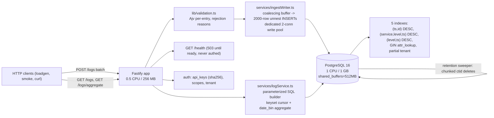

# 22. Final Review

## Summary

This is the definitive review document: everything the project is, measured and honest, in one place. It summarizes each subsystem in one paragraph, reproduces the full numbers table, shows the architecture diagram, lists the known limitations with their escape hatches, answers the ten whole-project interview questions most likely to be asked, and ends with what the author would do differently given the same constraints. Use it as the last thing you read before an interview or a demo: if you can explain every paragraph here — including the failures — the project is yours.

## Detailed explanation

**Schema.** One table, `logs` (`BIGSERIAL id`, `TIMESTAMPTZ ts`, `level` with a CHECK constraint instead of a PG enum, `service`, `message`, two JSONB columns, nullable `tenant_id`), plus `api_keys` and `schema_migrations`. The load-bearing decision is the double-JSONB strategy: `attributes` preserves the client's original types for responses, while `attr_lookup` holds a canonicalized string-valued copy built at INSERT time; all attribute filters run `@>` against `attr_lookup`, backed by a GIN `jsonb_path_ops` index. Five indexes cover the four contract query shapes; the partial tenant index costs nothing when tenancy is unused.

**Ingestion.** POST /logs validates every entry with a compiled Ajv schema (per-index rejection reasons), then pushes accepted rows into a shared buffer drained by one serial writer into `INSERT ... SELECT ... FROM unnest(...)` statements. Size-first flushing — 2000-row chunks (~80 ms on the 1-CPU DB vs ~72 ms for 500 rows) — makes throughput independent of client batch size and gives a ~25k/s serial ceiling. A dedicated 2-connection write pool isolates ingestion from query load. A 200 is sent only after PostgreSQL commits; failed chunks are retried once, then every request in the chunk errors.

**Querying.** GET /logs builds parameterized SQL from typed filter structs: every user value is a `$n` placeholder, and the only interpolated identifiers come from compile-time whitelists. Filters cover time windows, exact service/level, attribute equality via GIN containment, and case-insensitive message substring with LIKE metacharacters escaped. Unknown parameters are ignored (lenient); known ones are validated strictly to the contract's `{"error": ...}` 400 shape.

**Aggregation.** GET /logs/aggregate groups by `date_bin(ts, interval)` plus an optional `service`/`level` group, returning epoch-aligned buckets ascending by time then group. It shares the query builder, so every filter applies. At 1.2M rows the full-window plan is an Index Only Scan on `idx_logs_level_ts`: 575 ms measured cold, p95 73 ms warm at rest — comfortably inside the <1 s budget.

**Pagination.** Keyset pagination on `(ts, id)` with an opaque base64url cursor: the predicate is `(ts < $1 OR (ts = $1 AND id < $2))` and each query fetches `limit+1` rows to prove a next page exists. Every page costs O(page size), and the cursor is stable under concurrent inserts — no OFFSET re-scanning, no duplicates or gaps; malformed cursors are validated to a 400.

**Attributes.** The double-JSONB strategy carries the type-preservation and string-matching contracts at once. Canonicalization rules: scalars become their text form (`#>> '{}'`), nested objects and arrays are serialized as JSON text, empty objects become `{}`. The integration suite asserts both sides: numeric attributes round-trip to the client, and `attr.retries=3` matches the number 3.

**Retention.** A reentrancy-guarded sweeper deletes rows older than the horizon in bounded ctid chunks with a pause between chunks, so a sweep never blocks ingestion for long or builds a giant transaction. At 1M rows this is the right balance; at production scale the answer is time-based partitioning with DROP PARTITION.

**Auth.** Optional, off by default, credentials ignored when off. Keys exist only as SHA-256 hex hashes; the loadgen key is seeded idempotently before readiness. Per-route scopes (ingest for POST, query for GETs), 401/403 error shapes, and tenant scoping enforced as SQL predicates — a key with a tenant can only see and write its own rows.

**Testing.** 35 unit tests (validation, cursor, queryParams) need no database; 39 integration tests build the real app against the real compose DB with TRUNCATE isolation, serial execution, and a `drainWriter` helper that removes races with the async writer. The smoke script is the contract canary in both auth configurations, and CI runs the whole ladder on every push/PR.

**Performance.** The measured journey from client-induced GC collapse to exactly 15,000 logs/s sustained: bounded client concurrency, size-first batching (5.1k -> 8.9k/s), a dedicated write pool, `shared_buffers` 256 -> 512 MB, and SQL-side attribute canonicalization to relieve the 0.5-CPU app. Every fix was a measured delta, re-verified with the identical load command.

## Why this exists

A final review exists to compress a semester-sized project into something an interviewer or a future maintainer can absorb in one sitting, and to force the author to distinguish what was *designed* from what was *learned* (the five-bottleneck journey is mostly the latter). It also exists to be honest: the limitations section is as important as the numbers table, because the difference between "demo that passes" and "engineer who understands" is knowing exactly where the design stops being the right answer.

## Alternatives considered

| Alternative | Verdict |
|---|---|
| Skip the review document (rely on the README) | Rejected — README is facts; this doc is narrative, decisions, and interview prep in one place |
| Keep only bullet lists | Rejected — paragraphs carry the *reasoning*, which is what gets examined |
| Rewrite every prior doc's content | Rejected — each topic doc already exists (01-21); this is the index and synthesis, with pointers |

## Why this was chosen

The single-review format was chosen because every prior doc (01-21) already contains the depth; what an interview prep needs is a *map* — one paragraph per subsystem, the numbers, the architecture, the failures, the honest limits, and the author's own critique, which demonstrates self-assessment. It deliberately duplicates the numbers table and architecture diagram from the README so the doc stands alone.

## Advantages / Disadvantages / Trade-offs

### Advantages

- One-reading-required: every interview-critical fact and decision in a single document.
- The "what I would do differently" section demonstrates engineering judgment, not just execution.
- Explicitly separates measured facts (numbers table) from interpretation (limitations).

### Disadvantages

- Compresses nuance; readers needing depth must follow the topic-doc pointers.
- The numbers are tied to one environment (Docker Desktop) and will age as the project evolves.

### Trade-offs

- Duplication (numbers, architecture) buys standalone usability at the cost of keeping two places in sync — accepted for a review document.
- Length trades skimmability for completeness; the section headers make it skimmable anyway.

## Code

The code lives in `src/` and is quoted throughout docs 01-21; the two artifacts most worth re-reading for the review:

The writer's measured-cost rationale, which explains the whole performance story:

```ts
// src/services/ingestWriter.ts:18-24
// The one throughput lever, measured empirically on the 1-CPU DB container:
// chunk size. 500 rows ≈ 72ms, 2000 rows ≈ 80ms — index maintenance dominates
// the insert cost, so a 4× bigger chunk costs ~nothing extra. ... at 2000 rows
// per statement the serial writer sustains ~25k rows/s — comfortably above the
// 15k/s target, with no parallelism needed.
```

And the contract-shaped error envelope, which everything else hangs off:

```ts
// src/app.ts:43-54
app.setErrorHandler((err: FastifyError, _req, reply) => {
  if (err.statusCode === 400) {
    if (
      err.code === "FST_ERR_CTP_INVALID_JSON" ||
      err.code === "FST_ERR_CTP_EMPTY_JSON_BODY"
    ) {
      return reply.code(400).send({ error: "malformed JSON body" });
    }
    return reply.code(400).send({ error: err.message ?? "bad request" });
  }
  reply.send(err);
});
```

## Diagrams



## Measured numbers

Contract-scale run (`--mode mixed --rate 15000 --batch 500 --duration 70`): app 0.5 CPU / 256 MB, DB 1 CPU / 1 GB, `shared_buffers=512MB`, 1.2M rows, 629 MB table+indexes.

| Metric | Result | Target |
|---|---|---|
| Ingestion throughput | 15,000 logs/s (1.2M rows in 80 s, 0 rejected, 0 errors) | >= 15k/s |
| Ingest latency | p50 65 ms / p95 380 ms / p99 668 ms | — |
| Aggregate p95 during 15k/s ingestion | 162 ms (1 agg/s concurrent) | < 1 s |
| List query p95 during ingestion | ~161 ms | — |
| Aggregate at rest (1.2M rows, warm) | p50 42 ms / p95 73 ms | < 1 s |
| Aggregate cold, full-window EXPLAIN | 575 ms (Index Only Scan) | < 1 s |
| App memory during load | ~60 MB / 256 MB | 256 MB |
| DB memory during load | ~790 MB / 1 GB | 1 GB |
| Visibility (request -> queryable) | ~ ingest latency (commit-before-200) | < 20 s |

## Known limitations and extensions

- Aggregations scan the time window -> pre-aggregated rollup table maintained by the writer (documented escape hatch).
- Single instance, in-memory writer buffer -> replicas behind a load balancer; advisory-locked migrations and 503-until-ready already support this.
- At-least-once semantics on crash -> batch idempotency keys for exactly-once.
- Retention deletes leave dead tuples -> time-based partitioning + DROP PARTITION.
- No TLS, rate limiting, HA, sharding, observability -> production checklist in doc 21.
- Tuning constants are Docker-Desktop-specific -> re-run the load command on target hardware.
- Serial writer ceiling ~25k/s -> parallel writers on dedicated connections, or binary COPY.

## Common mistakes

- **Quoting the numbers without the environment.** The table means nothing without "Docker Desktop, caps as in compose, `shared_buffers=512MB`, warm cache" — an interviewer will probe exactly this.
- **Presenting the performance journey as a plan.** The five fixes were discoveries; claiming they were designed from the start is both false and a worse answer.
- **Forgetting the limitations.** Claiming the design scales to 100M rows is the fastest way to lose credibility; the honest answer (rollup/partition/ClickHouse path) is the winning one.
- **Not knowing the failure stories.** The double-decrement race, the pool starvation, the generator artifact — these are the most memorable and most asked-about details of the whole project.
- **Skipping the "why" behind each schema column.** `attr_lookup`, the CHECK constraint over an enum, `BIGSERIAL` over UUID — each is a decision with a reason; be ready to defend each.

## Optimization ideas

See docs 16 (index-level), 20 (throughput-level), and 21 (deployment-level) for the full lists; the shortlist: batch idempotency keys, binary COPY, parallel writers, a rollup table, partitioning, and the production hardening checklist.

## What I would do differently

1. **Load-test the writer design from day one.** The timer-flush writer shipped first; one 30-second load run on day two would have revealed the ~7k/s ceiling and skipped the redesign cycle.
2. **Add batch idempotency keys early.** The contract doesn't demand it, but the at-least-once gap is the first thing anyone probes in a durability question; a client-supplied `batch_id` with a dedupe table is cheap insurance.
3. **Prototype binary COPY before finalizing the INSERT encoding.** The unnest approach was chosen for zero dependencies; quantifying the app-side encode cost against a copy-streams prototype would have settled the trade on data.
4. **Measure `shared_buffers` arithmetic first.** The 629 MB working-set calculation could have been done on paper before the 736-page-reads measurement; same result, faster.
5. **Skip the parallel-writer experiment entirely.** The serial path had 1.6x headroom over target; the race it introduced (doc 19) cost more than the design would have gained at this scale.
6. **Make the loadgen a tiny library with a results file.** One-line JSON is nice; appending to a dated results file would have made the 5.1k -> 8.9k -> 15k journey queryable instead of recalled.
7. **Write the docs as I went.** The study docs were written after the fact; the design comments embedded in the source were the main memory aid. Reverse order costs nothing and preserves more reasoning.

## Interview questions & answers

The top-10 whole-project questions with model answers:

**Q: What is the single most important design decision?**
A: The coalescing writer with size-first flushing. The contract's 15k/s on 0.5 CPU is only reachable because concurrent requests are merged into ~2000-row INSERTs whose cost profile (~80 ms, index-maintenance-dominated) amortizes five indexes' write amplification. Every other win (write pool, SQL canonicalization) is secondary to this.

**Q: Why two JSONB columns?**
A: The contract requires both type-preserving round-trips and string-equality attribute matching, which a single JSONB column cannot satisfy: `@>` on typed values compares JSON types. `attributes` preserves types for responses; `attr_lookup` (canonicalized at INSERT time) is the string-matching target, indexed by GIN `jsonb_path_ops`.

**Q: Why keyset pagination instead of OFFSET?**
A: OFFSET is O(depth) per page, re-scans discarded rows, and drifts under concurrent inserts. Keyset resumes from the last `(ts, id)` with an indexed predicate, so every page is O(page size) and stable — and the cursor is opaque, validated base64url.

**Q: How did you actually reach 15k/s?**
A: Five measured fixes in order: bound client concurrency (the generator artifact), size-first flush chunks (5.1k -> 8.9k/s), a dedicated write pool (no acquire timeouts behind slow aggregates), `shared_buffers=512MB` (the 629 MB working set was thrashing), and moving attribute canonicalization into the INSERT SQL when the app hit ~98% of 0.5 CPU. Final run: 1.2M rows, 0 rejected, 0 errors.

**Q: What is your durability story?**
A: A 200 is sent only after PostgreSQL commits — acknowledged rows survive crashes. The writer's in-memory buffer means unflushed rows are lost on a hard crash, but the client never received a 200 for them, so at-least-once retry semantics hold. Batch idempotency keys would upgrade to exactly-once.

**Q: Why is auth off by default, and how is it secured when on?**
A: The contract requires zero-config operation and the load generator always sends credentials, so the disabled path ignores them. When on, keys exist only as SHA-256 hashes (lookup is exact equality on an indexed column), scopes are enforced per route, tenants are SQL predicates, and seeding is idempotent and pre-readiness. No TLS or rate limiting — those are deployment concerns.

**Q: Why PostgreSQL for log ingestion at all, versus Kafka or ClickHouse?**
A: Because the constraints say so (a single PG container, SQL-based aggregation) and because 1M rows is well within PG's comfort zone — the measured full-window aggregate is 575 ms via an Index Only Scan. Kafka adds a broker and exactly-once complexity for zero benefit at this scale; ClickHouse is the documented path if the data grows orders of magnitude.

**Q: What would you do differently?**
A: See the "What I would do differently" section; the short version: verify the writer design with the load test earlier, add batch idempotency keys, and prototype binary COPY before settling on unnest text encoding.

**Q: How do you know the measurements are real?**
A: The generator paces by elapsed-time targets over a fixed window, bounds in-flight concurrency, and reports `achieved_rate` vs `target_rate` with a full status map; `accepted == sent` on the run. App/DB memory were sampled with `docker stats` during the runs, and the environment (caps, `shared_buffers`, images) is exactly the compose file's.

**Q: What are the honest limits?**
A: Aggregations scan the time window (O(window size), fine at 1M rows, not at 1B); single instance with an in-memory buffer (no HA, at-least-once); no TLS/rate limiting/sharding; no rollup or partitioning; tuning constants measured on Docker Desktop. Each has a named escape hatch in the README and docs 01-21.

## Implementation references

- `README.md:3-14` — the one-paragraph project summary and architecture
- `README.md:90-130` — schema, indexes, double-JSONB strategy, ingestion pipeline
- `README.md:136-160` — measured results and the five bottlenecks
- `README.md:162-168` — known limitations (honest list)
- `src/services/ingestWriter.ts:6-33` — the design rationale comment (read it verbatim)
- `src/lib/queryParams.ts:189-297` — the parameterized SQL builder (read it verbatim)
- `src/db/migrations.ts:20-86` — the full DDL (read it verbatim)
- Topic docs: `16-indexes.md` .. `21-deployment-ci.md` and their predecessors `01`-`15` for depth on every subsystem
